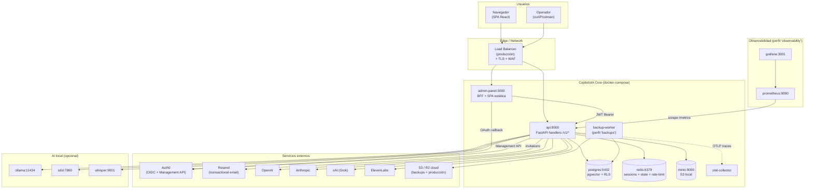
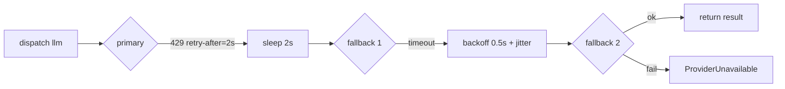

# Arquitectura — CopilotoIA Core

> **Sistema operativo multi-tenant para construir SaaS de productos
> verticales sobre una base común de auth, RBAC, IA dispatch, billing,
> observabilidad y operaciones.**

**Estado:** producción-ready. 1026 tests passed · coverage 94.1% · 4
auditorías cerradas · 0 vulnerabilidades P0/P1 conocidas.

---

## Tabla de contenidos

1. [Visión 10.000 pies](#1-visión-10000-pies)
2. [Herramientas de terceros](#2-herramientas-de-terceros)
3. [Componentes del stack (docker-compose)](#3-componentes-del-stack-docker-compose)
4. [Modelo de datos](#4-modelo-de-datos)
5. [Auth + RLS multi-tenant](#5-auth--rls-multi-tenant)
6. [Capa IA transversal](#6-capa-ia-transversal)
7. [Observabilidad](#7-observabilidad)
8. [Backups + RPO/RTO](#8-backups--rporto)
9. [Seguridad (defense-in-depth)](#9-seguridad-defense-in-depth)
10. [Cómo agregar un módulo opt-in](#10-cómo-agregar-un-módulo-opt-in)
11. [Performance: optimizaciones implementadas](#11-performance-optimizaciones-implementadas)

---

## 1. Visión 10.000 pies



---

## 2. Herramientas de terceros

Esta tabla es la **referencia canónica** de qué provider/servicio usa
el core, para qué, y dónde se configura. Si una pieza falla, este es
el primer lugar a consultar.

### 2.1 SaaS críticos (requeridos en producción)

| Servicio | Para qué | Conexión | Secret/Config | Doc/Status |
|----------|----------|----------|---------------|------------|
| **Auth0** | Authentication (OIDC RS256), MFA, Management API para CRUD de users/roles | `app/core/security.py` (JWT validation), `app/services/auth0_admin.py` (Management API), `app/admin/routes.py` (OAuth callback) | `AUTH0_DOMAIN`, `AUTH0_CLIENT_ID`, `AUTH0_ADMIN_CLIENT_SECRET`, `AUTH0_AUDIENCE` | https://auth0.com/docs · https://status.auth0.com |
| **Resend** | Email transaccional (invitaciones, password reset, alertas) | `app/services/email.py` → `ResendEmailProvider` | `RESEND_API_KEY_FILE`, `EMAIL_FROM_ADDRESS`, `EMAIL_FROM_NAME` | https://resend.com/docs |
| **PostgreSQL 16 + pgvector** | DB transaccional + embeddings IA + RLS multi-tenant | `app/db/pool.py` asyncpg | `DATABASE_URL`, `DATABASE_ADMIN_URL`, `DB_POOL_MIN_SIZE`, `DB_POOL_MAX_SIZE` | https://www.postgresql.org/docs/16/ · https://github.com/pgvector/pgvector |
| **Redis 7+** | Session store (multi-worker safe), OAuth state (single-use), rate-limit buckets | `app/admin/session_store.py`, `app/admin/oauth_state_store.py`, `app/services/rate_limit.py` | `REDIS_URL` | https://redis.io/docs |

### 2.2 SaaS opcionales / cloud (al menos uno requerido si usás IA)

| Servicio | Modalidades | Adapter | Secret | Notas |
|----------|-------------|---------|--------|-------|
| **OpenAI** | LLM, Image (DALL-E 3), TTS, STT (Whisper) | `app/ai/providers/openai.py` | `OPENAI_API_KEY` (via `secret_ref`) | Fallback default de Grok para LLM/Image |
| **Anthropic** | LLM (Claude) | `app/ai/providers/anthropic.py` | `ANTHROPIC_API_KEY` | Mejor para reasoning largo / chains complejos |
| **xAI (Grok)** | LLM, Image, Video, TTS, STT (multimodal en un solo provider) | `app/ai/providers/grok.py` | `XAI_API_KEY` | Único provider con Video; usado por default para Influencer Studio |
| **ElevenLabs** | TTS premium con voice cloning | `app/ai/providers/elevenlabs.py` | `ELEVENLABS_API_KEY` | Voice cloning para personas custom |

### 2.3 Local-only AI (off-cloud, datos sensibles)

| Servicio | Modalidades | Adapter | Donde corre |
|----------|-------------|---------|-------------|
| **Ollama** | LLM (llama 3.1 8b default) | `app/ai/providers/ollama.py` | Container local `:11434` |
| **Stable Diffusion XL** | Image | `app/ai/providers/local_sdxl.py` | `:7860` (AUTOMATIC1111 o ComfyUI) |
| **faster-whisper-server** | STT | `app/ai/providers/local_whisper.py` | `:9001` (OpenAI-compatible endpoint) |

### 2.4 Infraestructura de almacenamiento

| Servicio | Para qué | Config |
|----------|----------|--------|
| **MinIO** (dev) / **S3** (prod) | Uploads del admin (avatars, branding), backups | `S3_ENDPOINT_URL`, `S3_BUCKET`, `S3_ACCESS_KEY_ID`, `S3_SECRET_ACCESS_KEY`, `AWS_DEFAULT_REGION` |
| **S3 cloud para backups** | Almacenamiento off-site de los dumps cifrados | `BACKUP_S3_BUCKET`, `BACKUP_S3_ENDPOINT` |

### 2.5 Observabilidad (perfil opt-in `observability`)

| Servicio | Para qué | Config |
|----------|----------|--------|
| **Prometheus** | Scrape de `/metrics`, evaluación de alert rules | `infra/observability/prometheus.yml`, `infra/observability/alerts.yaml` + `alerts/core.yml` |
| **Grafana** | Dashboards | `infra/observability/grafana/dashboards/core-health.json` |
| **OpenTelemetry Collector** | Pipeline de logs + traces + métricas | Recibe vía OTLP del proceso `api` |

### 2.6 Crypto / Encryption

| Herramienta | Para qué | Implementación |
|-------------|----------|----------------|
| **GPG (gnupg)** | Cifrado de los backups antes de subirlos a S3 | `infra/backup-worker/Dockerfile` + `scripts/run-cloud-backup.sh` |
| **Fernet (cryptography lib)** | Cifrado at-rest de API keys de IA en DB | `AI_PROVIDER_MASTER_KEY` (32 bytes base64) |
| **HMAC-SHA256** | Firma de cookies de session/state + MFA attestation | `app/core/signed_cookies.py`, `app/core/security.py` |

### 2.7 Resumen — mapa de "qué pasa si X cae"

| Cae | Impacto | Mitigación |
|-----|---------|------------|
| Auth0 | Login nuevo bloqueado; sessions activas siguen funcionando hasta TTL | Sessions con TTL configurable; users existentes pueden seguir trabajando |
| Resend | Invitaciones quedan en `tenant_invitations` con `status=queued`; user re-envía manualmente más tarde | Retry programado (TODO Fase 3) |
| 1 provider IA | Dispatcher cae al fallback chain (PERF-022 con backoff/jitter + retry-after) | Configurar fallback en `app.platform_ai_providers.params.fallback` |
| Postgres | Total outage | HA con replica + failover (responsabilidad del deployment) |
| Redis | Sessions caen a memoria fail-fast en non-local; rate-limit cae a in-memory por worker | Replica + sentinel para alta disponibilidad |

---

## 3. Componentes del stack (docker-compose)

```yaml
# Vista resumen — ver docker-compose.yml para detalles.

services:
  postgres:           pgvector/pgvector:pg16       # 5432
  redis:              redis:7-alpine               # 6379
  minio:              minio/minio:latest           # 9000 (api) + 9001 (console)
  api:                build from Dockerfile.api    # 8000 — FastAPI
  admin-panel:        build from admin-panel/Dockerfile  # 3000 — BFF + SPA
  otel-collector:     otel/opentelemetry-collector # 4317 (OTLP grpc)

  # Perfiles opt-in:
  backup-worker:      perfil "backups"
  prometheus:         perfil "observability"  # 9090
  grafana:            perfil "observability"  # 3001
```

**Levantar solo lo esencial (dev local):**
```bash
docker compose up -d postgres redis minio api admin-panel
```

**Levantar con backups + observability:**
```bash
docker compose --profile backups --profile observability up -d
```

### 3.1 `api` (FastAPI)

- **Entrypoint:** `app.main:create_app`
- **Lifespan:** crea pool asyncpg, monta routers transversales, registra
  middlewares (security headers, rate limiter, cache-control no-store).
- **Routers v1:** `public`, `me`, `tenant_signup`, `tenant_user`,
  `platform_admin`, `platform_roles`, `invitations`.
- **Plus opt-in:** cada módulo registra su propio router al import time
  (via side-effect import en `app.api.v1.routes`).
- **Métricas:** `/metrics` con allowlist IP (`OBSERVABILITY_ALLOWED_IPS`).

### 3.2 `admin-panel` (BFF + SPA)

- **Stage 1:** `node:22-alpine` builda la SPA React (Vite, code-splitting
  con `React.lazy`, vendor chunk separado).
- **Stage 2:** `python:3.12-slim` corre el BFF FastAPI (`app/admin/main.py`)
  que sirve la SPA estática + proxea requests autenticados a la API.
- **USER non-root:** `copiloto:10001` (SEC-020-N audit#4).
- **Session cookie HTTP-only firmada** con HMAC-SHA256
  (`app/core/signed_cookies.py`); session store en Redis (multi-worker
  safe via P0-3).

### 3.3 `postgres`

- Imagen `pgvector/pgvector:pg16` (pgvector incluido nativamente para
  embeddings de búsqueda semántica).
- Schema único `app.*` con RLS multi-tenant en todas las tablas
  tenant-scoped.
- Init scripts en `infra/postgres/`:
  - `00-init-roles.sh` — crea roles `app_user` (RLS-enforced) y
    `app_admin` (RLS bypass para DDL/seeds).
  - `10-core.sql` — schema + tables + RLS policies + SECURITY DEFINER
    functions + indexes + views.
  - `20-seed.sql` — seed mínimo (guarded contra ejecución en prod).
  - `modules/*.sql` — schemas de módulos opt-in (cargados via flag
    `--module=<name>` en `bootstrap.sh`).

### 3.4 `redis`

Único storage compartido entre workers. Usado para:

| Uso | Implementación | Key pattern |
|-----|----------------|-------------|
| Session store del BFF | `app/admin/session_store.py` (RedisSessionStore) | `bff:session:<sid>` |
| OAuth state single-use | `app/admin/oauth_state_store.py` con `SET NX EX` atómico | `bff:oauth_state:<state>` |
| Rate-limit buckets | `app/services/rate_limit.py` (LRU + TTL eviction) | `rl:<bucket>:<key>` |

Fault tolerance: si Redis cae, la BFF loguea warning y entra en modo
fail-fast (production) o fallback in-memory (development).

### 3.5 `backup-worker` (perfil `backups`)

- Cron interno: corre `scripts/run-cloud-backup.sh` cada N horas.
- `pg_dump` → cifrado GPG → upload a S3 → verificación opcional con
  `pg_restore` en postgres efímero.
- **SEC-021-N (audit#4):** verificación efímera **opt-in** via
  `BACKUP_VERIFY_SKIP_EPHEMERAL=0` (default `=1` por seguridad — el
  mount de `/var/run/docker.sock` requiere nodo dedicado).
- Métricas: `cpi_backup_last_success_age_seconds`,
  `cpi_backup_last_verify_failed_age_seconds`.

---

## 4. Modelo de datos

Todo el schema en `app.*` (excepto módulos opt-in que crean su propio
schema).

### 4.1 Tablas del core

| Tabla | Rol |
|-------|-----|
| `tenants` | Catálogo + lifecycle |
| `users` | Identidad (Auth0 `sub` ↔ UUID interno) |
| `user_tenant_roles` | Membresía + rol por tenant |
| `user_preferences` | Cache de preferencias + matriz de notificaciones |
| `auth_sessions` | Sesiones activas + revoke |
| `audit_log` | Bitácora cross-tenant + cross-módulo |
| `operator_alerts` | Cola de alertas para platform_owner |
| `data_retention_policies` | Políticas de TTL por entidad |
| `backup_runs` | Bitácora de los backups |
| `tenant_legal_documents` | Términos / privacidad versionados por tenant |
| `tenant_modules` | Activación opt-in de módulos por tenant |
| `tenant_invitations` | Invitaciones pendientes (token hash + expiry) |
| `platform_secrets` | Refs a secrets (vault opaco; nunca valor crudo) |
| `platform_ai_providers` | Provider activo + modelo por modalidad |
| `provider_dispatch` | Audit de cada call de IA (provider, latencia) |
| `feature_flags` | Rollout + segmentación de flags |
| `role`, `capability`, `role_capability` | RBAC dinámico (Fase 2) |

### 4.2 SECURITY DEFINER functions (perf-críticas)

| Function | Para qué | Optimización |
|----------|----------|--------------|
| `app.resolve_or_create_user(sub, email, ...)` | Atomic lookup + create del user al login | 4 round-trips → 1 (P1-9 audit#1) |
| `app.current_user_id()` | RLS policy helper | Lee `app.user_id` setting |
| `app.current_tenant_id()` | RLS policy helper | Lee `app.tenant_id` setting |

### 4.3 Advisory locks

Usados para serializar operaciones que de otra forma harían race
(I-2 audit#3):

| Operación | Lock key |
|-----------|----------|
| `create_invitation_record` | hash de `(tenant_id, email.lower())` |
| Otros | TBD módulos opt-in |

---

## 5. Auth + RLS multi-tenant

### 5.1 Flujo OAuth (admin-panel)

```mermaid
sequenceDiagram
    autonumber
    participant U as Usuario
    participant B as Browser
    participant BFF as admin-panel:3000
    participant A0 as Auth0
    participant API as api:8000
    participant PG as Postgres
    participant R as Redis

    U->>B: GET /admin/auth/login
    B->>BFF: GET /admin/auth/login
    BFF->>R: SETNX oauth_state:<state>
    BFF->>B: 302 → Auth0 /authorize<br/>?state&nonce
    B->>A0: /authorize
    A0->>B: 302 callback?code&state
    B->>BFF: GET /admin/auth/callback
    BFF->>R: GET+DEL oauth_state (single-use)
    BFF->>A0: POST /oauth/token
    A0->>BFF: id_token + access_token
    BFF->>BFF: validate nonce/exp/aud/iss/azp/at_hash
    BFF->>R: SET bff:session:<sid> (TTL=access_token.exp)
    BFF->>B: Set-Cookie session=<sid>; 302 /admin
    Note over B,API: Requests subsiguientes
    B->>BFF: GET /admin/api/me
    BFF->>R: GET bff:session:<sid>
    BFF->>API: GET /v1/me<br/>Authorization: Bearer <jwt>
    API->>API: authenticate_request → JWKS validate
    API->>PG: BEGIN; SET app.tenant_id, app.user_id
    PG->>API: SELECT...
    API->>B: 200 JSON
```

### 5.2 RLS enforcement

`app/db/pool.py` setea por cada transacción:

```sql
select set_config('app.tenant_id', $1, true);
select set_config('app.user_id',   $2, true);
select set_config('app.support_mode', $3, true);  -- bypass solo para support staff
```

Cualquier policy en una tabla `app.<x>` puede leer:

```sql
create policy tenant_isolation on app.documents
  using (tenant_id = app.current_tenant_id());
```

Sin `tenant_id` set → la policy filtra todo → query devuelve `[]`
(no error, fail-closed por design).

### 5.3 Defensa-en-profundidad

- **OIDC compliance:** nonce, exp/iat/aud/iss, `azp`, `at_hash`
  validados en cada login (A-001, A-002, SEC-025 audit#1-#3).
- **JWKS rotation auto-recovery:** force-refresh on unknown kid
  (M-001 audit#2). Ver `docs/runbooks/auth0-key-rotation.md`.
- **Session hijack:** removido `x-admin-user-email` (A-003); sessions
  con HMAC firma + TTL alineado a access_token.
- **OAuth state single-use:** Redis `SET NX EX` atómico (P1-10).
- **MFA attestation:** validación con HMAC constant-time (M63).

---

## 6. Capa IA transversal

### 6.1 Componentes

```
app/ai/
├── registry.py       resolve_provider(conn, modality) → ResolvedProvider
├── dispatcher.py     dispatch(call_fn) con fallback chain + circuit breaker
└── providers/
    ├── base.py       interfaces LLM/Image/Video/TTS/STT + PersistentHttpxClient
    ├── factory.py    make_adapter_for_provider(resolved) → IAProvider
    ├── grok.py       multimodal (5 interfaces)
    ├── openai.py     LLM + Image + TTS + STT
    ├── anthropic.py  LLM
    ├── elevenlabs.py TTS
    ├── ollama.py     LLM local
    ├── local_sdxl.py Image local
    └── local_whisper.py STT local
```

### 6.2 Fallback chain con backoff (PERF-022)



- `_backoff_for_attempt`: exponencial base 0.25s, cap 8s, jitter ±30%.
- Si `ProviderRateLimited.retry_after` está presente → respeta ese
  valor en vez del backoff (cap 8s defensivo).
- Si chain agotada → NO duerme.

### 6.3 Performance hardening

- **Singleton httpx por provider (PERF-021):** un `AsyncClient` por
  instancia del adapter; reuso de conn pool entre calls. Caso peor
  (Grok video poll 120×): -60 a -120s en handshakes.
- **Bytes cap defensivo (SEC-022):** `Content-Length > 256MB` → reject.
- **SSRF guard en factory (SEC-023):** `base_url` validado contra
  `app/services/url_safety.py` (mode cloud → no private IPs, no
  localhost; mode local → http permitido).

### 6.4 Audit

Cada `dispatch()` inserta una fila en `app.provider_dispatch` con:
- `modality`, `provider_primary`, `provider_used`, `fallback_depth`,
- `elapsed_ms`, `success`, `error_class`.

---

## 7. Observabilidad

### 7.1 Métricas Prometheus

Todas con prefijo `cpi_` (CopilotoIA). Endpoint: `GET /metrics` con
IP allowlist (`OBSERVABILITY_ALLOWED_IPS`).

| Métrica | Tipo | Labels | Para qué |
|---------|------|--------|----------|
| `cpi_db_pool_size` | Gauge | — | Total conns en pool |
| `cpi_db_pool_idle` | Gauge | — | Conns disponibles (alerta < 1) |
| `cpi_db_pool_min` / `_max` | Gauge | — | Capacidad configurada |
| `cpi_ai_provider_health` | Gauge | `provider`, `modality` | 1=ok, 0=circuit open |
| `cpi_backup_last_success_age_seconds` | Gauge | `kind` | RPO tracking |
| `cpi_backup_last_verify_failed_age_seconds` | Gauge | `scope` | Restore validity |
| `cpi_rate_limit_buckets_current` | Gauge | — | Carga del LRU |
| `cpi_rate_limit_buckets_evicted_total` | Counter | — | Memory cap hits |
| `cpi_ws_fanout_subscriber_count` | Gauge | — | WS subs activos |
| `cpi_ws_fanout_tenant_count` | Gauge | — | Tenants con WS abierto |
| `cpi_ws_fanout_dropped_total` | Counter | — | Mensajes dropeados |
| `cpi_ws_fanout_supervisor_crashes_total` | Counter | — | Crash del supervisor |

### 7.2 Dashboards Grafana

`infra/observability/grafana/dashboards/core-health.json` — UID
`copilotoia-core-health`. Panels:
- DB pool idle (stat) + utilización vs max (timeseries)
- AI providers — salud actual (stat por provider/modality) + historial (timeseries)
- Backup — edad del último éxito (stat) + tendencia (timeseries)

Ver `infra/observability/grafana/dashboards/README.md` para provisioning.

### 7.3 Alertas

| Alerta | Trigger | Severity | Runbook |
|--------|---------|----------|---------|
| `DbPoolExhausted` | `cpi_db_pool_idle == 0` por > 30s | page | `docs/runbooks/db-pool-exhausted.md` |
| `AiProviderDown` | `cpi_ai_provider_health == 0` por > 5m | ticket | `docs/runbooks/ai-provider-down.md` |
| `BackupStale` | `cpi_backup_last_success_age_seconds > 86400` por > 5m | ticket | `docs/runbooks/backup-stale.md` |
| `BackupCloudStale` (legacy) | edad > 30h | page | `docs/runbooks/backup-stale.md` |
| `BackupVerifyFailed` (legacy) | verify failed < 24h | page | `docs/runbooks/backup-stale.md` |
| `MetricsEndpointSilent` (legacy) | `/metrics` sin scrape > 3m | page | `docs/runbooks/postgres-down.md` |

Archivos: `infra/observability/alerts.yaml` (legacy) +
`infra/observability/alerts/core.yml` (post audit#4).

### 7.4 Audit log

Todos los eventos de negocio (creación tenant, cambio rol, activación
módulo, invitación, etc.) → `app.audit_log` con `actor_id`, `action`,
`entity_type`, `payload_antes`, `payload_despues`. Para integridad
verificable, los registros van con hash SHA-256 + Merkle root (módulo
GD opt-in añade el sellado).

---

## 8. Backups + RPO/RTO

| Métrica | Objetivo |
|---------|----------|
| **RPO** (datos perdidos en peor caso) | ≤ 24h (alert a las 24h, page a las 30h) |
| **RTO** (tiempo de recuperación) | ≤ 4h (con runbook `restore-from-backup.md`) |

**Pipeline:**

1. Cron del `backup-worker` ejecuta `scripts/run-cloud-backup.sh`.
2. `pg_dump` → archivo local en `/tmp/backup-<ts>.sql`.
3. `gpg --encrypt --recipient $BACKUP_GPG_RECIPIENT` → `.sql.gpg`.
4. `aws s3 cp` → bucket configurado en `BACKUP_S3_BUCKET`.
5. (Opcional, opt-in) Verificación: descarga + decrypt + restore en
   postgres efímero + validación de schemas + drop.
6. INSERT en `app.backup_runs` con `status`, `started_at`, `finished_at`,
   `bytes`, `error` si aplica.

**Restore (runbook completo:** `docs/runbooks/restore-from-backup.md`
— TODO):

```bash
aws s3 cp s3://$BACKUP_S3_BUCKET/<dump>.sql.gpg .
gpg --decrypt <dump>.sql.gpg > <dump>.sql
pg_restore -d $TARGET_DB <dump>.sql
```

---

## 9. Seguridad (defense-in-depth)

Resumen de las capas; ver `docs/SECURITY.md` (TODO) para detalle
exhaustivo de cada vector.

| Capa | Defensa | Ubicación |
|------|---------|-----------|
| Network edge | TLS, WAF, rate-limit en LB | Deployment-specific |
| App middleware | Security headers (CSP, HSTS, X-Frame-Options), Cache-Control no-store, rate-limit per-actor | `app/main.py` |
| Auth | Auth0 OIDC + MFA + JWKS rotation auto | `app/core/security.py` |
| Session | HMAC firma + Redis store + TTL = access_token.exp | `app/admin/session_store.py` |
| OAuth state | Single-use con Redis SET NX EX | `app/admin/oauth_state_store.py` |
| CSRF | Sec-Fetch-Dest enforcement + state cookie | `app/admin/routes.py` |
| Multi-tenant isolation | RLS en tablas tenant-scoped + advisory locks anti-race | `infra/postgres/10-core.sql` |
| SSRF (provider URLs) | `app/services/url_safety.py` (write-path + read-path) | `admin_routes` + `factory` |
| Bytes exhaustion (IA responses) | `Content-Length` cap 256MB | `app/ai/providers/base.py` |
| Container runtime | USER non-root, docker.sock opt-in | `Dockerfile`s + `docker-compose.yml` |
| Secrets | Refs opacas en DB (`platform_secrets`); valor crudo solo en env/vault | `app/services/secret_resolver.py` |
| Audit | `app.audit_log` con actor + action + payload antes/después | `app/services/audit.py` |
| Backup | GPG-cifrado + verificación opcional | `infra/backup-worker/` |

---

## 10. Cómo agregar un módulo opt-in

El core **nunca cambia** para soportar un módulo nuevo. El módulo se
agrega encima siguiendo este checklist:

### Checklist

1. **SQL del módulo:**
   - Crear `infra/postgres/modules/<modulo>.sql` con schema propio
     (`<modulo>.tabla`).
   - Agregar el code del módulo al CHECK constraint de
     `app.tenant_modules.module`.

2. **Backend:**
   - Crear `app/<modulo>/` con sus routers (FastAPI APIRouter).
   - Registrar el router en `app/main.py` con `api.include_router(...)`.
   - Si el módulo usa IA: llama `app.ai.dispatcher.dispatch()` con su
     `call_fn` (no instancia providers directamente).

3. **Frontend:**
   - Agregar entrada al `MODULE_REGISTRY` en
     `admin-panel/src/app/moduleRegistry.js`.
   - Agregar al `TENANT_NAV` en `admin-panel/src/app/nav.js`.
   - Declarar capabilities en `admin-panel/src/permissions/matrix.js`.

4. **Hook de activación (opcional):**
   - Si el módulo requiere bootstrap por tenant al activarse (seed de
     catálogos, roles del módulo), registrar el hook con
     `/platform/tenant-modules/{id}/{code}` PATCH.

5. **Tests:**
   - Tests del módulo en `tests/test_<modulo>_*.py`.
   - **NO modificar tests del core.**

6. **Docs del módulo:**
   - `docs/<modulo>/README.md` con su arquitectura propia + endpoints.

Ejemplo de referencia: módulo Gestión Documental (GD) — ver el
worktree de UI bloques para implementación completa.

---

## 11. Performance — optimizaciones implementadas

| Fix | Impacto | Audit |
|-----|---------|-------|
| httpx singleton para 7 AI providers | -60 a -120s en `generate_video` (poll 120×) | PERF-021 #4 |
| httpx singleton Auth0/Resend/core-bff | -30-80ms por call | PERF-001 #1 |
| Backoff + jitter + Retry-After | Elimina thundering-herd al fallback en 429 | PERF-022 #4 |
| SECURITY DEFINER `resolve_or_create_user` | 4 RTT → 1 (~300ms login) | P1-9 #1 |
| Resend send fuera de TX via BackgroundTask | TX invitation 800ms → 80ms | P0-4 #1 |
| SPA code-splitting React.lazy | Bundle inicial 391KB → 89KB + 207KB vendor | PERF-020 #3 |
| Session local-TTL cache | -1 Redis GET por request reusada | PERF-019 #3 |
| DB pool observability | Detección temprana de saturación | PERF-023 #4 |
| Cache-Control no-store default | Previene cache de datos PII | PERF-024 #4 |
| Email outbound semaphore (cap 8) | Burst signup no satura Resend | PERF-025 #4 |

---

## Apéndices

- **Runbooks operativos:** `docs/runbooks/`
- **Esquema SQL completo:** `infra/postgres/10-core.sql`
- **Catálogo de métricas:** `app/services/metrics.py`
- **Schema de alertas:** `infra/observability/alerts.yaml` +
  `infra/observability/alerts/core.yml`
- **Dashboards Grafana:** `infra/observability/grafana/dashboards/`
- **Auditorías ejecutadas:** 4 (todas cerradas). Resumen en
  `docs/auditorias/` (TODO consolidar).

---

**Última revisión:** 2026-05-27 — post audit#4 + TASK-OBSERV + TASK-PROD + TASK-DOCS.
