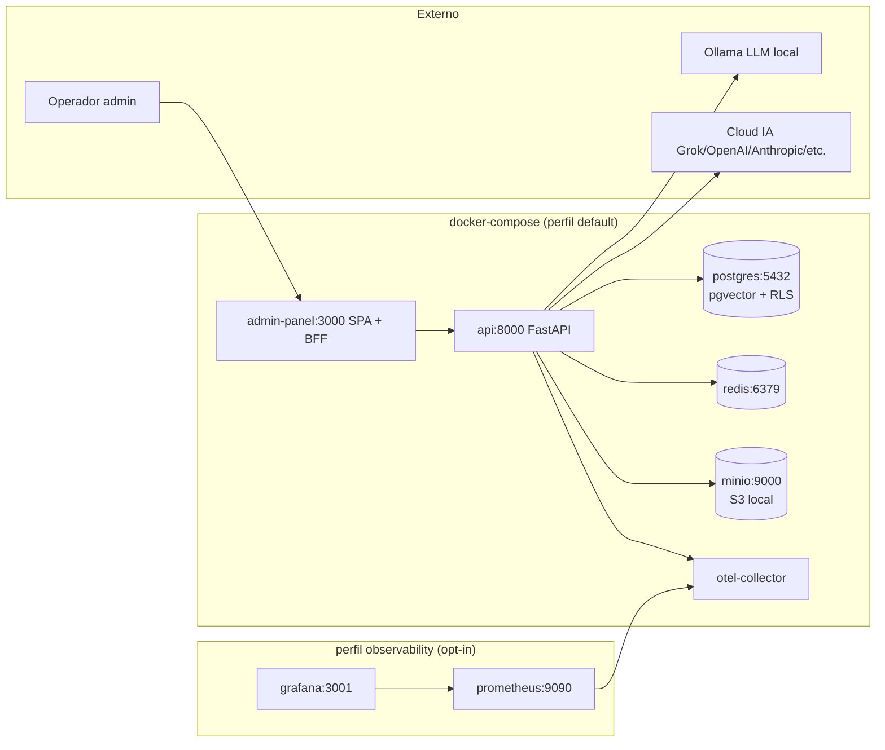

# Arquitectura — Copiloto Core

Este documento describe la arquitectura vigente del CORE: lo que está
implementado y desplegado en `docker-compose.yml`. Cada módulo opt-in que
se instala sobre el core agrega su propia documentación.

## 1. Componentes del docker-compose

- **`api`** — FastAPI con `app.main`. Sirve los routers transversales
  (`/v1/me/*`, `/v1/tenants/*`, `/v1/platform/*`).
- **`admin-panel`** — BFF FastAPI que sirve la SPA React (Vite) bajo
  `/admin/` y proxea las llamadas autenticadas a `/admin/api/core/v1/*`
  → `api:8000/v1/*`.
- **`postgres`** — `pgvector/pgvector:pg16`. Schema único `app.*` con
  Row-Level Security multi-tenant (toda query setea `app.tenant_id` por
  transacción vía `set_config`).
- **`redis`** — cache + rate limit buckets (opcional).
- **`minio`** — S3 local para uploads del admin (avatars, branding, etc.).
- **`otel-collector`** — pipeline OpenTelemetry (logs + traces + métricas).
- **`prometheus` + `grafana`** — observabilidad opt-in (`--profile
  observability`).

## 2. Modelo de datos del core

Todo en el schema `app.*`. Tablas principales:

| Tabla                       | Rol                                              |
| --------------------------- | ------------------------------------------------ |
| `tenants`                   | catálogo de tenants + lifecycle                  |
| `users`                     | identidad (Auth0 `sub` ↔ UUID interno)           |
| `user_tenant_roles`         | membresía + rol del chrome por tenant            |
| `user_preferences`          | cache de prefs + matriz de notificaciones        |
| `auth_sessions`             | sesiones activas (login + revoke)                |
| `audit_logs`                | bitácora cross-tenant + cross-módulo             |
| `operator_alerts`           | cola de alertas para platform_owner              |
| `data_retention_policies`   | políticas de TTL por entidad                     |
| `backup_runs`               | bitácora de los backups (`backup-worker`)        |
| `tenant_legal_documents`    | términos / privacidad versionados por tenant     |
| `tenant_modules`            | activación opt-in de módulos por tenant          |
| `platform_secrets`          | refs a secrets (vault opaco; nunca valor crudo)  |
| `platform_ai_providers`     | provider activo + modelo por modalidad           |
| `provider_dispatch`         | audit de cada call de IA (provider, latencia)    |
| `feature_flags`             | rollout + segmentación de flags                  |
| `role`, `capability`,       | RBAC dinámico (Fase 2 — CRUD desde el panel)     |
| `role_capability`           |                                                  |

Cualquier módulo opt-in declara su propio schema en
`infra/postgres/modules/<modulo>.sql` con sus propias tablas — NO
modifica el schema `app.*`.

## 3. Auth y RLS

- **Auth0** Authorization Code Flow + MFA → cookie session HTTP-only en
  el BFF; el JWT del access token va al API.
- Cada request del API resuelve `authenticate_request` → setea
  `request.state.actor_id` (Auth0 `sub`) y el rol efectivo.
- `app.core.identity.resolve_user_id_from_request` mapea `sub` → UUID
  interno (cached por request).
- `app/db/pool.py` setea `app.tenant_id` y `app.support_mode` al iniciar
  cada transacción (lo lee `RLS` en cada tabla). Cualquier query sin
  tenant set rechaza el `INSERT/SELECT` con `InsufficientPrivilegeError`.

## 4. Capa IA transversal (`app/ai`)

- `app/ai/registry.py` — `resolve_provider(conn, modality)` lookup
  cacheado contra `app.platform_ai_providers`. Fallback a env var
  `AI_DEFAULT_{MODALITY}_PROVIDER`.
- `app/ai/dispatcher.py` — `dispatch(conn, modality, call_fn)` ejecuta
  el call_fn contra el provider primario, hace fallback chain en errores
  retryables, abre circuit breaker tras N fallos consecutivos, audita
  cada call en `app.provider_dispatch`.
- `app/ai/providers/` — adapters concretos (Grok, OpenAI, Anthropic,
  ElevenLabs, Ollama, LocalSDXL, LocalWhisper). Todos implementan las 5
  interfaces de `base.py`: LLM, Image, Video, TTS, STT.
- Secrets resueltos via `app/services/secret_resolver.py` —
  `secret_ref="env:NOMBRE_VAR"` lee de `os.environ`.

Cualquier módulo opt-in que necesite IA llama `dispatch()` con su
`call_fn` específico (no instancia providers directamente).

## 5. Cómo agregar un módulo nuevo (checklist)

1. **SQL del módulo**: crear `infra/postgres/modules/<modulo>.sql` con
   un schema propio (`<modulo>.tabla`). Agregar el código del módulo al
   CHECK constraint de `app.tenant_modules.module`.
2. **Backend**: crear `app/<modulo>/` con sus routers
   (`from app.api.v1.routes import APIRouter`). Registrar el router en
   `app/main.py` con `api.include_router(...)`.
3. **Frontend**: agregar la entrada al `MODULE_REGISTRY` en
   `admin-panel/src/app/moduleRegistry.js`, al `TENANT_NAV` en
   `admin-panel/src/app/nav.js`, y declarar las capabilities del módulo
   en `admin-panel/src/permissions/matrix.js`.
4. **Hook de activación**: si el módulo requiere bootstrap por tenant al
   activarse (seed de catálogos, roles del módulo), registrar el hook
   con el endpoint platform_admin `/platform/tenant-modules/{id}/{code}`
   — el endpoint llama `_module_gate_cache_invalidate()` al guardar.
5. **Tests + CI**: agregar tests unitarios + de integración del módulo
   sin tocar los tests del core.

El core NO cambia para soportar un módulo nuevo; el módulo se agrega
encima.

## 6. Observabilidad

- **Métricas Prometheus** en `/metrics` (allowlist de IPs).
- **Alerts** en `infra/observability/alerts.yaml`.
- **Traces OTel** colectados por `otel-collector`.
- **Audit log** en `app.audit_logs` para eventos de negocio (creación
  de tenant, cambio de rol, activación de módulo, etc.).

## 7. Backups

- `backup-worker` (perfil `backups`) corre `pg_dump` + cifrado GPG +
  upload a S3 + verificación con `pg_restore` en un Postgres efímero
  isolated.
- Cron diario; rotación configurable con `BACKUP_RETENTION_DAYS`.
- Métricas de stale-ness en `app.backup_runs` + gauges Prometheus.
