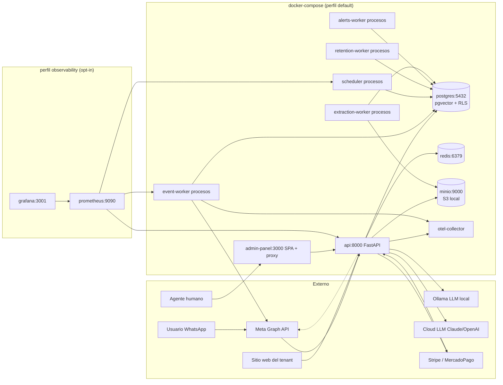
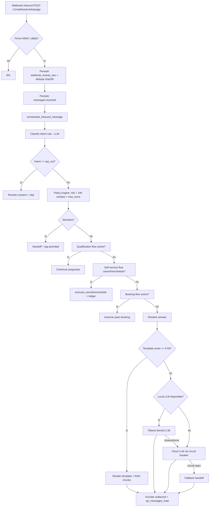

# Arquitectura de CopilotoIA — Core ejecutable

Este documento describe la arquitectura **vigente** del MVP: lo que efectivamente está implementado y desplegado en `docker-compose.yml`, no lo aspiracional. La especificación de referencia y la justificación de cada decisión están en [`README.md`](README.md); este archivo es la guía operativa.

> **Estado actual:** 61 tareas completadas (TASK-0000 → TASK-0061), 16 pendientes para go-live comercial (TASK-0062 → TASK-0076). Detalle en [`docs/DONE.md`](docs/DONE.md) y [`docs/BACKLOG.md`](docs/BACKLOG.md).

## 1. Componentes del compose



| Servicio Docker | Imagen / build | Puerto | Responsabilidad | Escalado |
|---|---|---:|---|---|
| `api` | `./Dockerfile` (uvicorn FastAPI) | 8000 | REST `/v1`, webhooks Meta + payments, `/v1/web/*`, `/metrics`, Admin Panel API proxy. Carga `app.main:app`. | horizontal |
| `admin-panel` | `./admin-panel/Dockerfile` | 3000 | SPA React (Vite) + proxy `app.admin.main:app` que sirve assets y delega API al `api` interno por `ADMIN_CORE_API_BASE_URL`. | horizontal |
| `event-worker` | mismo build que `api` | 9100 (interno) | Procesa `domain_events` con `published_at IS NULL`: envía outbound a Meta, marca status, instrumenta `cpi_messages_total`. | singleton hasta reclamar filas con `FOR UPDATE SKIP LOCKED` (ver `app/workers/event_worker.py`); escalar horizontalmente dispara envíos duplicados a Meta |
| `scheduler` | mismo build que `api` | 9100 (interno) | Tick periódico: despacha `reminder_jobs` vencidos, ejecuta `operator_alerts` pendientes, recall, auto-rebook timeouts, refresh de segmentos. | singleton recomendado |
| `retention-worker` | mismo build (no en compose default, ver TASK-0061) | — | Job diario a 03:00 UTC: aplica `data_retention_policies` por tenant; DELETE paginado o anonimización in-place. | singleton |
| `alerts-worker` | mismo build (entrypoint separado opcional) | — | Despacha `operator_alerts` con backoff exponencial. Reusable como subset del `scheduler` o proceso aparte. | singleton |
| `extraction-worker` | mismo build (`python -m app.workers.extraction_worker`) | — | Extrae texto de PDF/DOCX subidos a Knowledge fuera del request HTTP. | horizontal |
| `postgres` | `pgvector/pgvector:pg16` | 5432 | Estado transaccional, 38 tablas, `pgvector` HNSW, `btree_gist` para exclusión de slot, RLS por tenant. | vertical + réplica |
| `redis` | `redis:7.4-alpine` con appendonly | 6379 | Cache, locks, sesiones efímeras, idempotencia distribuida. | horizontal (cluster) |
| `minio` | `minio/minio:RELEASE.2025-04-22` | 9000 / 9001 | Compatible S3 local para media, documentos y exports. | gestionado en prod |
| `otel-collector` | `otel/opentelemetry-collector-contrib:0.117.0` | 4318 / 8889 | OTLP receiver + exportador local de Prometheus y logs. | horizontal |
| `prometheus` | `prom/prometheus:v2.55.1` (perfil `observability`) | 9090 | Scrape de `api:8000/metrics`, `event-worker:9100/metrics`, `scheduler:9100/metrics` cada 15 s; reglas en `infra/observability/alerts.yaml`. | opt-in |
| `grafana` | `grafana/grafana:11.4.0` (perfil `observability`) | 3001 | Dashboards (entrega post-MVP). | opt-in |

Arranque por defecto:

```bash
./scripts/bootstrap.sh
```

Arranque con observabilidad:

```bash
docker compose --profile observability up
```

## 2. Procesos asíncronos y jobs programados

| Proceso | Entrypoint | Frecuencia | Idempotencia |
|---|---|---|---|
| `event_worker` | `python -m app.workers.event_worker` | loop continuo | `domain_events.idempotency_key` único por `(tenant, key)` |
| `scheduler` | `python -m app.workers.scheduler` | tick configurable | dedupe por `reminder_jobs.status='claimed'` + `for update skip locked` |
| `retention_worker` | `python -m app.workers.retention_worker` | 1×/día a `RETENTION_RUN_HOUR_UTC` (default 03:00) | `retention:<tenant>:<YYYY-MM-DD>` |
| `alerts_worker` | `python -m app.workers.alerts_worker` | reaprovecha el loop del scheduler o se monta separado | `operator_alerts.id` + `for update skip locked` |
| `extraction_worker` | `python -m app.workers.extraction_worker` | loop con cola en DB | `knowledge_documents.status` |

Todos los jobs usan `for update skip locked` cuando reclaman trabajo, así múltiples réplicas no se pisan.

## 3. Modelo de datos vigente (38 tablas)

Schema completo en [`infra/postgres/01-schema.sql`](infra/postgres/01-schema.sql). Tablas agrupadas por dominio:

### 3.1 Plataforma, tenants, canal y usuarios

| Tabla | Propósito |
|---|---|
| `tenants` | tenant, slug, vertical (campo libre tras TASK-0033), timezone, status |
| `tenant_settings` | `business_hours`, `escalation_policy`, `pii_policy`, `notification_settings`, `bot_personality` (futuro TASK-0071) |
| `tenant_channels` | conexión WABA con `provider='whatsapp_cloud_api'`, refs a secretos en `.secrets/` |
| `users` | usuarios humanos del panel, `auth_subject` (Auth0/OIDC), `mfa_enabled` |
| `user_tenant_roles` | roles `owner/admin/manager/agent/viewer/support`, scopes y default |
| `data_retention_policies` | TTL por entidad por tenant (TASK-0061) |
| `operator_alerts` | cola de alertas multicanal (email/WhatsApp/webhook firmado) — TASK-0057 |

### 3.2 Contactos y conversaciones

| Tabla | Propósito |
|---|---|
| `contacts` | wa_id, phone E.164 + hash, `opt_in_status`, `tags[]`, `metadata`, `lead_source jsonb`, `qualification jsonb`, `referrer_contact_id` (TASK-0055) |
| `conversations` | estado, `current_intent`, `handoff_required`, `service_window_expires_at`, `metadata` (booking flow + qualification state) |
| `messages` | inbound/outbound/system con `external_message_id`, status (received → queued → sent → delivered → read / failed), `payload jsonb` |
| `message_status_events` | reconciliación con webhooks de estado de Meta |
| `contact_tags`, `contact_tag_assignments` | etiquetas CRM (TASK-0037) |
| `contact_notes` | notas internas |
| `contact_segments`, `contact_segment_members` | segmentos automáticos (TASK-0047) |
| `handoffs` | escalamiento a humano: `reason`, `assigned_to`, `status` |

### 3.3 Negocio: agenda, catálogo, paquetes, sedes

| Tabla | Propósito |
|---|---|
| `branches` | multi-sede por tenant (TASK-0050), `lat/lng/maps_url` con autogeneración (TASK-0058) |
| `resources` | recursos (`staff/bay/vehicle/seat/route`) con `capabilities.working_hours`, perfil (bio/foto/especialidad — TASK-0049), `branch_id` |
| `service_catalog` | servicios configurables, precio, duración, `recall_interval_days` (TASK-0052), `recall_template_id`, `eligibility jsonb` (TASK-0054) |
| `qualification_questions` | preguntas pre-booking (TASK-0042) con tipos `yes_no/single_choice/multi_choice/free_text/number/budget_tier/urgency_level` (TASK-0053) |
| `service_requests` | intake estructurado |
| `quotes` | cotización orientativa, `line_items jsonb`, status `draft→sent→accepted/rejected/expired` |
| `appointments` | exclusión de solape `EXCLUDE USING GIST (resource_id WITH =, tstzrange WITH &&)`, `confirmation_status`, links de pago, `closed_by_user_id` (futuro TASK-0068) |
| `appointment_feedback` | rating 1–5★, comentario, dispara `_escalate_negative_feedback` si ≤ 2★ |
| `treatment_packages`, `contact_packages`, `appointment_package_links` | paquetes multi-cita (TASK-0051) |

### 3.4 Mensajería, plantillas, recordatorios

| Tabla | Propósito |
|---|---|
| `whatsapp_templates` | catálogo sincronizado con Meta (`status` aprobado/pendiente), variables, categoría |
| `reminder_jobs` | jobs programados con `kind` extendido: `appointment_reminder_24h/1h`, `appointment_confirmation`, `post_appointment`, `service_recall`, `auto_rebook_timeout` |

### 3.5 Conocimiento, IA, prompts

| Tabla | Propósito |
|---|---|
| `knowledge_documents` | metadata + status (`draft→indexing→ready/error/archived`) |
| `knowledge_chunks` | `vector(1536)` con índice HNSW; chunk_text, metadata |
| `prompt_templates` | versionados por scope + name + version |
| `media_assets` | biblioteca de imágenes/videos por tenant (TASK-0046) |
| `promotions` | promociones activas con vigencia y media asociado |

### 3.6 Campañas y atribución

| Tabla | Propósito |
|---|---|
| `campaigns` | mensajería masiva a segmentos, counters de sent/delivered/read |
| `campaign_attributions` | atribución de citas/ingreso por campaña (TASK-0048) |

### 3.7 Trazabilidad y auditoría

| Tabla | Propósito |
|---|---|
| `webhook_events_raw` | persistencia idempotente del payload Meta (`payload_sha256` UNIQUE) |
| `domain_events` | bus interno de eventos, `idempotency_key` por tenant |
| `audit_logs` | acciones sensibles + retención GDPR + alertas operativas |

### 3.8 Diagrama relacional resumido

```mermaid
erDiagram
    TENANTS ||--|| TENANT_SETTINGS : has
    TENANTS ||--o{ TENANT_CHANNELS : owns
    TENANTS ||--o{ USER_TENANT_ROLES : scopes
    USERS ||--o{ USER_TENANT_ROLES : assigned
    TENANTS ||--o{ DATA_RETENTION_POLICIES : configures
    TENANTS ||--o{ OPERATOR_ALERTS : queues

    TENANTS ||--o{ BRANCHES : owns
    TENANTS ||--o{ RESOURCES : owns
    BRANCHES ||--o{ RESOURCES : groups
    TENANTS ||--o{ SERVICE_CATALOG : offers
    TENANTS ||--o{ QUALIFICATION_QUESTIONS : asks

    TENANTS ||--o{ CONTACTS : owns
    CONTACTS ||--o{ CONVERSATIONS : opens
    CONTACTS ||--o{ CONTACT_TAG_ASSIGNMENTS : tagged
    CONTACTS ||--o{ CONTACT_NOTES : annotated
    CONTACTS ||--o{ CONTACT_PACKAGES : purchases
    CONTACTS ||--o{ CONTACT_SEGMENT_MEMBERS : belongs_to
    CONTACTS ||--o{ APPOINTMENTS : books
    CONTACTS ||--o{ SERVICE_REQUESTS : creates
    CONTACTS }o--|| CONTACTS : referrer_contact_id

    CONVERSATIONS ||--o{ MESSAGES : contains
    MESSAGES ||--o{ MESSAGE_STATUS_EVENTS : tracks
    CONVERSATIONS ||--o{ HANDOFFS : escalates

    APPOINTMENTS ||--o| APPOINTMENT_FEEDBACK : receives
    APPOINTMENTS ||--o{ APPOINTMENT_PACKAGE_LINKS : counted_against
    SERVICE_REQUESTS ||--o| QUOTES : may_have
    RESOURCES ||--o{ APPOINTMENTS : allocates

    TENANTS ||--o{ TREATMENT_PACKAGES : sells
    TREATMENT_PACKAGES ||--o{ CONTACT_PACKAGES : sold_as

    TENANTS ||--o{ WHATSAPP_TEMPLATES : approves
    TENANTS ||--o{ REMINDER_JOBS : schedules
    TENANTS ||--o{ MEDIA_ASSETS : stores
    TENANTS ||--o{ PROMOTIONS : runs

    TENANTS ||--o{ CONTACT_SEGMENTS : defines
    TENANTS ||--o{ CAMPAIGNS : launches
    CAMPAIGNS ||--o{ CAMPAIGN_ATTRIBUTIONS : credits

    TENANTS ||--o{ KNOWLEDGE_DOCUMENTS : owns
    KNOWLEDGE_DOCUMENTS ||--o{ KNOWLEDGE_CHUNKS : splits
    TENANTS ||--o{ PROMPT_TEMPLATES : owns

    TENANTS ||--o{ WEBHOOK_EVENTS_RAW : receives
    TENANTS ||--o{ DOMAIN_EVENTS : emits
    TENANTS ||--o{ AUDIT_LOGS : records
```



## 4. Aislamiento multitenant

| Capa | Mecanismo en código |
|---|---|
| SQL | `tenant_id` en cada tabla + RLS con `app.current_tenant_id()` y `app.support_mode()`; default-deny si no hay política |
| Secretos | referencias por tenant en `.secrets/tenants/<TENANT_ID>/`: `whatsapp_verify_token`, `meta_access_token`, `whatsapp_app_secret`, `alerts_webhook_secret` |
| Objetos | prefijos `knowledge/<tenant>/<doc_id>/`, `media/<tenant>/<asset_id>/` |
| Caché Redis | namespacing implícito por clave (no compartido entre tenants) |
| Logs | structlog con `tenant_id`, `trace_id`, `request_id` |
| RAG | filtro obligatorio `tenant_id = $1 AND visibility IN (...)` en `rag_retrieval.py` |
| Rate limit | `RateLimiter` con bucket por `ip:tenant_uuid` (TASK-0059) |
| Circuit breaker | proceso-local por `name='cloud_llm:claude'`, `payment:stripe`, etc. |

La API setea `app.tenant_id` y `app.support_mode` en cada transacción a través del middleware de autenticación; sin ellos PostgreSQL niega cualquier lectura por RLS.

## 5. Endpoints REST `/v1`

La superficie `/v1` se agrupa en 11 routers, cada uno con su dependency de seguridad:

| Router | Auth | Endpoints clave |
|---|---|---|
| `public_router` | sin auth | `GET /v1/health`, `GET /v1/tenants/{id}/resources/public` |
| `webhook_router` | firma HMAC (`X-Hub-Signature-256` para Meta, firma del provider para Stripe/MP) | `GET/POST /v1/webhooks/whatsapp`, `POST /v1/webhooks/payments/{provider}` |
| `web_router` | sin auth (origin allowlist + CORS gestionado en `main.py`) | `POST /v1/web/chat/start`, `POST /v1/web/chat/{id}/messages`, `GET /v1/web/chat/{id}/messages` |
| `platform_admin_router` | JWT con rol `owner` plataforma sin `tenant_id` | `POST /v1/tenants` |
| `tenant_admin_router` | JWT `admin` + tenant scope | tenant settings, channels, templates, knowledge, prompts, branches, packages, services, qualification questions, media, promotions, segments, campaigns, payments settings, retention policies, audit-logs, exports |
| `tenant_catalog_router` | `admin` + service-token | catálogo público al frontend del booking flow (`/services`, `/qualification-questions`, `/availability`) |
| `tenant_ops_router` | `agent` + service-token | conversations, contacts, handoffs, appointments, feedback, payment-links, branches lectura, packages lectura |
| `tenant_analytics_router` | `manager` | `/analytics/overview/conversations/appointments/contacts/funnel/campaigns/referrals` |
| `tenant_signup_router` | JWT (self-service) | `POST /v1/tenant-signup` |
| `tenant_user_router` | JWT cualquier rol | `/me/tenants` (Slack-style tenant switcher) |
| `system_router` | service-token Bearer | `POST /v1/contacts/upsert`, `POST /v1/conversations` |

Total: **150 endpoints REST** + `GET /metrics` (raíz, IP allowlist) + assets del admin panel bajo `/admin/*`.

## 6. Flujo conversacional (rag_orchestrator)

El procesamiento de un mensaje inbound sigue esta secuencia en `app/services/rag_orchestrator.py`:



Componentes activos:

| Componente | Archivo | Responsabilidad |
|---|---|---|
| Intent classifier | `app/chatbot/intent_classifier.py` | 3 capas: rules → LLM (cloud o local) → fallback. Devuelve `(intent, confidence, resolved_by)`. |
| Policy engine | `app/services/policy_engine.py` | Risk keywords + triggers, ventana 24h Meta, `max_bot_turns`, `after_bot_turns` |
| Qualification flow | `app/services/qualification_flow.py` | Lleva al cliente por preguntas; persiste en `contacts.qualification` |
| Booking flow | `app/services/booking_flow.py` | Service → branch → resource → slot, con mensajes interactivos (listas/botones) |
| Self-service | `app/services/appointment_self_service.py` | Cancelación y reprogramación por WhatsApp con política de ventana |
| Feedback flow | `app/services/feedback_flow.py` | Recibe rating 1-5★, escala ≤2★ a handoff + tag + alerta operativa |
| Conversation flow | `app/services/conversation_flow.py` | Helpers de estado: pause/resume bot, release a humano, recompute window |
| RAG retrieval | `app/services/rag_retrieval.py` | Hybrid: ANN HNSW + léxico, filtrado por `tenant_id + visibility` |
| RAG indexing | `app/services/rag_indexing.py` | Pipeline upload → extract → sanitize → chunk → embed → store |
| LLM answer | `app/chatbot/llm_answer.py` | Ollama HTTP (local) |
| Cloud LLM | `app/chatbot/cloud_llm_answer.py` | Claude / OpenAI con circuit breaker por proveedor |
| AI providers | `app/ai/{registry,dispatcher}.py` + `app/ai/providers/*` | Capa transversal: 7 adapters (Grok, Anthropic, OpenAI, ElevenLabs, Ollama, SDXL, Whisper) + dispatcher con fallback chain + circuit breaker, consumida por workers Influencer (TASK-INFLU-012) y disponible para chatbot (TASK-0088 follow-up) |
| WhatsApp adapter | `app/services/whatsapp.py` | Meta Graph API outbound + template render + media |
| Notifications | `app/services/notifications.py` | Builders de plantillas (confirmación, recordatorio, recall, post-cita) |
| Promotions | `app/services/promotions.py` | Match de promociones activas con intent del cliente |
| Operator alerts | `app/services/operator_alerts.py` | Despacho multicanal con HMAC, backoff exponencial |
| Campaigns | `app/services/campaigns.py` | Mensajería masiva a segmentos + counters |
| Segments | `app/services/segments.py` | Reglas declarativas (sin-visita > N días, total > $X, ha-recibido-promo) |
| Campaign attribution | `app/services/campaign_attribution.py` | Liga citas/ingreso a la campaña que tocó al contacto |
| Maps builder | `app/services/maps.py` | URL canónica Google Maps desde lat/lng o dirección |
| Rate limit | `app/services/rate_limit.py` | TokenBucket en memoria, scope webhook vs default |
| Circuit breaker | `app/services/circuit_breaker.py` | Estados closed/open/half_open por proveedor |
| Retention | `app/services/retention.py` | DELETE paginado o anonimización por política |
| Metrics | `app/services/metrics.py` | Counters/histograms/gauges Prometheus + render |
| Payments | `app/services/payment_provider.py` | Stripe + MercadoPago link + webhook |
| Web widget | `app/services/web_widget.py` | Sesión por `conversation_id` para canal web |

## 7. Cascada de respuesta (answer_engine)

Configurable por `ANSWER_ENGINE` en `.env`:

| Modo | Comportamiento | Cuándo usar |
|---|---|---|
| `template` | solo templates con score ≥ `CASCADE_TEMPLATE_MIN_SCORE` (0.55); resto → handoff | desarrollo / fallback |
| `local_llm` | Ollama directo si no hay match de template | servidor con GPU o llama3.2:3b local |
| `cloud_llm` | Claude/OpenAI directo | producción premium |
| `cascade` (default) | template → local_llm → cloud_llm → handoff | **producción recomendada** |

En modo `cascade`, el orquestador instrumenta `cpi_response_latency_seconds{tier=...}` por capa que respondió. El circuit breaker protege a cada proveedor cloud (5 fallos consecutivos → `open` durante 30 s).

Los archivos del answer-engine viven en `app/chatbot/` (movidos desde `app/services/` en TASK-0087): `llm_answer.py` (Ollama local), `cloud_llm_answer.py` (Claude/OpenAI directo vía `httpx`) e `intent_classifier.py` (3 capas). El follow-up TASK-0088 evaluará rewirearlos para que pasen por el dispatcher transversal de `app/ai/` y unificar el circuit breaker — opt-in, cambia comportamiento (métricas + audit).

## 8. Seguridad operativa

| Control | Implementación |
|---|---|
| Autenticación | Auth0/OIDC (RS256 con JWKS) en producción; HS256 local. `app/core/security.py` |
| MFA | obligatoria para `owner/admin/manager/support` (TASK-0016) |
| RBAC | `require_min_role('agent'|'admin'|...)` por router |
| Service token | `Authorization: Bearer <service-token>` para workloads internos; activa `support_mode` |
| Webhook Meta | firma `X-Hub-Signature-256` con `whatsapp_app_secret` resuelto por `phone_number_id` |
| Webhook payments | firma del provider con secret en `.secrets/tenants/<TENANT_ID>/payments_webhook_secret` |
| Rate limiting | TokenBucket por `ip:tenant`; webhook 600 req/min, resto 60 req/min |
| Circuit breaker | por proveedor: `cloud_llm:{claude,openai}`, `payment:{stripe,mercadopago}` |
| RLS | default-deny; cada transacción `set local app.tenant_id` |
| Auditoría | `audit_logs` append-only por trigger; 1825 días retención default |
| Secretos | `.secrets/**` con `chmod 600`, `.gitignore` estricto, plan de rotación documentado |
| Retención GDPR | `data_retention_policies` por entidad; anonimización para `messages/conversations`, DELETE para el resto; `chk_audit_logs_no_anonymize` |
| Observabilidad | `/metrics` Prometheus con IP allowlist exacta (`OBSERVABILITY_ALLOWED_IPS`) |

## 9. Endpoints públicos sin Auth0

| Endpoint | Validación |
|---|---|
| `GET /v1/health` | sin validación |
| `GET /v1/tenants/{id}/resources/public` | tenant solo expone catálogo público; sin PII |
| `GET /v1/webhooks/whatsapp` | `hub.verify_token` contra `.secrets/tenants/<id>/whatsapp_verify_token` |
| `POST /v1/webhooks/whatsapp` | lee body crudo, extrae `metadata.phone_number_id`, resuelve `tenant_channel.app_secret_ref`, valida `X-Hub-Signature-256`. **No usa un secreto global** |
| `POST /v1/webhooks/payments/{provider}` | firma del provider (`stripe-signature` o equivalente MP) |
| `POST /v1/web/chat/start` | CORS preflight + tenant `allowed_origins` por canal web |
| `POST /v1/web/chat/{conversation_id}/messages` | mismo CORS + `conversation_id` válido del tenant |
| `GET /v1/web/chat/{conversation_id}/messages` | mismo CORS + `conversation_id` válido del tenant |
| `GET /metrics` | IP allowlist exacta (`OBSERVABILITY_ALLOWED_IPS`); sin match → 403 |

## 10. Estructura de directorios

```
.
├── app/                          # Backend Python (FastAPI)
│   ├── main.py                   # create_app + middlewares + lifespan
│   ├── core/                     # config, logging, security
│   ├── db/                       # pool asyncpg
│   ├── api/v1/                   # routes.py (9.7k LOC) + schemas.py
│   ├── admin/                    # proxy del admin-panel + static
│   ├── services/                 # servicios de dominio (RAG, booking,
│   │                             #   policy, qualification, feedback, etc.)
│   ├── ai/                       # TASK-0087 — módulo AI transversal:
│   │   ├── providers/            #   7 adapters (Grok, Anthropic, OpenAI,
│   │   │                         #     ElevenLabs, Ollama, SDXL, Whisper)
│   │   │                         #     + base.py con 5 interfaces abstractas
│   │   ├── registry.py           #   resolve_provider() + cache TTL 5min
│   │   └── dispatcher.py         #   dispatch() + fallback chain + circuit
│   │                             #     breaker + audit
│   ├── chatbot/                  # TASK-0087 — answer-engine puro:
│   │                             #   llm_answer.py / cloud_llm_answer.py /
│   │                             #   intent_classifier.py (resto del flujo
│   │                             #   conversacional vive en app/services/)
│   ├── influencer/               # Módulo Ravit Studio: router +
│   │                             #   personas/wizard/posts/credits + workers
│   │                             #   y feature flag tenant_modules
│   └── workers/                  # event, scheduler, retention, alerts,
│                                 #   extraction, influencer_generation,
│                                 #   influencer_publish
├── admin-panel/                  # SPA React (Vite)
│   └── src/components/modules/   # analytics, audit, branches, campaigns,
│                                 #   contacts, knowledge, media, operations,
│                                 #   packages, readiness, segments, services,
│                                 #   team, tenantSetup, whatsapp
├── infra/
│   ├── postgres/                 # 00-init-roles.sh, 01-schema.sql, 02-seed.sql
│   ├── observability/            # prometheus.yml, alerts.yaml
│   └── otel-collector.yaml
├── tests/                        # 60 archivos (48 estáticos + 12 con DB / efectos)
├── docs/
│   ├── BACKLOG.md                # tareas pendientes (TASK-0062 → TASK-0076)
│   ├── DONE.md                   # tareas completadas (TASK-0000 → TASK-0061)
│   ├── ADMIN_PANEL.md
│   ├── DPA.md
│   └── runbook-go-live-evidence.md
├── scripts/                      # bootstrap, smoke-test, configure-auth0, etc.
├── .secrets/                     # secretos locales (gitignored)
├── docker-compose.yml
├── Dockerfile
├── ARCHITECTURE.md               # este archivo
├── README.md                     # especificación + decisiones de producto
└── INSTALL.md                    # guía de instalación
```

## 11. Conexiones efectivas

| Origen | Destino | Protocolo | Garantía / Auth |
|---|---|---|---|
| Cliente WhatsApp | Meta | WhatsApp | — |
| Meta | `api` `/v1/webhooks/whatsapp` | HTTPS POST | firma `X-Hub-Signature-256` |
| Sitio web del tenant | `api` `/v1/web/chat/*` | HTTPS | CORS + tenant origin allowlist |
| Stripe / MercadoPago | `api` `/v1/webhooks/payments/{provider}` | HTTPS POST | firma del provider |
| Admin Panel | `api` `/v1/*` | HTTPS REST | JWT Auth0/OIDC + `X-Tenant-Id` |
| `event_worker` | Meta Graph API | HTTPS REST | Bearer `meta_access_token` resuelto por tenant |
| `api` | Ollama local | HTTPS REST | sin auth (red interna) |
| `api` | Claude / OpenAI | HTTPS REST | API key del tenant en `.secrets/tenants/<id>/cloud_llm_api_key` |
| `api` | Stripe / MercadoPago | HTTPS REST | API key del tenant |
| `api` / workers | `postgres` | SQL asyncpg | usuario `copiloto_app` + `set local app.tenant_id` |
| `api` / workers | `redis` | redis protocol | clave por namespace |
| `api` / `extraction_worker` | `minio` | S3 API | access key + secret en `.env` |
| Prometheus | `api:8000/metrics`, `event-worker:9100`, `scheduler:9100` | HTTPS pull cada 15 s | IP allowlist |
| `api` / workers | `otel-collector` | OTLP | sin auth (red interna) |

## 12. Tenants demo y datos sembrados

Tras `bootstrap.sh`, el seed (`infra/postgres/02-seed.sql`) crea 3 tenants demo con vertical configurable (TASK-0033 eliminó el enum fijo). Cada uno trae catálogo de servicios mínimo, recursos, un canal WhatsApp con secrets locales y la política de retención GDPR sembrada por defecto:

| Vertical de ejemplo | Tenant ID | Slug |
|---|---|---|
| Servicio técnico de electrodomésticos | `11111111-1111-1111-1111-111111111111` | `demo-taller` |
| Barbería / peluquería | `22222222-2222-2222-2222-222222222222` | `demo-barberia` |
| Grooming / daycare de mascotas (no clínico) | `33333333-3333-3333-3333-333333333333` | `demo-mascotas` |

El verticality fijo del MVP original se eliminó; cualquier tenant puede definir su propio vertical (texto libre) y su catálogo de servicios desde el wizard.

## 13. Objetivos operativos vigentes

| Métrica | Valor | Cómo se mide |
|---|---:|---|
| RPO | 24 h (objetivo, pendiente TASK-0064) | snapshots diarios + verificación semanal |
| RTO | 4 h | restore documentado en `docs/runbook-go-live-evidence.md` |
| Respuesta webhook | < 2 s | `cpi_response_latency_seconds` p95 vs alerta `BotResponseLatencyP95High` |
| Reintento transitorio Meta | 1m, 5m, 15m, 60m | `reminder_jobs.retry_count`; `event_worker` con backoff |
| Circuit breaker | 5 fallos → 30 s open | `cpi_circuit_breaker_state` |
| Rate limit webhook | 600 req/min/IP | TokenBucket scope `webhook` |
| Rate limit default | 60 req/min/IP | TokenBucket scope `default` |
| Retention worker | diario 03:00 UTC | `domain_events('retention.cycle_completed')` con idempotency key diaria |

## 14. Reglas de alerta activas

Definidas en `infra/observability/alerts.yaml`:

| Regla | Condición |
|---|---|
| `HighOutboundErrorRate` | >5% fallos outbound en 5 min |
| `BotResponseLatencyP95High` | p95 `cpi_response_latency_seconds` > 5 s durante 10 min |
| `WorkerQueueBacklog` | `cpi_worker_queue_depth` > 1000 en 5 min |
| `CircuitBreakerOpenSustained` | `cpi_circuit_breaker_state` ≥ 2 durante 2 min |
| `SchedulerBehind` | cola del scheduler > 100 en 5 min |
| `MetricsEndpointSilent` | sin métricas durante 3 min |

(Pendiente TASK-0065: `OutboundDLQGrowing`.)

## 15. CI/CD

Pipeline en `.github/workflows/ci.yml`:

1. **Lint backend:** `uv run ruff check app/ tests/`.
2. **Tests estáticos:** `uv run pytest tests/` con marcado por archivo. 1020 passed + 11 skipped en la última corrida.
3. **Lint frontend:** `cd admin-panel && npm run lint`.
4. **Build frontend:** `npm run build` (catched a Vite warnings).

Pendiente TASK-0063: agregar job `tests-e2e` con Postgres efímero y journey real.

## 16. Limitaciones y deuda explícita para producción

1. **Consentimiento sin ledger auditable** (TASK-0062, P0).
2. **Tests E2E reales ausentes** (TASK-0063, P0).
3. **Backups cloud automatizados** (TASK-0064, P0).
4. **DLQ outbound no visible** (TASK-0065, P0).
5. **Sin runbooks por incidente** (TASK-0066, P1).
6. **Sin digest periódico al manager** (TASK-0067, P1).
7. **KPIs por agente ausentes** (TASK-0068, P2).
8. **Onboarding semi-manual** (TASK-0069, P2).
9. **Widget JS embebible no distribuido** (TASK-0070, P2).
10. **Tono del bot no configurable** (TASK-0071, P3).
11. **Sin load tests + SLA documentado** (TASK-0072, P3).
12. **i18n limitada a es-CO** (TASK-0073, P3).
13. **Sin canal Instagram / Facebook** (TASK-0074, P3).
14. **Sin suscripciones recurrentes** (TASK-0075, P3).
15. **Sin páginas legales por tenant** (TASK-0076, P3).

El detalle de cada brecha, criterios de aceptación, archivos a tocar y tests requeridos está en [`docs/BACKLOG.md`](docs/BACKLOG.md).
