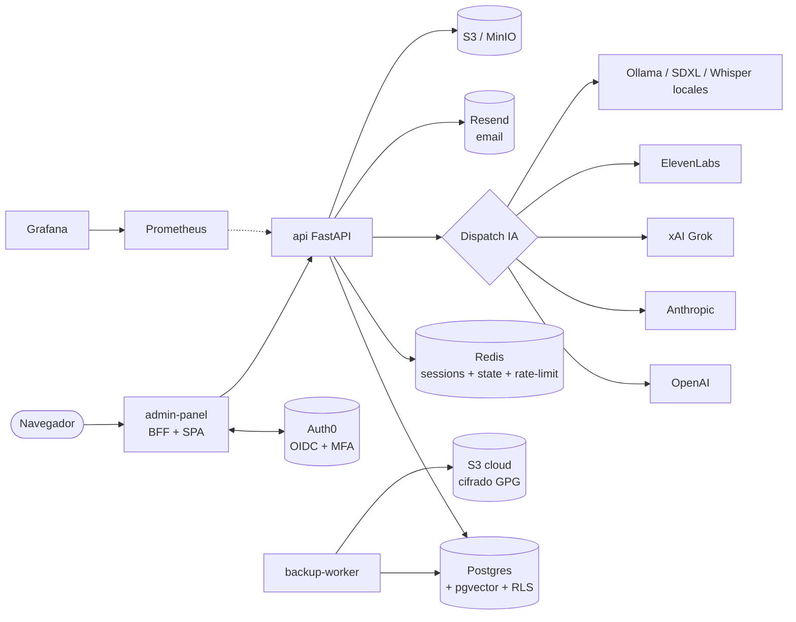

# CopilotoIA Core

> **Sistema operativo multi-tenant para construir SaaS de productos
> verticales sobre una base común de auth, RBAC, IA dispatch, billing,
> observabilidad y operaciones.**

[]()
[]()
[]()
[]()

---

## ¿Qué es esto?

CopilotoIA Core es la **base reutilizable** que se instala como `pip install
copiloto-core`. Cualquier SaaS multi-tenant vertical (CRM, gestión
documental, IoT, etc.) se construye encima del core sin reimplementar:

- **Autenticación** con Auth0 (OIDC RS256) + MFA + JWKS rotation
- **Multi-tenancy** con RLS de Postgres y aislamiento por transacción
- **RBAC dinámico** (roles + capabilities + matriz de permisos)
- **Dispatch de IA** unificado para LLM/Image/Video/TTS/STT con
  fallback chain, circuit breaker y backoff exponencial
- **Backups** cifrados con GPG + S3 + verificación opcional
- **Observabilidad** Prometheus + Grafana + OpenTelemetry
- **Audit log** y bitácora de operaciones cross-tenant
- **Admin panel** completo (React SPA + BFF FastAPI)

El **core nunca conoce productos** — los módulos opt-in se construyen
encima como paquetes Python independientes que importan
`from copiloto_core import create_app, CoreModule, ...`.

**¿Cómo construyo mi SaaS sobre el core?** Ver
[`docs/EXTENDING.md`](docs/EXTENDING.md) — la guía completa para
autores de módulos.

---

## Quick start (5 minutos, dev local)

### Opción A — Crear un nuevo SaaS encima del core (recomendado)

A partir de `v1.1.0` el core trae su propio scaffolder. **No** clones
este repo: instalá `copiloto-core` como librería en un proyecto nuevo.

**TL;DR** (cero → SaaS corriendo en 5 minutos):

```bash
gh auth setup-git
python3 -m venv .venv && source .venv/bin/activate
pip install "copiloto-core @ git+https://github.com/agentecopilotoai-code/copiloto-core.git@v1.4.0"
python -m copiloto_core new-project mi-saas --with-infra
cd mi-saas
pip install -e ".[dev]"
python -m copiloto_core generate-secrets
./scripts/dev-up.sh
```

Cuando ves `Uvicorn running on http://0.0.0.0:8000`, ya está corriendo.
Probá: `curl http://localhost:8000/v1/branding`.

**Guías completas**:
- **[docs/QUICKSTART.md](docs/QUICKSTART.md)** — desde cero, con
  pre-checks, troubleshooting y explicación de cada paso.
- **[docs/CLI.md](docs/CLI.md)** — catálogo de los 12 subcomandos del CLI.
- **[docs/AUTH0.md](docs/AUTH0.md)** — modelo de 3 capas de
  credenciales + configuración con `auth0-configure`.
- **[docs/EXTENDING.md](docs/EXTENDING.md)** — contrato de módulos
  para construir tu vertical.

### Opción B — Hackear el core mismo

Solo si vas a modificar el core (no para construir SaaS encima).

**Pre-requisitos:** Docker Desktop 4.x+ (o Docker Engine 24+), bash,
openssl, curl.

```bash
git clone https://github.com/agentecopilotoai-code/copiloto-core.git
cd copiloto-core
./scripts/generate-local-secrets.sh
./scripts/bootstrap.sh --reset --yes
./scripts/smoke-test.sh
open http://localhost:3000/admin
```

Para **producción** (Auth0 real + Resend + S3 cloud), seguir
[INSTALL.md](INSTALL.md) completo.

---

## Arquitectura en una imagen



**Detalle completo** + tabla de herramientas terceras + cómo se vinculan
→ [ARCHITECTURE.md](ARCHITECTURE.md).

---

## Estructura del repo

```
copiloto-core/
├── app/                          Backend Python (FastAPI + asyncpg)
│   ├── ai/                       Registry + dispatcher + 7 adapters IA
│   ├── admin/                    BFF del admin-panel (OAuth + sessions)
│   ├── api/v1/handlers/          Handlers HTTP transversales
│   ├── core/                     Auth, identity, config, security
│   ├── db/                       Pool asyncpg + helpers RLS
│   ├── platform_admin/           Endpoints platform-owner-only
│   └── services/                 Audit, metrics, rate-limit, url-safety, email
│
├── admin-panel/                  Frontend React + Vite + BFF
│   ├── src/features/             Componentes por dominio
│   ├── src/permissions/          Matriz capabilities × roles
│   └── Dockerfile                Build stage Node → runtime Python
│
├── infra/
│   ├── postgres/                 10-core.sql + 20-seed.sql + modules/
│   ├── backup-worker/            Dockerfile + scripts del cron
│   └── observability/
│       ├── prometheus.yml        Scrape config
│       ├── alerts.yaml           Alertas legacy (backup + metrics liveness)
│       ├── alerts/core.yml       Alertas post audit#4 (pool, AI, backup-24h)
│       └── grafana/dashboards/   core-health.json + README
│
├── docs/
│   ├── runbooks/                 db-pool-exhausted, ai-provider-down,
│   │                             backup-stale, auth0-key-rotation
│   └── ARCHITECTURE.md           (link al raíz)
│
├── scripts/
│   ├── bootstrap.sh              Setup completo desde cero
│   ├── bootstrap-admin-panel.sh  npm install + build del SPA
│   ├── configure-auth0.sh        Setup automático tenant Auth0 (17 secciones)
│   ├── generate-local-secrets.sh Random secrets para dev
│   ├── smoke-test.sh             Health checks post-bootstrap
│   └── run-cloud-backup.sh       Pipeline pg_dump + GPG + S3
│
├── tests/                        1026 tests (94.1% cov backend)
├── README.md                     ← estás aquí
├── ARCHITECTURE.md               Arquitectura completa + diagramas
├── INSTALL.md                    Instalación detallada paso a paso
├── pyproject.toml                Deps Python + ruff + pytest config
└── docker-compose.yml            Stack completo dev local
```

---

## Stack tecnológico (resumen)

### Runtime

| Capa | Tecnología | Versión |
|------|------------|---------|
| Backend | FastAPI + asyncpg + Pydantic v2 | Python 3.12+ |
| Frontend | React + Vite + vitest | Node 22+ |
| DB | PostgreSQL + pgvector | 16 |
| Cache / Session | Redis | 7+ |
| Almacenamiento | MinIO (dev) / S3 (prod) | — |
| Container | Docker + docker-compose v2 | — |

### Servicios externos

| Servicio | Para | Requerido |
|----------|------|-----------|
| **Auth0** | OIDC + MFA + Management API | ✅ Sí |
| **Resend** | Email transaccional | ⚠️ Opcional (sin él las invitaciones quedan pending) |
| **OpenAI / Anthropic / xAI / ElevenLabs** | AI providers cloud | ⚠️ Al menos uno si usás IA |
| **S3 cloud** | Backups off-site | ⚠️ Recomendado prod |
| **Prometheus + Grafana** | Observabilidad | ⚠️ Recomendado prod |

Detalle de cada uno + cómo configurarlo → [ARCHITECTURE.md § 2](ARCHITECTURE.md#2-herramientas-de-terceros)
y [INSTALL.md](INSTALL.md).

---

## Comandos comunes

```bash
# Desarrollo
docker compose up -d                       # levantar stack base
docker compose --profile observability up  # con Prometheus + Grafana
docker compose --profile backups up        # con backup-worker

# Tests
source .venv/bin/activate && pytest        # backend (1026 tests)
cd admin-panel && npx vitest run           # frontend

# Reset DB local
./scripts/bootstrap.sh --reset --yes

# Solo core, sin módulos opt-in
./scripts/bootstrap.sh --reset --yes --no-modules

# Cargar módulos específicos (cada módulo debe tener su SQL en
# infra/postgres/modules/<name>.sql — el branch `core` no incluye
# ninguno; vienen al instalar el módulo opt-in correspondiente)
./scripts/bootstrap.sh --module=<nombre> [--module=<otro>]

# Smoke test post-deploy
./scripts/smoke-test.sh

# Backup manual (desde el container worker)
docker compose exec backup-worker bash scripts/run-cloud-backup.sh

# Coverage report
pytest --cov=app --cov-report=html && open htmlcov/index.html
```

---

## Estado del proyecto

| Métrica | Valor |
|---------|-------|
| Backend tests | 1026 passed · 3 skipped (DB-integration) |
| Backend coverage | **94.1%** |
| Frontend tests | 2456 passed |
| Frontend coverage | **89.5%** (gate 86%) |
| Lint backend (ruff) | 0 errores |
| Auditorías cerradas | 4 (50 fixes implementados) |
| Vulnerabilidades P0/P1 | **0 open** |
| Commits en `main` | Últimos en `copiloto-core/main` |

---

## Roadmap

- [x] **Auth0 full automation** (script de 17 secciones idempotente)
- [x] **CRUD de Roles + Permisos** (Fase 2)
- [x] **Audit completo** (4 rondas) — todas las vulns P0/P1 cerradas
- [x] **Observabilidad** — Prometheus + Grafana dashboards + alertas + runbooks
- [ ] **Module discovery automático** (Fase 3) — cada módulo declara
      `manifest.json` con su nombre, prefijo de URL, capability, label;
      el core escanea al arranque y registra routers + sidebar items.
- [ ] **Multi-region active-active** con replicación logical de Postgres.
- [ ] **WAF + edge rate-limiting** (Cloudflare / AWS Shield).

---

## Documentación

| Doc | Propósito |
|-----|-----------|
| [README.md](README.md) | Visión rápida + quick start (este archivo) |
| [docs/QUICKSTART.md](docs/QUICKSTART.md) | **Onboarding desde cero**: 6 pasos copy-paste hasta SaaS corriendo + troubleshooting |
| [docs/CLI.md](docs/CLI.md) | **Referencia CLI**: catálogo de los 12 subcomandos con ejemplos + exit codes |
| [docs/CONSUMER_ROUTES.md](docs/CONSUMER_ROUTES.md) | **Mapa de rutas**: quién sirve qué (`/`, `/dashboard`, `/admin/`, `/v1/*`) + flujo de login |
| [docs/AUTH0.md](docs/AUTH0.md) | **Auth0**: modelo de 3 capas de credenciales + configuración + rotación |
| [docs/EXTENDING.md](docs/EXTENDING.md) | **Guía para autores de módulos** — cómo construir tu SaaS sobre el core |
| [ARCHITECTURE.md](ARCHITECTURE.md) | Arquitectura completa con diagramas + terceros + RLS + IA + observabilidad |
| [INSTALL.md](INSTALL.md) | Instalación paso a paso desde cero (Auth0 + Resend + Postgres + dev/prod) |
| [docs/runbooks/](docs/runbooks/) | Guías operativas para incidentes |
| [infra/observability/grafana/dashboards/README.md](infra/observability/grafana/dashboards/README.md) | Importar dashboards a Grafana |

### Runbooks operativos

- [auth0-key-rotation.md](docs/runbooks/auth0-key-rotation.md) — Rotación de signing keys, M2M secret, state secret
- [db-pool-exhausted.md](docs/runbooks/db-pool-exhausted.md) — Pool de asyncpg sin idle
- [ai-provider-down.md](docs/runbooks/ai-provider-down.md) — Provider IA degraded por > 5min
- [backup-stale.md](docs/runbooks/backup-stale.md) — Último backup > 24h

---

## Contribuir

- Mantener tests verdes: `pytest && cd admin-panel && npx vitest run`.
- Lint: `ruff check app/` debe pasar.
- Cualquier endpoint nuevo necesita tests + auditoría manual antes de merge.
- Para módulos opt-in: NO modificar el core; agregar en
  `app/<modulo>/` + `admin-panel/src/features/<modulo>/` +
  `infra/postgres/modules/<modulo>.sql`. Ver checklist en
  [ARCHITECTURE.md § 10](ARCHITECTURE.md#10-cómo-agregar-un-módulo-opt-in).

---

## Licencia

Propietario — uso interno Agente Copiloto IA.
