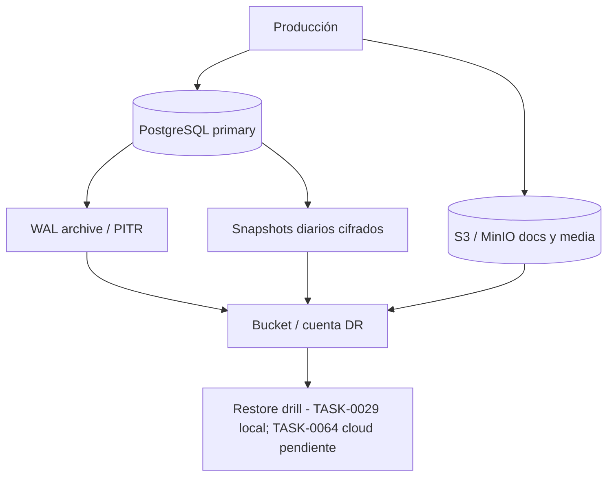
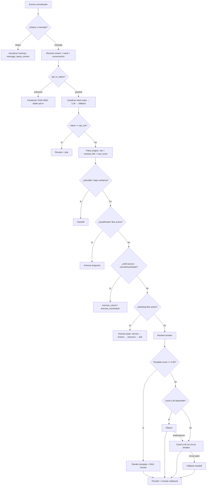
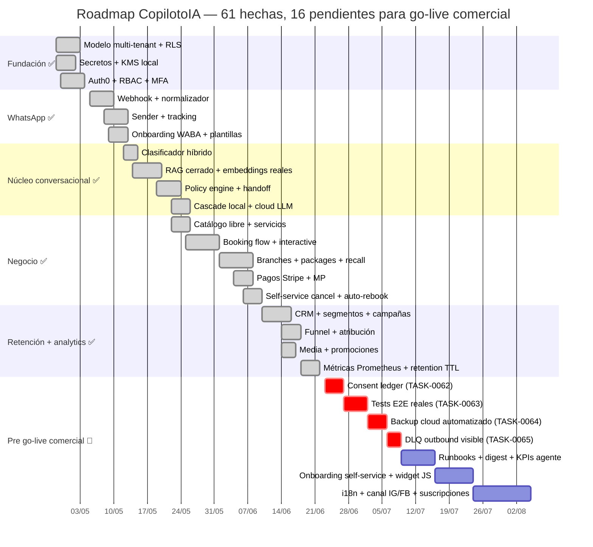

# CopilotoIA — Especificación técnica y estado actual del MVP multitenant

> **Lectura rápida**
> - **Qué es:** SaaS multitenant que automatiza la atención conversacional de pymes (talleres, salones, peluquerías, grooming, clínicas, fitness, profesionales independientes) sobre WhatsApp Business Platform y Widget Web, con agendamiento, cobros, CRM, campañas y analítica.
> - **Estado:** 61 tareas implementadas (TASK-0000 → TASK-0061). 16 tareas pendientes para go-live comercial (TASK-0062 → TASK-0076). Ningún tenant en producción aún.
> - **Cómo se levanta:** [`INSTALL.md`](INSTALL.md). Arranque local: `./scripts/bootstrap.sh`.
> - **Guía operativa runtime:** [`ARCHITECTURE.md`](ARCHITECTURE.md).
> - **Backlog y trazabilidad:** [`docs/BACKLOG.md`](docs/BACKLOG.md), [`docs/DONE.md`](docs/DONE.md).

---

## 1. Contexto y supuestos de diseño

Este documento define la arquitectura técnica del Copiloto IA: un SaaS multitenant con **un único core** y **packs verticales configurables**, porque los casos de uso comparten captura de datos, FAQs, agenda, reprogramación, recordatorios, estado y handoff humano. La integración principal es **WhatsApp Business Platform / Graph API** con una capa propia de abstracción para desacoplar cambios del proveedor; Meta publica especificaciones OpenAPI versionadas para mensajes, perfiles, números, soluciones y automatización conversacional, por lo que la recomendación técnica es encapsular todo acceso externo detrás de un adaptador interno estable.

Desde el punto de vista normativo, el sistema asume que la **Ley 1581 de 2012** aplica al tratamiento de datos personales y define autorización previa, roles de **Responsable** (cliente del SaaS) y **Encargado** (plataforma), y tratamiento como recolección, almacenamiento, uso, circulación o supresión. El **Decreto 1377 de 2013** exige designar a una persona o área para la función de protección de datos y regula transferencias internacionales. La **Circular Externa 002 de 2024 de la SIC** confirma que la normativa aplica al desarrollar, probar, desplegar o monitorear sistemas de IA, exige responsabilidad demostrada, privacidad desde el diseño y, en escenarios de alto riesgo, un estudio de impacto de privacidad documentado.

Desde el canal, la arquitectura respeta los límites reales de WhatsApp Business: la plataforma usa `/{Phone-Number-ID}/messages` para enviar mensajes y marcar leídos; los mensajes se identifican por un ID único; los estados se rastrean por webhooks; la Business Messaging Policy gobierna lo permitido; y la automatización conversacional oficial se configura sobre welcome messages, prompts, ice breakers y comandos, **no como sustitución integral del soporte humano**. El contrato de WhatsApp Business Solution exige que un tercero que procese Business Solution Data lo haga **solo en nombre del cliente**, siguiendo sus instrucciones, con salvaguardas técnicas, físicas y administrativas adecuadas. Por eso el diseño impone **orquestador con handoff humano obligatorio**, **no entrenamiento con datos del cliente** y **RAG cerrado por tenant**.

### 1.1 Restricciones operativas obligatorias

| Tema | Decisión vigente |
|---|---|
| Canal principal | WhatsApp Business Platform |
| Canal secundario | Widget Web (vivo desde TASK-0039) |
| Producto | SaaS multitenant, un solo core |
| API pública propia | REST `/v1` |
| GraphQL | Descartado |
| IAM del panel | JWT/OIDC vía Auth0 (HS256 local para dev) |
| LLM | Engine `cascade`: template → Ollama local (llama3.2:3b por default) → Claude `claude-sonnet-4-6` o OpenAI |
| Política de entrenamiento | No entrenamiento con datos del cliente |
| RAG | Cerrado por tenant + visibility |
| Diagnóstico clínico o técnico automático | Fuera de alcance |
| Handoff humano | Obligatorio (intent sensible, baja confianza, `max_bot_turns` superado) |
| Pagos | Stripe + MercadoPago (links + webhook firmado) |
| Idioma inicial | es-CO (TASK-0073 ampliará a es-MX/AR/CL/PE/EC/UY) |

### 1.2 Decisiones de producto fijadas

| Capa | Común a todos los tenants | Configurable por tenant |
|---|---|---|
| Inbox conversacional | Sí | — |
| Contactos y consentimiento | Sí | Etiquetas, notas, segmentos |
| Intenciones y estados | Taxonomía base común | Reglas de policy engine, keywords de risk |
| Agenda, recordatorios, reprogramación | Sí | Duración por servicio, recursos, sedes, slots |
| Catálogo de servicios | — | Sí (TASK-0033, free-form) |
| Calificación previa al booking | Motor común | Preguntas, opciones, branching (TASK-0042/0053/0054) |
| Sedes (multi-branch) | Modelo común | Sí (TASK-0050) |
| Paquetes / planes multi-cita | Modelo común | Sí (TASK-0051) |
| Recall automático post-cita | Sí | Intervalo en días por servicio (TASK-0052) |
| Biblioteca de medios y promociones | Sí | Sí (TASK-0046) |
| Perfil del especialista | Sí | Bio/foto/especialidad por recurso (TASK-0049) |
| Campañas y atribución | Sí | Segmentos + reglas (TASK-0047/0048) |
| Pagos | Sí | Provider (Stripe/MP), comisiones, monedas |
| Cotización orientativa / intake | Sí | Campos específicos por vertical |
| RAG | Arquitectura común | Corpus y prompts |
| Handoff humano | Obligatorio | Reglas de escalamiento |
| Política de retención GDPR | Sí | Días por entidad (TASK-0061) |
| Alertas operativas | Sí | Canales: email, WhatsApp, webhook (TASK-0057) |

### 1.3 Variables decididas durante la implementación

| Elemento | Estado |
|---|---|
| IdP | Auth0 con OIDC (RS256 en prod, HS256 local) |
| LLM cloud | Claude `claude-sonnet-4-6` (default) + OpenAI |
| LLM local | Ollama con llama3.2:3b por default |
| Dimensión de embedding | 1536 (`pgvector(1536)` + HNSW) |
| Cloud principal | agnóstico (compose corre cualquier cloud con Postgres + Redis + S3); referencia AWS en producción |
| Retención por tenant | configurable por entidad con default seguro (messages 365d, audit_logs 1825d, etc.) |
| Integraciones externas | Meta Graph + Stripe + MercadoPago + SMTP (alerts) + Ollama + Anthropic/OpenAI |
| Política de exportación | export firmado con TTL desde `/v1/tenants/{id}/data-export` |

---

## 2. Arquitectura de referencia (estado actual)

La arquitectura es **event-driven, web-first** y separa **ingestión**, **orquestación**, **operación humana**, **persistencia** y **observabilidad**. La razón es doble: los webhooks de WhatsApp operan mejor con procesamiento asíncrono e idempotente, y Meta documenta una superficie de API versionada y en evolución, por lo que conviene aislar la integración en adaptadores propios. La documentación pública de Meta también recomienda asumir rate limits estándar de Graph API y usar retry con backoff exponencial.

```mermaid
flowchart LR
    subgraph Externo
        U[Usuario WhatsApp]
        WS[Sitio web del tenant]
        M[Meta Graph API]
        SP[Stripe / MercadoPago]
        LLM_LOC[Ollama local]
        LLM_CLD[Claude / OpenAI]
        A[Agente humano en panel]
    end

    subgraph Borde
        WH[/v1/webhooks/whatsapp/]
        WP[/v1/webhooks/payments/]
        WBW[/v1/web/chat/*/]
        R[REST API /v1 — 150 endpoints]
        ADM[Admin Panel proxy]
    end

    subgraph Core
        N[event-worker - normalizador y outbound]
        O[rag_orchestrator]
        I[intent_classifier - 3 capas]
        P[policy_engine]
        K[rag_retrieval - ANN HNSW + léxico]
        IDX[rag_indexing pipeline]
        QF[qualification_flow]
        BF[booking_flow]
        SS[appointment_self_service]
        FF[feedback_flow]
        S[scheduler]
        OA[operator_alerts]
        RW[retention_worker]
        XW[extraction_worker]
    end

    subgraph Datos
        DB[(PostgreSQL + RLS - 38 tablas)]
        V[(pgvector HNSW)]
        OBJ[(MinIO / S3)]
        C[(Redis)]
        AUD[(audit_logs append-only)]
    end

    subgraph Observabilidad
        MET[/metrics Prometheus]
        ALT[6 reglas seed]
        OTL[otel-collector]
        GRA[Grafana opt-in]
    end

    U --> M --> WH
    WS --> WBW
    SP --> WP
    WH --> N
    WP --> R
    WBW --> R
    R --> O
    O --> I
    O --> P
    O --> K
    O --> QF
    O --> BF
    O --> SS
    O --> FF
    K --> V
    IDX --> V
    O --> N
    N --> M
    R --> DB
    R --> SP
    O --> LLM_LOC
    O --> LLM_CLD
    S --> N
    S --> OA
    S --> R
    OA --> R
    RW --> DB
    XW --> DB
    XW --> OBJ
    R --> DB
    R --> C
    R --> OBJ
    DB --> AUD
    A --> ADM --> R
    R --> MET
    N --> OTL
    R --> OTL
    MET --> ALT
    GRA --> MET
```

### 2.1 Componentes y responsabilidades vigentes

| Componente lógico | Implementación | Escalado |
|---|---|---|
| `api-gateway` | FastAPI con middleware de rate limit (TokenBucket) + CORS para web widget | horizontal |
| `webhook-receiver` | `webhook_router` (Meta + payments); valida firma HMAC, persiste raw, responde rápido | horizontal |
| `event-normalizer` | `app/workers/event_worker.py` | horizontal |
| `conversation-orchestrator` | `app/services/rag_orchestrator.py` (1539 LOC) | horizontal |
| `intent-service` | `app/services/intent_classifier.py` (rules → LLM → fallback) | horizontal |
| `policy-engine` | `app/services/policy_engine.py` | horizontal |
| `rag-service` | `app/services/rag_retrieval.py` + `rag_indexing.py` | horizontal |
| `action-engine` | `booking_flow.py`, `appointment_self_service.py`, `qualification_flow.py`, `feedback_flow.py`, `promotions.py`, `campaigns.py` | horizontal |
| `desk-api` | `tenant_ops_router` | horizontal |
| `scheduler` | `app/workers/scheduler.py` | singleton recomendado |
| `retention-worker` | `app/workers/retention_worker.py` (1×/día) | singleton |
| `alerts-worker` | `app/workers/alerts_worker.py` (reusable como subset del scheduler) | singleton |
| `extraction-worker` | `app/workers/extraction_worker.py` (PDF/DOCX) | horizontal |
| `postgres` | `pgvector/pgvector:pg16` con RLS, HNSW, btree_gist | vertical + réplica |
| `object-storage` | MinIO local; S3/GCS/Blob en cloud | gestionado |
| `redis` | `redis:7.4-alpine` con appendonly | horizontal |
| `otel/monitoring` | OTLP collector + Prometheus opt-in | horizontal |

### 2.2 Comunicación entre componentes

| Origen | Destino | Protocolo | Garantía |
|---|---|---|---|
| Meta | `webhook-receiver` | HTTPS POST con `X-Hub-Signature-256` | at-least-once |
| Stripe / MercadoPago | `webhook-receiver` | HTTPS POST firmado | at-least-once |
| Sitio web del tenant | `web_router` | HTTPS REST con CORS por tenant | síncrono |
| Panel web | `desk-api` | HTTPS REST con JWT Auth0 | síncrono |
| `webhook-receiver` | `domain_events` | enqueue SQL transaccional | durable |
| `event-worker` | Meta Graph API | HTTPS REST | retryable + idempotency_key |
| `api` / workers | PostgreSQL | SQL asyncpg | transaccional + RLS |
| `api` / workers | MinIO / S3 | S3 API | durable |
| `api` / orchestrator | Ollama / Claude / OpenAI | HTTPS REST | con circuit breaker para cloud |
| `scheduler` | `reminder_jobs` | SQL `for update skip locked` | durable + idempotente |
| `prometheus` | `api` / workers `/metrics` | HTTPS pull cada 15 s | best-effort |

### 2.3 Estrategia de despliegue

La opción de referencia para MVP es **cloud gestionada con contenedores sin Kubernetes** (Cloud Run / ECS Fargate / App Service / Container Apps). El diseño en AWS sería ECS Fargate + RDS PostgreSQL + ElastiCache Redis + S3 + Secrets Manager + KMS; en GCP Cloud Run + Cloud SQL + Memorystore + GCS + Secret Manager + Cloud KMS. Si se elige otra nube, debe reproducir backup PITR, cifrado en reposo con KMS, y secret manager con rotación.

| Plano | AWS referencia | GCP referencia | Local (compose) |
|---|---|---|---|
| Runtime API/workers | ECS Fargate | Cloud Run | docker-compose |
| Cola | DB-based (domain_events) | DB-based | DB-based |
| Base de datos | RDS PostgreSQL 16 + pgvector | Cloud SQL PostgreSQL 16 + pgvector | `pgvector/pgvector:pg16` |
| Cache | ElastiCache Redis 7 | Memorystore Redis 7 | `redis:7.4-alpine` |
| Objetos | S3 + SSE-KMS | GCS + CMEK | MinIO |
| Secretos | Secrets Manager + KMS | Secret Manager + Cloud KMS | `.secrets/` con chmod 600 |
| Observabilidad | CloudWatch + Prometheus | Cloud Monitoring + Prometheus | otel-collector + Prometheus opt-in |
| Identidad | Auth0 | Auth0 | Auth0 dev tenant + HS256 local |

### 2.4 Despliegue, DR y recuperación



El drill local de restore quedó validado en TASK-0029. La automatización en cloud con verificación periódica está pendiente como **TASK-0064** (P0 para go-live).

### 2.5 Objetivos operativos vigentes

| Métrica | Valor | Tipo | Medición |
|---|---:|---|---|
| RPO (objetivo) | 24 h | propuesta | snapshots diarios + WAL |
| RTO (objetivo) | 4 h | propuesta | restore documentado |
| p95 respuesta inbound | < 2 s | medido | `cpi_response_latency_seconds` |
| Reintento outbound transitorio | 1 m, 5 m, 15 m, 60 m | implementado | `reminder_jobs.retry_count` |
| Rate limit por IP/tenant | 60 req/min (default), 600 req/min (webhook) | implementado | `RateLimiter` |
| Circuit breaker | 5 fallos → 30 s open | implementado | `cpi_circuit_breaker_state` |
| Retention worker | 1×/día 03:00 UTC | implementado | `retention.cycle_completed` |
| Prueba de restore | mensual local | parcial | TASK-0064 pendiente para cloud |

---

## 3. Modelo de dominio y datos

El modelo separa **plataforma**, **tenant/canal**, **contactos y conversaciones**, **catálogo y agenda**, **paquetes y sedes**, **conocimiento/RAG**, **mensajería y plantillas**, **campañas y segmentos**, **pagos**, **jobs**, **retención GDPR**, y **auditoría**. La decisión central es un **shared database, shared schema** con `tenant_id` en cada tabla operativa y **Row-Level Security** activa.

Schema completo en [`infra/postgres/01-schema.sql`](infra/postgres/01-schema.sql) — **38 tablas, 1173 líneas**.

### 3.1 Modelo de clases UML (vigente)

```mermaid
classDiagram
    class Tenant {
      +uuid id
      +citext slug
      +text legalName
      +text displayName
      +text verticalCode
      +text timezone
      +text status
    }

    class TenantSettings {
      +uuid tenantId
      +jsonb businessHours
      +jsonb escalationPolicy
      +jsonb piiPolicy
      +jsonb notificationSettings
      +bool noTrain
      +int maxBotTurns
    }

    class TenantChannel {
      +uuid id
      +uuid tenantId
      +text provider
      +text wabaId
      +text phoneNumberId
      +text tokenRef
      +text appSecretRef
      +text status
    }

    class Contact {
      +uuid id
      +uuid tenantId
      +text waId
      +text phoneE164
      +bytea phoneHash
      +text optInStatus
      +jsonb leadSource
      +jsonb qualification
      +uuid referrerContactId
      +text[] tags
    }

    class Conversation {
      +uuid id
      +uuid tenantId
      +uuid contactId
      +uuid channelId
      +text status
      +text currentIntent
      +bool handoffRequired
      +jsonb metadata
    }

    class Message {
      +uuid id
      +text externalMessageId
      +text direction
      +text messageType
      +text status
      +jsonb payload
    }

    class Branch {
      +uuid id
      +uuid tenantId
      +text name
      +text address
      +numeric lat
      +numeric lng
      +text mapsUrl
    }

    class Resource {
      +uuid id
      +uuid tenantId
      +uuid branchId
      +text resourceType
      +text name
      +jsonb capabilities
      +jsonb profile
    }

    class ServiceCatalog {
      +uuid id
      +uuid tenantId
      +text serviceCode
      +text name
      +numeric price
      +int durationMin
      +int recallIntervalDays
      +uuid recallTemplateId
      +jsonb eligibility
    }

    class QualificationQuestion {
      +uuid id
      +uuid tenantId
      +text questionType
      +jsonb options
      +int sortOrder
    }

    class Appointment {
      +uuid id
      +uuid tenantId
      +uuid contactId
      +uuid resourceId
      +uuid branchId
      +text serviceCode
      +tstzrange slot
      +text status
      +text confirmationStatus
      +jsonb paymentLink
    }

    class TreatmentPackage {
      +uuid id
      +uuid tenantId
      +text name
      +int sessionsTotal
      +numeric price
    }

    class ContactPackage {
      +uuid id
      +uuid contactId
      +uuid packageId
      +int sessionsRemaining
      +text status
    }

    class AppointmentFeedback {
      +uuid appointmentId
      +int rating
      +text comment
    }

    class WhatsAppTemplate {
      +uuid id
      +uuid tenantId
      +text name
      +text category
      +text status
    }

    class MediaAsset {
      +uuid id
      +uuid tenantId
      +text kind
      +text storagePath
    }

    class Promotion {
      +uuid id
      +uuid tenantId
      +text title
      +timestamptz startsAt
      +timestamptz endsAt
    }

    class ContactSegment {
      +uuid id
      +uuid tenantId
      +jsonb rules
    }

    class Campaign {
      +uuid id
      +uuid tenantId
      +uuid segmentId
      +uuid templateId
      +text status
    }

    class CampaignAttribution {
      +uuid campaignId
      +uuid contactId
      +uuid appointmentId
      +numeric revenue
    }

    class ReminderJob {
      +uuid id
      +text kind
      +text targetType
      +uuid targetId
      +timestamptz scheduledFor
      +text status
    }

    class OperatorAlert {
      +uuid id
      +text kind
      +jsonb payload
      +text status
      +int attempts
    }

    class DataRetentionPolicy {
      +uuid tenantId
      +text entity
      +int retentionDays
      +bool anonymizeInsteadOfDelete
    }

    class Handoff {
      +uuid id
      +text reason
      +uuid assignedTo
      +text status
    }

    class KnowledgeDocument {
      +uuid id
      +text title
      +text visibility
      +text status
    }

    class KnowledgeChunk {
      +uuid id
      +uuid documentId
      +int chunkIndex
      +vector embedding
    }

    Tenant --> TenantSettings
    Tenant --> TenantChannel
    Tenant --> Contact
    Tenant --> Branch
    Branch --> Resource
    Tenant --> Resource
    Tenant --> ServiceCatalog
    Tenant --> QualificationQuestion
    Contact --> Conversation
    TenantChannel --> Conversation
    Conversation --> Message
    Conversation --> Handoff
    Contact --> Appointment
    Resource --> Appointment
    Branch --> Appointment
    Appointment --> AppointmentFeedback
    Tenant --> TreatmentPackage
    TreatmentPackage --> ContactPackage
    Contact --> ContactPackage
    Tenant --> WhatsAppTemplate
    Tenant --> MediaAsset
    Tenant --> Promotion
    Tenant --> ContactSegment
    ContactSegment --> Campaign
    Campaign --> CampaignAttribution
    Tenant --> ReminderJob
    Tenant --> OperatorAlert
    Tenant --> DataRetentionPolicy
    Tenant --> KnowledgeDocument
    KnowledgeDocument --> KnowledgeChunk
    Contact --> Contact : referrer
```



### 3.2 Diagrama relacional resumido

```mermaid
erDiagram
    TENANTS ||--|| TENANT_SETTINGS : has
    TENANTS ||--o{ TENANT_CHANNELS : owns
    TENANTS ||--o{ USER_TENANT_ROLES : scopes
    USERS ||--o{ USER_TENANT_ROLES : assigned
    TENANTS ||--o{ DATA_RETENTION_POLICIES : configures
    TENANTS ||--o{ OPERATOR_ALERTS : queues

    TENANTS ||--o{ BRANCHES : owns
    BRANCHES ||--o{ RESOURCES : groups
    TENANTS ||--o{ RESOURCES : owns
    TENANTS ||--o{ SERVICE_CATALOG : offers
    TENANTS ||--o{ QUALIFICATION_QUESTIONS : asks

    TENANTS ||--o{ CONTACTS : owns
    CONTACTS ||--o{ CONVERSATIONS : opens
    CONTACTS ||--o{ CONTACT_TAG_ASSIGNMENTS : tagged
    CONTACTS ||--o{ CONTACT_NOTES : annotated
    CONTACTS ||--o{ CONTACT_PACKAGES : purchases
    CONTACTS ||--o{ CONTACT_SEGMENT_MEMBERS : belongs_to
    CONTACTS ||--o{ APPOINTMENTS : books
    CONTACTS ||--o{ SERVICE_REQUESTS : creates
    CONTACTS }o--|| CONTACTS : referrer_contact_id

    CONVERSATIONS ||--o{ MESSAGES : contains
    MESSAGES ||--o{ MESSAGE_STATUS_EVENTS : tracks
    CONVERSATIONS ||--o{ HANDOFFS : escalates

    APPOINTMENTS ||--o| APPOINTMENT_FEEDBACK : receives
    APPOINTMENTS ||--o{ APPOINTMENT_PACKAGE_LINKS : counted_against
    SERVICE_REQUESTS ||--o| QUOTES : may_have
    RESOURCES ||--o{ APPOINTMENTS : allocates

    TENANTS ||--o{ TREATMENT_PACKAGES : sells
    TREATMENT_PACKAGES ||--o{ CONTACT_PACKAGES : sold_as

    TENANTS ||--o{ WHATSAPP_TEMPLATES : approves
    TENANTS ||--o{ REMINDER_JOBS : schedules
    TENANTS ||--o{ MEDIA_ASSETS : stores
    TENANTS ||--o{ PROMOTIONS : runs

    TENANTS ||--o{ CONTACT_SEGMENTS : defines
    TENANTS ||--o{ CAMPAIGNS : launches
    CAMPAIGNS ||--o{ CAMPAIGN_ATTRIBUTIONS : credits

    TENANTS ||--o{ KNOWLEDGE_DOCUMENTS : owns
    KNOWLEDGE_DOCUMENTS ||--o{ KNOWLEDGE_CHUNKS : splits
    TENANTS ||--o{ PROMPT_TEMPLATES : owns

    TENANTS ||--o{ WEBHOOK_EVENTS_RAW : receives
    TENANTS ||--o{ DOMAIN_EVENTS : emits
    TENANTS ||--o{ AUDIT_LOGS : records
```



### 3.3 Tablas principales (38 totales, agrupadas)

#### Plataforma, tenant, canal, usuarios

| Tabla | Campos clave | Notas |
|---|---|---|
| `tenants` | `id, slug, legal_name, display_name, vertical_code (free text), country_code, timezone, status` | `vertical_code` libre desde TASK-0033 |
| `tenant_settings` | `tenant_id PK, locale, business_hours, escalation_policy, pii_policy, notification_settings, no_train, max_bot_turns` | `notification_settings.complaint_alert_channels` desde TASK-0057 |
| `tenant_channels` | `id, tenant_id, provider, business_id, waba_id, phone_number_id, token_ref, app_secret_ref, status` | provider actual: `whatsapp_cloud_api` (Instagram pendiente en TASK-0074) |
| `users` | `id, auth_subject, email, display_name, status, mfa_enabled, last_login_at` | MFA obligatoria por rol (TASK-0016) |
| `user_tenant_roles` | `user_id, tenant_id, role, scopes[]` | roles: owner/admin/manager/agent/viewer/support |
| `data_retention_policies` | `tenant_id, entity, retention_days, anonymize_instead_of_delete` | TASK-0061 — defaults seguros sembrados |
| `operator_alerts` | `id, tenant_id, kind, payload, status, attempts, scheduled_for` | despacho multicanal con backoff exponencial |

#### Contactos y conversaciones

| Tabla | Campos clave |
|---|---|
| `contacts` | `id, tenant_id, wa_id, phone_e164, phone_hash, display_name, locale, opt_in_status, tags[], metadata, lead_source jsonb, qualification jsonb, referrer_contact_id` |
| `conversations` | `id, tenant_id, contact_id, channel_id, status, opened_by, current_owner_user_id, current_intent, vertical_case_type, handoff_required, service_window_expires_at, summary, metadata` |
| `messages` | `id, tenant_id, conversation_id, external_message_id, direction, sender_actor_type, message_type, body_text, media_id, mime_type, payload jsonb, status, timestamps, error_code, error_message` |
| `message_status_events` | reconciliación con webhooks de estado de Meta |
| `contact_tags`, `contact_tag_assignments` | etiquetas CRM TASK-0037 |
| `contact_notes` | notas internas para agentes |
| `handoffs` | `id, conversation_id, reason, assigned_to, status` |
| `contact_segments`, `contact_segment_members` | segmentos con `rules jsonb` (TASK-0047) |

#### Catálogo y agenda

| Tabla | Notas |
|---|---|
| `branches` | TASK-0050 — multi-sede con lat/lng/maps_url |
| `resources` | tipos: staff/bay/vehicle/seat/route; `profile jsonb` con bio/foto (TASK-0049); `branch_id` FK |
| `service_catalog` | TASK-0033 + 0052 + 0054 — recall + eligibility |
| `qualification_questions` | TASK-0042 + 0053 — tipos: yes_no/single_choice/multi_choice/free_text/number/budget_tier/urgency_level |
| `service_requests` | intake con `intake jsonb` |
| `quotes` | cotización orientativa con `line_items jsonb` |
| `appointments` | `EXCLUDE USING GIST (resource_id WITH =, tstzrange(starts_at, ends_at, '[)') WITH &&)`; `payment_link jsonb`, `closed_by_user_id` |
| `appointment_feedback` | rating 1-5★ + comment + escalado ≤2★ |
| `treatment_packages`, `contact_packages`, `appointment_package_links` | TASK-0051 — multi-cita |

#### Mensajería, plantillas, recordatorios, media

| Tabla | Notas |
|---|---|
| `whatsapp_templates` | sincronizado con Meta vía `POST /tenants/{id}/whatsapp/templates/sync` |
| `reminder_jobs` | `kind`: appointment_reminder_24h/1h, appointment_confirmation, post_appointment, service_recall, auto_rebook_timeout |
| `media_assets` | TASK-0046 |
| `promotions` | TASK-0046 — match contra intent |

#### Campañas y atribución

| Tabla | Notas |
|---|---|
| `campaigns` | TASK-0038 + counters |
| `campaign_attributions` | TASK-0048 — liga citas e ingresos a la campaña |

#### Conocimiento, IA, trazabilidad

| Tabla | Notas |
|---|---|
| `knowledge_documents` | source_type: upload/url/manual/text; visibility: faq/internal/agent_only |
| `knowledge_chunks` | `embedding vector(1536)` + índice HNSW |
| `prompt_templates` | versionados por scope + name + version |
| `webhook_events_raw` | `payload_sha256` UNIQUE para dedupe |
| `domain_events` | `idempotency_key` por tenant |
| `audit_logs` | append-only por trigger; 1825 días retención default |

### 3.4 Aislamiento por tenant

| Capa | Mecanismo |
|---|---|
| SQL | `tenant_id` + RLS con `app.current_tenant_id()` + `app.support_mode()` |
| Secretos | `.secrets/tenants/<TENANT_ID>/` con `chmod 600` y plan de rotación |
| Objetos | prefijos `knowledge/<tenant>/<doc_id>/`, `media/<tenant>/<asset_id>/` |
| Caché | claves namespaced por tenant |
| Logs | `structlog` con `tenant_id`, `trace_id`, `request_id` |
| RAG | filtro obligatorio `tenant_id + visibility` en `rag_retrieval.py` |
| Rate limit | bucket por `ip:tenant_uuid` |
| Circuit breaker | breaker por proveedor (proceso-local) |
| Jobs | colas lógicas en tablas por tenant |

### 3.5 RLS y funciones auxiliares (vigentes)

```sql
create schema if not exists app;

create or replace function app.current_tenant_id()
returns uuid
language sql stable
as $$
  select nullif(current_setting('app.tenant_id', true), '')::uuid
$$;

create or replace function app.support_mode()
returns boolean
language sql stable
as $$
  select coalesce(current_setting('app.support_mode', true), 'false') = 'true'
$$;

-- Loop genérico que aplica RLS a todas las tablas con tenant_id.
-- Política tipo:
create policy contacts_select_policy on app.contacts
for select using (tenant_id = app.current_tenant_id() or app.support_mode());
create policy contacts_insert_policy on app.contacts
for insert with check (tenant_id = app.current_tenant_id());
-- ... análogo para update/delete y para cada tabla.
```

`audit_logs` agrega un trigger anti-edición (`chk_audit_logs_no_anonymize` para retención) que bloquea UPDATE/DELETE en filas históricas.

### 3.6 SQL DDL principal

El bloque clave (38 tablas) está en [`infra/postgres/01-schema.sql`](infra/postgres/01-schema.sql). Extracto reducido (núcleo + extensiones del MVP):

```sql
create extension if not exists pgcrypto;
create extension if not exists citext;
create extension if not exists vector;
create extension if not exists btree_gist;

-- Núcleo
create table app.tenants (
  id uuid primary key default gen_random_uuid(),
  slug citext not null unique,
  legal_name text not null,
  display_name text not null,
  vertical_code text not null,            -- libre desde TASK-0032
  country_code char(2) not null default 'CO',
  timezone text not null default 'America/Bogota',
  status text not null check (status in ('trial','active','suspended','churned')),
  created_at timestamptz not null default now(),
  updated_at timestamptz not null default now(),
  deleted_at timestamptz
);

create table app.tenant_settings (
  tenant_id uuid primary key references app.tenants(id) on delete cascade,
  locale text not null default 'es-CO',
  business_hours jsonb not null default '{}'::jsonb,
  escalation_policy jsonb not null default '{}'::jsonb,
  pii_policy jsonb not null default '{}'::jsonb,
  notification_settings jsonb not null default '{}'::jsonb,
  no_train boolean not null default true,
  max_bot_turns integer not null default 8 check (max_bot_turns > 0),
  created_at timestamptz not null default now(),
  updated_at timestamptz not null default now()
);

-- Agenda con exclusión de solape
create table app.appointments (
  id uuid primary key default gen_random_uuid(),
  tenant_id uuid not null references app.tenants(id) on delete cascade,
  contact_id uuid not null references app.contacts(id) on delete cascade,
  branch_id uuid references app.branches(id) on delete set null,
  resource_id uuid references app.resources(id) on delete set null,
  service_code text not null,
  starts_at timestamptz not null,
  ends_at timestamptz not null,
  status text not null check (status in ('provisional','confirmed','rescheduled','cancelled','completed','no_show')),
  confirmation_status text not null default 'pending'
    check (confirmation_status in ('pending','confirmed','reminded','declined','cancelled')),
  payment_link jsonb,
  closed_by_user_id uuid references app.users(id),
  created_at timestamptz not null default now(),
  updated_at timestamptz not null default now(),
  check (starts_at < ends_at)
);

alter table app.appointments
  add constraint ex_appt_resource_no_overlap
  exclude using gist (
    resource_id with =,
    tstzrange(starts_at, ends_at, '[)') with &&
  )
  where (status in ('provisional','confirmed','rescheduled'));

-- Operator alerts (TASK-0057)
create table app.operator_alerts (
  id uuid primary key default gen_random_uuid(),
  tenant_id uuid not null references app.tenants(id) on delete cascade,
  kind text not null check (kind in ('negative_feedback','complaint')),
  payload jsonb not null,
  status text not null check (status in ('pending','sent','failed')),
  attempts int not null default 0,
  last_error text,
  scheduled_for timestamptz not null default now(),
  sent_at timestamptz,
  created_at timestamptz not null default now(),
  updated_at timestamptz not null default now()
);

-- Política de retención GDPR (TASK-0061)
create table app.data_retention_policies (
  tenant_id uuid not null references app.tenants(id) on delete cascade,
  entity text not null,                  -- messages, conversations, audit_logs, etc.
  retention_days int not null check (retention_days >= 30),
  anonymize_instead_of_delete boolean not null default false,
  updated_at timestamptz not null default now(),
  primary key (tenant_id, entity),
  constraint chk_audit_logs_no_anonymize check (
    entity <> 'audit_logs' or anonymize_instead_of_delete = false
  )
);

-- Vector (RAG cerrado por tenant)
create table app.knowledge_chunks (
  id uuid primary key default gen_random_uuid(),
  tenant_id uuid not null references app.tenants(id) on delete cascade,
  document_id uuid not null references app.knowledge_documents(id) on delete cascade,
  chunk_index integer not null,
  section_path text,
  chunk_text text not null,
  token_count integer not null,
  embedding vector(1536),
  metadata jsonb not null default '{}'::jsonb,
  created_at timestamptz not null default now(),
  unique (document_id, chunk_index)
);

create index hnsw_chunks_embedding on app.knowledge_chunks
  using hnsw (embedding vector_cosine_ops);
```

### 3.7 Elección de índice vectorial

`pgvector` soporta HNSW e IVFFlat. HNSW ofrece mejor relación velocidad/recall pero construye más lento y consume más memoria. Para el MVP el corpus por tenant es pequeño/mediano y la prioridad es respuesta consistente: **HNSW por defecto**. Si la dimensión del corpus o la memoria escalan, IVFFlat queda como opción de retroceso.

---

## 4. API, eventos y webhooks

La API pública propia es **REST versionada** (`/v1`). 150 endpoints distribuidos en 11 routers, cada uno con su dependency de seguridad. La superficie se documenta automáticamente en `http://localhost:8000/docs`.

### 4.1 Convenciones de autenticación y cabeceras

| Header | Uso |
|---|---|
| `Authorization: Bearer <jwt>` | autenticación Auth0 de usuarios humanos |
| `Authorization: Bearer <service-token>` | autenticación de workloads internos (activa `support_mode`) |
| `Content-Type: application/json` | payload JSON |
| `Idempotency-Key: <uuid>` | operaciones POST/PATCH mutantes |
| `X-Request-Id` | correlación end-to-end |
| `X-Tenant-Id` | tenant scope explícito; redundante con el `tenant_id` del token |
| `X-Hub-Signature-256` | firma HMAC de webhooks Meta (validada contra `app_secret_ref` del canal) |

### 4.2 Endpoints internos del SaaS (vigentes)

#### Tenants y canales

| Ruta | Método | Auth | Descripción |
|---|---|---|---|
| `/v1/tenants` | POST | `owner` plataforma | crear tenant |
| `/v1/tenant-signup` | POST | usuario autenticado | self-service inicial |
| `/v1/tenants/{id}` | GET | tenant scoped | detalle |
| `/v1/tenants/{id}` | PATCH | `admin` tenant | actualizar tenant |
| `/v1/tenants/{id}/status` | PATCH | `admin` tenant | trial/active/suspended |
| `/v1/tenants/{id}/settings` | GET / PATCH | `admin` tenant | settings + escalation policy + notifications |
| `/v1/tenants/{id}/members` | GET / POST / PATCH / DELETE | `admin` tenant | gestión de equipo |
| `/v1/tenants/{id}/channels/whatsapp` | POST / GET (health) / PATCH (mode) | `admin` tenant | onboarding WABA |
| `/v1/tenants/{id}/channels/web` | GET / PUT | `admin` tenant | configuración Widget Web |
| `/v1/tenants/{id}/retention/policies` | GET / PUT / GET preview | `admin` tenant | TTL GDPR (TASK-0061) |
| `/v1/tenants/{id}/knowledge/storage` | GET / PATCH | `admin` tenant | backend de almacenamiento |
| `/v1/tenants/{id}/payments/settings` | GET / PUT | `admin` tenant | Stripe/MercadoPago |
| `/v1/me/tenants` | GET | cualquier autenticado | tenant switcher Slack-style |

#### Contactos, conversaciones, mensajes

| Ruta | Método | Auth | Descripción |
|---|---|---|---|
| `/v1/contacts/upsert` | POST | service | alta/actualización (workers) |
| `/v1/contacts` | GET | `agent`+ | listar con filtros |
| `/v1/contacts/{id}` | GET | `agent`+ | ficha |
| `/v1/contacts/{id}/profile` | GET | `agent`+ | perfil completo |
| `/v1/contacts/{id}/tags` | POST / DELETE | `agent`+ | etiquetas CRM |
| `/v1/contacts/{id}/notes` | GET / POST | `agent`+ | notas internas |
| `/v1/contacts/{id}/packages` | GET / POST / PATCH / DELETE | `agent`+ | paquetes contratados |
| `/v1/contacts/{id}/suppress` | POST | `admin` | derecho al olvido |
| `/v1/conversations` | GET | `agent`+ | listar |
| `/v1/conversations/complaints` | GET | `agent`+ | pestaña Quejas |
| `/v1/conversations/start` | POST | `agent`+ | iniciar manualmente |
| `/v1/conversations/{id}` | GET | `agent`+ | detalle |
| `/v1/conversations/{id}/messages` | POST | `agent`+ | enviar desde desk |
| `/v1/conversations/{id}/messages/{msg_id}/media` | GET | `agent`+ | descarga firmada |
| `/v1/conversations/{id}/handoff` | POST | `agent`+ | crear handoff |
| `/v1/conversations/{id}/handoff/accept` | POST | `agent`+ | aceptar handoff |
| `/v1/conversations/{id}/release` | POST | `agent`+ | devolver al bot |

#### Negocio: agenda, catálogo, sedes, paquetes

| Ruta | Método | Auth | Descripción |
|---|---|---|---|
| `/v1/branches` | GET / POST / PATCH / DELETE | `admin` / `agent`+ | multi-sede (TASK-0050) |
| `/v1/packages` | GET / POST / PATCH / DELETE | `admin` / `agent`+ | paquetes (TASK-0051) |
| `/v1/resources` | GET / POST / PATCH / DELETE | `agent`+ | staff/bay/vehicle |
| `/v1/tenants/{id}/services` | GET / POST / PATCH / DELETE / reorder | `admin` / `agent`+ | catálogo (TASK-0033/0052) |
| `/v1/tenants/{id}/qualification-questions` | GET / POST / PATCH / DELETE / reorder | `admin` / `agent`+ | preguntas pre-booking (TASK-0042) |
| `/v1/tenants/{id}/availability` | GET | `agent`+ + service | slots libres |
| `/v1/service-requests` | POST / GET / PATCH | `agent`+ | intake |
| `/v1/service-requests/{id}/quotes` | POST / GET | `agent`+ | cotización |
| `/v1/quotes/{id}` | PATCH | `agent`+ | actualizar quote |
| `/v1/quotes/{id}/send` | POST | `agent`+ | enviar resumen |
| `/v1/appointments` | GET / POST | `agent`+ | listar / crear |
| `/v1/appointments/{id}` | PATCH | `agent`+ | reprogramar |
| `/v1/appointments/{id}/cancel` | POST | `agent`+ | cancelar |
| `/v1/appointments/{id}/feedback` | GET / POST | `agent`+ | rating + comentario |
| `/v1/appointments/{id}/payment-link` | POST | `agent`+ | generar link Stripe/MP |
| `/v1/appointments/{id}/send-payment` | POST | `agent`+ | enviar link al cliente |
| `/v1/appointments/{id}/payment-status` | PATCH | `agent`+ | actualizar manual |

#### Conocimiento y configuración IA

| Ruta | Método | Auth | Descripción |
|---|---|---|---|
| `/v1/knowledge/documents` | GET / POST / PATCH / DELETE | `admin` tenant | documentos |
| `/v1/knowledge/documents/upload` | POST | `admin` tenant | upload + extraction worker |
| `/v1/knowledge/documents/{id}/index` | POST | `admin` tenant | reindexar |
| `/v1/knowledge/reindex-all` | POST | `admin` tenant | reindexar todos |
| `/v1/prompts` | POST | `admin` tenant | crear prompt version |
| `/v1/intents/evaluate` | POST | `admin` tenant | test de intención + RAG |
| `/v1/tenants/{id}/media` | GET / POST / PATCH / DELETE | `admin` tenant | biblioteca (TASK-0046) |
| `/v1/tenants/{id}/promotions` | GET / POST / PATCH / DELETE | `admin` tenant | promociones (TASK-0046) |
| `/v1/tenants/{id}/whatsapp/templates` | GET / POST / PATCH / DELETE / sync | `admin` tenant | plantillas Meta |

#### Campañas y segmentación

| Ruta | Método | Auth | Descripción |
|---|---|---|---|
| `/v1/tenants/{id}/segments` | GET / POST / PATCH / DELETE | `admin` tenant | reglas (TASK-0047) |
| `/v1/tenants/{id}/segments/{id}/preview` | GET | `admin` tenant | preview de contactos matched |
| `/v1/tenants/{id}/segments/{id}/refresh` | POST | `admin` tenant | recalcular miembros |
| `/v1/tenants/{id}/segments/{id}/members` | POST | `admin` tenant | añadir manual |
| `/v1/tenants/{id}/campaigns` | GET / POST / PATCH | `admin` tenant | gestión (TASK-0038) |
| `/v1/tenants/{id}/campaigns/{id}/preview` | POST | `admin` tenant | dry run |
| `/v1/tenants/{id}/campaigns/{id}/launch` | POST | `admin` tenant | despachar |
| `/v1/tenants/{id}/campaigns/{id}/cancel` | POST | `admin` tenant | abortar |

#### Observabilidad, analítica, privacidad

| Ruta | Método | Auth | Descripción |
|---|---|---|---|
| `/v1/analytics/overview` | GET | `manager`+ | KPIs generales |
| `/v1/analytics/conversations` | GET | `manager`+ | funnel conversacional |
| `/v1/analytics/appointments` | GET | `manager`+ | agenda y no-show |
| `/v1/analytics/contacts` | GET | `manager`+ | CRM, opt-out, recurrencia |
| `/v1/analytics/funnel` | GET | `manager`+ | lead → cita → completada (TASK-0048) |
| `/v1/analytics/campaigns` | GET | `manager`+ | atribución (TASK-0048) |
| `/v1/analytics/referrals` | GET | `manager`+ | red de referidos (TASK-0055) |
| `/v1/audit-logs` | GET | `admin` tenant | auditoría |
| `/v1/audit-logs/export` | GET | `admin` tenant | CSV firmado |
| `/v1/tenants/{id}/readiness` | GET | `admin` tenant | go-live checklist |
| `/v1/tenants/{id}/data-export` | GET | `admin` tenant | export controlado |
| `/v1/contacts/{id}/suppress` | POST | `admin` tenant | derecho al olvido |
| `/metrics` | GET | IP allowlist | Prometheus (raíz, fuera de `/v1`) |

#### Webhooks y canal web

| Ruta | Método | Auth | Descripción |
|---|---|---|---|
| `/v1/webhooks/whatsapp` | GET | verify token | handshake Meta |
| `/v1/webhooks/whatsapp` | POST | firma HMAC | inbound + status |
| `/v1/webhooks/payments/{provider}` | POST | firma del provider | Stripe / MercadoPago |
| `/v1/web/chat/start` | POST | CORS + origin allowlist | iniciar sesión web |
| `/v1/web/chat/{id}/messages` | POST | CORS + origin | enviar mensaje |
| `/v1/web/chat/{id}/messages` | GET | CORS + origin | poll de mensajes |

#### Sistema interno

| Ruta | Método | Auth | Descripción |
|---|---|---|---|
| `/v1/contacts/upsert` | POST | service-token | normalización desde workers |
| `/v1/conversations` | POST | service-token | crear desde workers |
| `/v1/health` | GET | sin auth | health check |

### 4.3 Integración externa con Meta

| Endpoint externo | Método | Uso interno |
|---|---|---|
| `/{Version}/{Phone-Number-ID}/messages` | POST | enviar texto / template / interactive / mark as read |
| `/{Version}/{Phone-Number-ID}` | GET | health, quality, verification, limits |
| `/{Version}/{Phone-Number-ID}/whatsapp_business_profile` | GET / POST | perfil |
| `/{Version}/{Phone-Number-ID}/conversational_automation` | POST | welcome / prompts / commands |
| `/{Version}/{Media-ID}` y media URL | GET | descarga temporal (5 min) |
| `/{Version}/{WABA-ID}/message_templates` | GET / POST | plantillas (`POST /v1/tenants/{id}/whatsapp/templates/sync` lo consume) |
| `/{Version}/{Solution-ID}/access_token?business_id=...` | GET | MPS pendiente (preparado en abstracción) |

`MetaGraphVersion` actual: `v23.0` (configurable por `META_GRAPH_VERSION`).

### 4.4 Ejemplos de request/response

#### Crear cita

```json
POST /v1/appointments
Authorization: Bearer <jwt>
Content-Type: application/json
Idempotency-Key: 6a1177b5-5ccd-4039-a6d9-1dfd3dcaafe2

{
  "tenant_id": "6c3e0b60-0c11-4e46-8fd7-04f1ad0f1e44",
  "contact_id": "f8f8f6ff-89ec-4b54-a1a2-bd61f7c78ef2",
  "conversation_id": "13ae02b8-6cd8-4adf-9a0b-28d4c337e145",
  "branch_id": "b1a0fb7e-0fe1-4c5e-b1bf-44b6b6f5a111",
  "resource_id": "d6382fa0-9ff0-48f0-94e8-77cb0c58e39d",
  "service_code": "limpieza_dental",
  "starts_at": "2026-05-12T14:00:00-05:00",
  "ends_at":   "2026-05-12T14:45:00-05:00",
  "timezone": "America/Bogota",
  "notes": "Paciente nuevo; primer control"
}
```

```json
201 Created
{
  "id": "18eef6df-62cc-4d38-97ff-e4adde9a7b47",
  "status": "confirmed",
  "confirmation_status": "pending",
  "conflicts": [],
  "maps_url": "https://www.google.com/maps/search/?api=1&query=4.654,-74.05",
  "created_at": "2026-05-11T15:35:04Z"
}
```

#### Enviar mensaje desde desk

```json
POST /v1/conversations/13ae02b8-6cd8-4adf-9a0b-28d4c337e145/messages
Authorization: Bearer <jwt>
Idempotency-Key: 0c5e5f0f-fd49-40df-9b22-18b54c0f9dfd

{
  "channel": "whatsapp",
  "type": "text",
  "body": { "text": "Hola, te confirmamos tu cita de mañana 2 p.m." },
  "metadata": { "origin": "agent" }
}
```

```json
202 Accepted
{ "request_id": "req_01JT0P3Y4RP7G2KWW", "message_job_status": "queued" }
```

#### Iniciar conversación desde Widget Web

```json
POST /v1/web/chat/start
Content-Type: application/json

{
  "tenant_id": "6c3e0b60-0c11-4e46-8fd7-04f1ad0f1e44",
  "visitor_id": "v_8af3...",
  "lead_source": { "channel": "web", "utm_source": "google", "utm_campaign": "limpieza-mayo" }
}
```

```json
201 Created
{
  "conversation_id": "1c1f...",
  "messages_url": "/v1/web/chat/1c1f.../messages",
  "welcome_message": "Hola, soy el asistente de Clínica Andina. ¿Cómo puedo ayudarte?"
}
```

### 4.5 Catálogo de eventos internos

Eventos persistidos en `domain_events` con `idempotency_key` por tenant:

| Evento | Disparador |
|---|---|
| `wa.inbound.received` | webhook inbound |
| `wa.status.updated` | webhook status |
| `contact.upserted` | contacto creado/actualizado |
| `conversation.opened` | creación o reapertura |
| `intent.classified` | salida del clasificador |
| `rag.retrieval.completed` | retrieval exitoso |
| `qualification.completed` | calificación terminada |
| `action.service_request.created` | intake completo |
| `action.appointment.created` | cita creada |
| `action.appointment.rescheduled` | cita movida |
| `action.appointment.cancelled` | cita cancelada |
| `action.appointment.completed` | cita marcada completada |
| `bot.appointment_cancelled` | cancelación por bot (self-service o timeout) |
| `action.quote.sent` | cotización comunicada |
| `feedback.received` | rating + comentario |
| `feedback.negative_escalated` | TASK-0045 |
| `handoff.requested` | requiere humano |
| `handoff.accepted` | humano toma control |
| `handoff.resolved` | humano cierra |
| `message.outbound.requested` | encolado |
| `message.outbound.failed` | fallo definitivo |
| `payment.link_generated` | TASK-0040 |
| `payment.completed` | webhook Stripe/MP |
| `payment.failed` | webhook Stripe/MP |
| `campaign.dispatched` | TASK-0038 |
| `segment.refreshed` | TASK-0047 |
| `recall.scheduled` | TASK-0052 |
| `auto_rebook.started` | TASK-0044 |
| `auto_rebook.timeout` | TASK-0056 |
| `operator_alert.queued` | TASK-0057 |
| `retention.cycle_completed` | TASK-0061 |
| `document.indexed` | documento listo |
| `job.retry.scheduled` | retry programado |
| `audit.entry.created` | acción sensible o administrativa |

#### Esquema canónico de evento

```json
{
  "$schema": "https://json-schema.org/draft/2020-12/schema",
  "title": "CanonicalDomainEvent",
  "type": "object",
  "required": ["id", "type", "tenant_id", "source", "occurred_at", "payload", "schema_version"],
  "properties": {
    "id":             { "type": "string", "format": "uuid" },
    "type":           { "type": "string" },
    "tenant_id":      { "type": "string", "format": "uuid" },
    "source":         { "type": "string" },
    "subject":        { "type": "string" },
    "trace_id":       { "type": "string" },
    "occurred_at":    { "type": "string", "format": "date-time" },
    "schema_version": { "type": "integer", "minimum": 1 },
    "idempotency_key":{ "type": "string" },
    "payload":        { "type": "object" }
  }
}
```

---

## 5. Orquestación conversacional, RAG y diseño multitenant

El servidor ejecuta una lógica **guiada por estado**, no una conversación libre. La secuencia, implementada en `app/services/rag_orchestrator.py`, es: normalización del evento → resolución de tenant/canal/conversación → consentimiento → clasificación → policy → flujos activos (qualification / self-service / booking / feedback) → retrieval autorizado → respuesta en cascade → outbound idempotente → handoff cuando aplique.



### 5.1 Taxonomía mínima de intenciones vigente

| Grupo | Intenciones |
|---|---|
| FAQ | horario, ubicación, cobertura, medios_pago, precios_orientativos, políticas |
| Agenda | reservar, confirmar, reprogramar, cancelar, disponibilidad |
| Calificación | continuar, abandonar (con keyword), saltar opcional |
| Servicio (vertical-agnóstico) | crear_solicitud, seguimiento_estado, enviar_fotos, cobertura_zona, recall_response |
| Riesgo | queja, garantía_excepción, descuento_excepción, tema_clínico, tema_legal |
| Canal | opt_in, opt_out, fuera_de_alcance, unsupported_message |
| Pagos | pagar_ahora, comprobante_pago, pago_fallido |
| Promociones | preguntar_promocion, aceptar_promocion |

### 5.2 Clasificación híbrida

| Capa | Implementación |
|---|---|
| `rule-router` | keywords, catálogos, regex, comandos en `intent_classifier._rule_layer` |
| `intent-llm` | cloud LLM o local cuando reglas no bastan; prompt acotado a la taxonomía |
| `risk-detector` | reglas + signals en policy engine |
| `fallback-human` | si confidence < 0.70 o intent ambiguo |

| Umbral | Valor |
|---|---:|
| aceptar intent por LLM | `confidence >= 0.78` |
| ejecutar acción sin humano | `confidence >= 0.85` y entidades completas |
| handoff automático | `confidence < 0.70` o caso sensible |
| responder con RAG | template_min_score `0.55` por default |
| disparar local LLM | `cascade_llm_min_score >= 0.12` |

### 5.3 RAG cerrado por tenant

Reglas duras (implementadas en `rag_retrieval.py`):

1. nunca mezclar documentos entre tenants;
2. filtro `tenant_id = $1 AND visibility IN (...)` siempre;
3. `agent_only` nunca se sirve al usuario final, solo al desk;
4. no se consulta web pública;
5. trazabilidad: `domain_events('rag.retrieval.completed')` con doc_ids, scores y versión del prompt.

#### Pipeline de ingestión (`rag_indexing.py`)

| Paso | Resultado |
|---|---|
| upload | objeto en MinIO + `knowledge_documents` registrado |
| extracción | `extraction_worker` procesa PDF/DOCX fuera del request |
| sanitización | control de instrucciones hostiles y caracteres de control |
| chunking | `chunk_index, section_path, token_count` |
| embeddings | provider real (OpenAI / Claude / Ollama) o `local_hash` para dev |
| indexado | inserción en `knowledge_chunks` con HNSW |
| validación | smoke test de retrieval |
| publicación | `status='ready'` |

OWASP advierte de prompt injection vía documentos. La sanitización, allowlist de herramientas y separación instrucciones-vs-contenido son obligatorias.

#### Prompt base del sistema (vigente)

```text
Eres el asistente operativo de {{tenant_display_name}}.
Tu objetivo es responder preguntas frecuentes, recoger datos completos, agendar,
reprogramar, recordar y escalar a humano cuando el caso sea ambiguo, sensible o
fuera de política.

Reglas:
- No inventes políticas, precios finales ni disponibilidad.
- Usa solo conocimiento recuperado del tenant actual.
- No accedas ni hagas referencia a datos de otros tenants.
- Si falta información esencial, pide solo el dato mínimo faltante.
- Si el caso es sensible, de salud, jurídico, garantía excepcional o reclamo, escala a humano.
- Si el cliente pide hablar con un humano, escala sin pelearlo.
```

### 5.4 Motor de acciones (action engine)

| Acción | Requisitos | Efecto |
|---|---|---|
| `create_service_request` | contacto + tipo + intake mínimo | inserta `service_requests` |
| `create_quote` | solicitud existente | inserta `quotes` |
| `create_appointment` | slot + recurso + branch + contacto | inserta `appointments` |
| `reschedule_appointment` | cita existente + nuevo slot | actualiza + emite evento |
| `cancel_appointment` | cita existente | cancela + emite evento |
| `schedule_reminder` | target + plantilla | inserta `reminder_jobs` |
| `start_qualification_flow` | conversación | persiste estado en `conversation.metadata` |
| `start_booking_flow` | conversación | idem |
| `start_auto_rebook_flow` | cita declinada | TASK-0044 + timeout TASK-0056 |
| `escalate_negative_feedback` | rating ≤2★ | abre handoff + etiqueta + alerta operativa |
| `match_promotion` | mensaje del cliente | inserta media de la promoción activa |
| `generate_payment_link` | cita + provider | crea link Stripe/MP |
| `handoff_human` | cualquiera | inserta `handoffs` |

### 5.5 Colas, retries e idempotencia

Tratamiento at-least-once para Meta. Claves de idempotencia:

| Operación | Clave |
|---|---|
| webhook inbound | `payload_sha256` UNIQUE |
| mensaje outbound | `Idempotency-Key` + `conversation_id` |
| cita | `contact_id + resource_id + starts_at + service_code` |
| reminder | `target_type + target_id + template_name + scheduled_for` |
| recall | `appointment_id + kind='service_recall'` |
| auto_rebook_timeout | `conversation_id + appointment_id + source='auto_rebook'` |
| operator_alert | natural por `id` + `for update skip locked` |
| retention cycle | `retention:<tenant>:<YYYY-MM-DD>` |

| Tipo de fallo | Estrategia |
|---|---|
| `429`, `5xx`, `is_transient=true` | retry 1m, 5m, 15m, 60m, luego DLQ visible (TASK-0065) |
| token expirado | refresh + 1 retry |
| URL de media vencida | reobtener + 1 retry |
| circuit breaker open | degrade al tier inferior del cascade |
| conflicto de agenda | no retry automático |
| validación de negocio | no retry automático |

### 5.6 Diseño multitenant y onboarding de WABA

| Modo | Descripción | Estado |
|---|---|---|
| `direct_waba` | el cliente conecta su WABA al tenant | **vigente** |
| `mps` | partner usa Multi-Partner Solutions con token granular | abstracción lista; activación pendiente |

Aunque el MVP usa `direct_waba`, el `token_manager` (resolver por `tenant_channels.token_ref` y `app_secret_ref`) está diseñado para soportar resolución por `solution_id + business_id` sin reescribir el core.

#### Checklist de onboarding WABA

| Paso | Validación |
|---|---|
| alta de tenant | slug, vertical (libre), timezone |
| alta de canal | `provider=whatsapp_cloud_api` |
| registrar IDs | `business_id`, `waba_id`, `phone_number_id` |
| health inicial | `verified_name`, `quality_rating`, `messaging_limit_tier` (`GET /v1/tenants/{id}/channels/whatsapp/health`) |
| configurar webhook | `GET /v1/webhooks/whatsapp` con `hub.verify_token` + `POST` con HMAC |
| cargar plantillas | sync desde Meta (`POST /v1/tenants/{id}/whatsapp/templates/sync`) |
| configurar perfil | about, email, address, websites |
| prueba técnica | inbound + outbound + status + media (smoke test) |

---

## 6. Seguridad, cumplimiento, infraestructura y operación

Seguridad por diseño: secretos fuera de la base, cifrado en tránsito y reposo, MFA para perfiles privilegiados, RBAC por tenant, auditoría exhaustiva, logs con minimización de PII, backups PITR, política de no entrenamiento. La SIC exige medidas auditables y multinivel: tecnológicas, humanas, administrativas, físicas, contractuales.

### 6.1 Cifrado, claves y secretos

| Activo | Ubicación recomendada | Protección |
|---|---|---|
| Access tokens Meta | Secret Manager + KMS / `.secrets/tenants/<id>/meta_access_token` local | rotación + versionado |
| App secrets Meta | Secret Manager / `.secrets/tenants/<id>/whatsapp_app_secret` | KMS en cloud |
| Verify tokens | `.secrets/tenants/<id>/whatsapp_verify_token` | nunca en DB |
| Webhook secrets payments | `.secrets/tenants/<id>/payments_webhook_secret` | nunca en DB |
| Alerts webhook secret (HMAC) | `.secrets/tenants/<id>/alerts_webhook_secret` | usado por TASK-0057 |
| Cloud LLM keys | env + `.secrets/tenants/<id>/cloud_llm_api_key` | rotación trimestral |
| Credenciales de BD | env / Secret Manager / IAM auth | sin `.env` persistente |
| Media / snapshots / exports | S3 / MinIO | SSE-KMS en cloud |
| Backups lógicos | bucket dedicado | cifrado + retención (TASK-0064) |

### 6.2 Payload encryption de WhatsApp

Meta documenta una capa opcional de **payload encryption** sobre `/messages` y echoes en webhooks usando **JWE** con RSA 2048. Tratada como **endurecimiento post-MVP**: no es imprescindible para arrancar pero sí recomendable cuando el valor de la información del tenant lo justifique.

### 6.3 RBAC, MFA y soporte

| Rol | Permisos principales |
|---|---|
| `owner` | admin total del tenant, exportes, usuarios, privacidad |
| `admin` | canales, documentos, prompts, settings, catálogo, branches, templates, segments, campaigns |
| `manager` | analítica, agenda, visión operacional |
| `agent` | conversations, handoffs, citas, solicitudes, contactos, payment links |
| `viewer` | lectura |
| `support` | acceso temporal excepcional y auditado (`support_mode=true` en RLS) |

MFA obligatoria para `owner`, `admin`, `manager`, `support` (TASK-0016).

### 6.4 PII handling

| Regla | Implementación |
|---|---|
| minimización | pedir solo datos necesarios por acción |
| hashing | `contacts.phone_hash` para analítica agregada |
| logs redactados | `structlog` con filtro de PII |
| visibilidad documental | `faq`, `internal`, `agent_only` |
| exports | firmados + TTL + autorización explícita |
| supresión | `POST /v1/contacts/{id}/suppress` → `opt_in_status='suppressed'` + anonimización |
| retención | `data_retention_policies` por entidad + worker diario |

### 6.5 Notas DPA, DPO y gobierno de datos

La Ley 1581 y el Decreto 1377 exigen bases legales claras, autorización previa y distinción Responsable/Encargado. El Decreto exige designar a una persona/área para protección de datos y regula transmisiones internacionales. La SIC añade accountability, privacy by design, gestión de riesgos y PIA en escenarios de alto riesgo. La implementación mínima incluye:

- DPA / anexo de tratamiento (`docs/DPA.md`).
- Registro de subencargados.
- Política de no entrenamiento documentada y firmada.
- Flujo de atención de titulares (`/v1/contacts/{id}/suppress`).
- Evidencia de opt-in/opt-out (**ledger auditable pendiente en TASK-0062**).
- Responsable interno de privacidad designado por el cliente del SaaS.

### 6.6 Política de no entrenamiento

1. Los datos del cliente no se usan para entrenar modelos compartidos.
2. No se hace fine-tuning general con Business Solution Data.
3. El retrieval usa exclusivamente documentos del tenant.
4. Las evaluaciones internas se anonimizan o sintetizan.
5. Cualquier cambio de finalidad requiere nueva base legal/autorización.

### 6.7 Infraestructura recomendada (resumen)

| Capa | Recomendación |
|---|---|
| Runtime | contenedores gestionados sin Kubernetes en MVP (Cloud Run / ECS Fargate) |
| Base de datos | PostgreSQL 16 gestionado con PITR + pgvector |
| Cache | Redis gestionado |
| Cola | DB-based (`domain_events`) — gestionada externa solo si se requiere |
| Secretos | gestor de secretos con KMS |
| Objetos | almacenamiento con SSE-KMS |
| Observabilidad | OpenTelemetry + Prometheus + alertas + runbooks (TASK-0066) |
| CI/CD | `.github/workflows/ci.yml` con lint + tests; job E2E pendiente (TASK-0063) |
| IaC | pendiente (sugerido Terraform) |

### 6.8 Pruebas y UAT

| Tipo de prueba | Casos mínimos | Estado |
|---|---|---|
| Unitarias / estáticas | validadores, state machines, policies | **1020 passed + 11 skipped** |
| Integración | webhook → cola → worker → DB → sender | parcial (sin Postgres real en mayoría) |
| Contrato | requests/responses REST, errores, headers | parcial |
| RAG | groundedness, denials, no cross-tenant leakage | sí (`test_rag_retrieval.py`) |
| Seguridad | RLS, RBAC, MFA, support mode, secretos | sí (`test_rls_multitenant_e2e.py`, `test_mfa_enforcement.py`, `test_tenant_access.py`) |
| Resiliencia | token refresh, retry, DLQ, URLs media vencidas | parcial |
| DR | restore PITR | local (TASK-0029); cloud pendiente (TASK-0064) |
| E2E journey | inbound → cita → recordatorio → no-show → feedback → recall | **pendiente TASK-0063** |
| UAT por vertical | taller / belleza / mascotas / clínica / fitness | manual con tenants demo |

### 6.9 Checklist de despliegue

| Fase | Control |
|---|---|
| Predeploy | migraciones revisadas (`infra/postgres/01-schema.sql`), índices listos, secretos creados, plantillas base cargadas, defaults de retención sembrados |
| Deploy | health checks, workers conectados (`event-worker`, `scheduler`, `retention-worker`, `alerts-worker`, `extraction-worker`), rate limiter activo, métricas accesibles solo desde allowlist |
| Postdeploy | smoke tests inbound/outbound/status/media, prueba de cascade (template + local + cloud), prueba de circuit breaker |
| Seguridad | MFA activa, roles mínimos, support mode desactivado, secretos rotados desde defaults |
| DR | snapshot inicial + prueba de restore agendada (TASK-0064 cuando esté implementada) |
| Compliance | DPA firmado, política de no entrenamiento, avisos de tratamiento actualizados, consent ledger activo (TASK-0062) |

### 6.10 Roadmap técnico (estado)



---

## 7. Anexos

### 7.1 JSON Schema de `SendMessageRequest`

```json
{
  "$schema": "https://json-schema.org/draft/2020-12/schema",
  "title": "SendMessageRequest",
  "type": "object",
  "required": ["channel", "type"],
  "properties": {
    "channel": { "type": "string", "enum": ["whatsapp", "web"] },
    "type":    { "type": "string", "enum": ["text", "template", "interactive", "media", "read_receipt"] },
    "body":    { "type": "object" },
    "reply_to_external_message_id": { "type": "string" },
    "metadata": { "type": "object" }
  }
}
```

### 7.2 JSON Schema de `ServiceRequestCreate`

```json
{
  "$schema": "https://json-schema.org/draft/2020-12/schema",
  "title": "ServiceRequestCreate",
  "type": "object",
  "required": ["tenant_id", "contact_id", "service_type"],
  "properties": {
    "tenant_id":       { "type": "string", "format": "uuid" },
    "contact_id":      { "type": "string", "format": "uuid" },
    "conversation_id": { "type": "string", "format": "uuid" },
    "vertical_code":   { "type": "string" },
    "service_type":    { "type": "string" },
    "asset_type":      { "type": "string" },
    "asset_brand":     { "type": "string" },
    "asset_model":     { "type": "string" },
    "problem_summary": { "type": "string" },
    "location_address":{ "type": "string" },
    "urgency":         { "type": "string", "enum": ["low", "normal", "high", "critical"] },
    "preferred_date":  { "type": "string", "format": "date" },
    "preferred_slot":  { "type": "string" },
    "intake":          { "type": "object" }
  }
}
```

### 7.3 JSON Schema de `AppointmentCreate`

```json
{
  "$schema": "https://json-schema.org/draft/2020-12/schema",
  "title": "AppointmentCreate",
  "type": "object",
  "required": ["tenant_id", "contact_id", "service_code", "starts_at", "ends_at"],
  "properties": {
    "tenant_id":         { "type": "string", "format": "uuid" },
    "contact_id":        { "type": "string", "format": "uuid" },
    "conversation_id":   { "type": "string", "format": "uuid" },
    "service_request_id":{ "type": "string", "format": "uuid" },
    "branch_id":         { "type": "string", "format": "uuid" },
    "resource_id":       { "type": "string", "format": "uuid" },
    "service_code":      { "type": "string" },
    "starts_at":         { "type": "string", "format": "date-time" },
    "ends_at":           { "type": "string", "format": "date-time" },
    "timezone":          { "type": "string" },
    "notes":             { "type": "string" }
  }
}
```

### 7.4 Plantillas WhatsApp mínimas requeridas

| Caso | Template (categoría) |
|---|---|
| Solicitud de consentimiento (TASK-0062 pendiente) | `consent_request_v1` (UTILITY) |
| Confirmación de cita | `appointment_confirmation_v1` (UTILITY) |
| Recordatorio 24 h | `appointment_reminder_24h_v1` (UTILITY) |
| Recordatorio 1 h | `appointment_reminder_1h_v1` (UTILITY) |
| Post-cita / feedback | `post_appointment_v1` (UTILITY) |
| Recall ("control en N meses") | `service_recall_v1` (UTILITY) |
| Auto-rebook ofreciendo slots | `auto_rebook_v1` (UTILITY) |
| Link de pago | `payment_link_v1` (UTILITY) |
| Campaña genérica | `campaign_v1` (MARKETING) |
| Alerta de queja al operador | `complaint_alert_v1` (UTILITY) |
| Promoción activa | `promotion_v1` (MARKETING) |
| Reafirmación de consentimiento (TASK-0062) | `consent_reaffirm_v1` (UTILITY) |

### 7.5 Decisiones técnicas finales (vigentes)

| Tema | Decisión |
|---|---|
| Persistencia principal | PostgreSQL 16 gestionado |
| Vector DB | pgvector(1536) |
| Índice vectorial inicial | HNSW |
| Aislamiento | shared schema + `tenant_id` + RLS |
| Canal principal | WhatsApp Business Platform |
| Canal secundario | Widget Web |
| API producto | REST `/v1` (150 endpoints) |
| Tokens | secretos fuera de DB (`.secrets/tenants/<id>/*`) |
| Modo WABA inicial | `direct_waba` |
| Modo partner future-ready | `mps` con abstracción `token_manager` |
| RAG | cerrado por tenant + visibility |
| Handoff humano | obligatorio |
| Política de entrenamiento | no entrenamiento |
| Engine de respuesta | `cascade` (template → local LLM → cloud LLM → handoff) |
| LLM local default | Ollama llama3.2:3b |
| LLM cloud default | Claude `claude-sonnet-4-6` |
| Embedding | OpenAI `text-embedding-3-small` (1536) o equivalente Anthropic/Ollama |
| Pagos | Stripe + MercadoPago con webhook firmado |
| Identidad | Auth0 / OIDC con MFA |
| Observabilidad | Prometheus + Grafana opt-in + OTLP |
| Retención GDPR | configurable por tenant y entidad, worker diario |
| Rate limit | TokenBucket por IP/tenant (60/600 req/min) |
| Circuit breaker | por proveedor (5 fallos → 30 s open) |

### 7.6 Pendientes para go-live comercial

| TASK | Severidad | Descripción |
|---|---|---|
| TASK-0062 | P0 | Doble opt-in + consent ledger auditable |
| TASK-0063 | P0 | Tests E2E reales con DB efímera |
| TASK-0064 | P0 | Backups automatizados en cloud + verificación |
| TASK-0065 | P0 | DLQ de mensajes outbound visible en panel |
| TASK-0066 | P1 | Runbooks por incidente |
| TASK-0067 | P1 | Digest periódico al manager |
| TASK-0068 | P2 | KPIs por agente en analytics |
| TASK-0069 | P2 | Wizard de onboarding self-service |
| TASK-0070 | P2 | Widget JS embebible distribuido por CDN |
| TASK-0071 | P3 | Tono / personalidad configurable por tenant |
| TASK-0072 | P3 | Pruebas de carga + SLA documentado |
| TASK-0073 | P3 | i18n multi-país |
| TASK-0074 | P3 | Canal Instagram DM / Facebook Messenger |
| TASK-0075 | P3 | Suscripciones / membresías con cobro recurrente |
| TASK-0076 | P3 | Páginas legales por tenant (T&C + privacidad) |

Detalle, criterios de aceptación, archivos a tocar y tests requeridos en [`docs/BACKLOG.md`](docs/BACKLOG.md).

La arquitectura y el modelo aquí descritos priorizan **rapidez de lanzamiento**, **seguridad**, **replicabilidad por vertical** y **cumplimiento** con WhatsApp Business y protección de datos en Colombia. Las decisiones rígidas — núcleo común, RLS, RAG cerrado, no entrenamiento, handoff humano, PITR planificado, secretos fuera de la BD, circuit breaker por proveedor, rate limit por IP/tenant y retención TTL — no son adorno arquitectónico, sino medidas alineadas a la documentación oficial de Meta, PostgreSQL, AWS / GCP y la regulación colombiana vigente.

---

## 8. Implementación Docker del core

### 8.1 Guía de instalación

La guía paso a paso vive en [`INSTALL.md`](INSTALL.md): requisitos, generación de secretos, Docker Compose, verificación, base de datos inicial, tenants demo, configuración de WhatsApp real y troubleshooting. La guía operativa runtime (qué hace cada servicio, cómo se conecta, qué tablas existen, qué endpoints expone) vive en [`ARCHITECTURE.md`](ARCHITECTURE.md).

### 8.2 Arranque local seguro

```bash
./scripts/bootstrap.sh
```

Genera `.env` y `.secrets/*` con permisos seguros si no existen y levanta los servicios definidos en `docker-compose.yml`: PostgreSQL con `pgvector`, Redis, MinIO, OpenTelemetry Collector, API, `event-worker` y `scheduler`. Los workers de retención, alertas y extracción no se incluyen en el compose por defecto: revisa [`ARCHITECTURE.md`](ARCHITECTURE.md) para arrancarlos manualmente cuando los necesites. Los archivos con secretos reales están en `.gitignore`; usa `.env.example` como plantilla y cambia los valores antes de producción.

Para arrancar también el stack de observabilidad (Prometheus + Grafana):

```bash
docker compose --profile observability up
```

### 8.3 Validación rápida

```bash
curl -fsS http://localhost:8000/v1/health
./scripts/smoke-test.sh
```

La API queda en `http://localhost:8000/docs` y usa `X-Tenant-Id` para activar Row-Level Security en cada transacción. El smoke test usa `curl` contra `http://localhost:${API_PORT:-8000}` validando los endpoints principales. Sin Auth0, genera tokens locales HS256; con `AUTH0_DOMAIN` configurado exige `SMOKE_OWNER_TOKEN` real de plataforma, más `SMOKE_ADMIN_TOKEN` y `SMOKE_AGENT_TOKEN` tenant-scoped, para evitar falsos negativos.

### 8.4 Variables de entorno clave

Lista completa en `.env.example`. Las más relevantes para producción:

| Variable | Default | Significado |
|---|---|---|
| `APP_ENV` | `local` | `local`, `staging`, `prod` |
| `DATABASE_URL` | — | conexión `copiloto_app@postgres:5432` |
| `REDIS_URL` | `redis://redis:6379/0` | cache + locks |
| `ANSWER_ENGINE` | `template` | `template` / `local_llm` / `cascade` / `cloud_llm` |
| `LOCAL_LLM_BASE_URL` | `http://host.docker.internal:11434` | Ollama |
| `LOCAL_LLM_MODEL` | `llama3.2:3b` | modelo Ollama |
| `CLOUD_LLM_PROVIDER` | — | `claude` o `openai` |
| `CLOUD_LLM_MODEL` | `claude-sonnet-4-6` | modelo cloud |
| `CLOUD_LLM_API_KEY` | — | key del cliente |
| `RAG_EMBEDDING_PROVIDER` | `local_hash` | `local_hash` / `openai` / `anthropic` / `ollama` |
| `RAG_EMBEDDING_DIMENSIONS` | `1536` | debe coincidir con `knowledge_chunks.embedding` |
| `RATE_LIMIT_PER_MIN` | `60` | TokenBucket default |
| `RATE_LIMIT_WEBHOOK_PER_MIN` | `600` | TokenBucket webhooks |
| `CIRCUIT_BREAKER_FAILURE_THRESHOLD` | `5` | fallos consecutivos |
| `CIRCUIT_BREAKER_COOLDOWN_SECONDS` | `30` | tiempo open |
| `OBSERVABILITY_ALLOWED_IPS` | `''` | allowlist exacto para `/metrics`; vacío = denied |
| `RETENTION_RUN_HOUR_UTC` | `3` | hora del retention worker |
| `RETENTION_PAGE_SIZE` | `5000` | DELETE / UPDATE paginados |
| `BOT_REOPEN_AFTER_HOURS` | `2.0` | reasignar al bot si handoff queda sin agente |
| `ADMIN_PANEL_PUBLIC_URL` | `http://localhost:3000` | link en operator alerts |
| `ALERTS_SMTP_HOST` | — | SMTP para alertas y digest |

Documentación completa de variables: [`.env.example`](.env.example).
