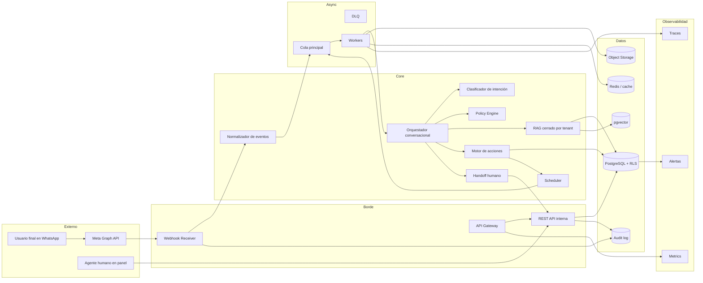
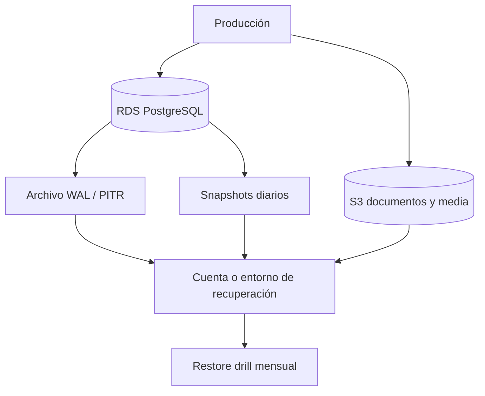
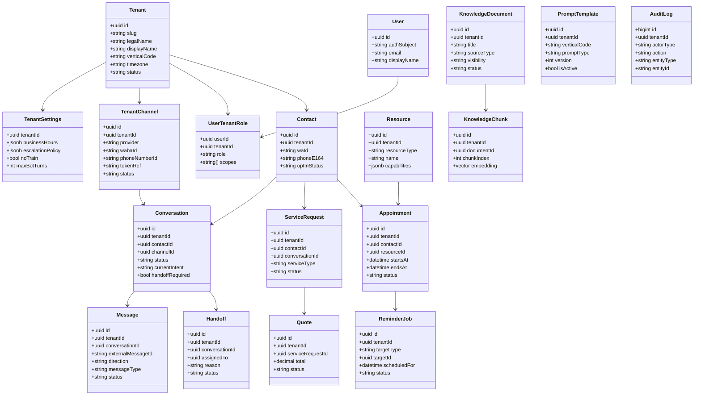
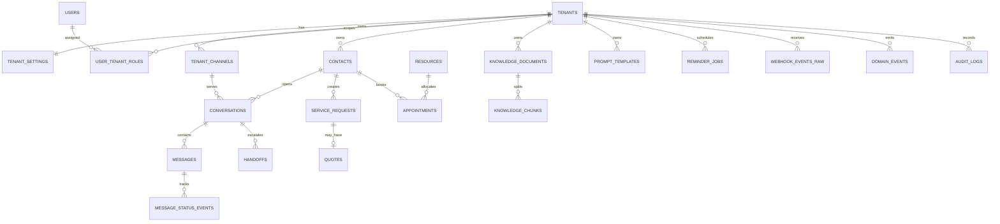
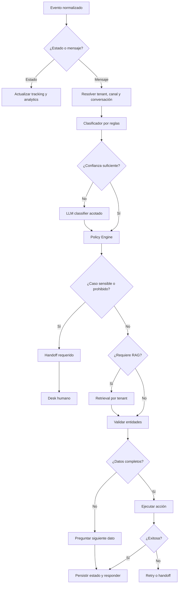
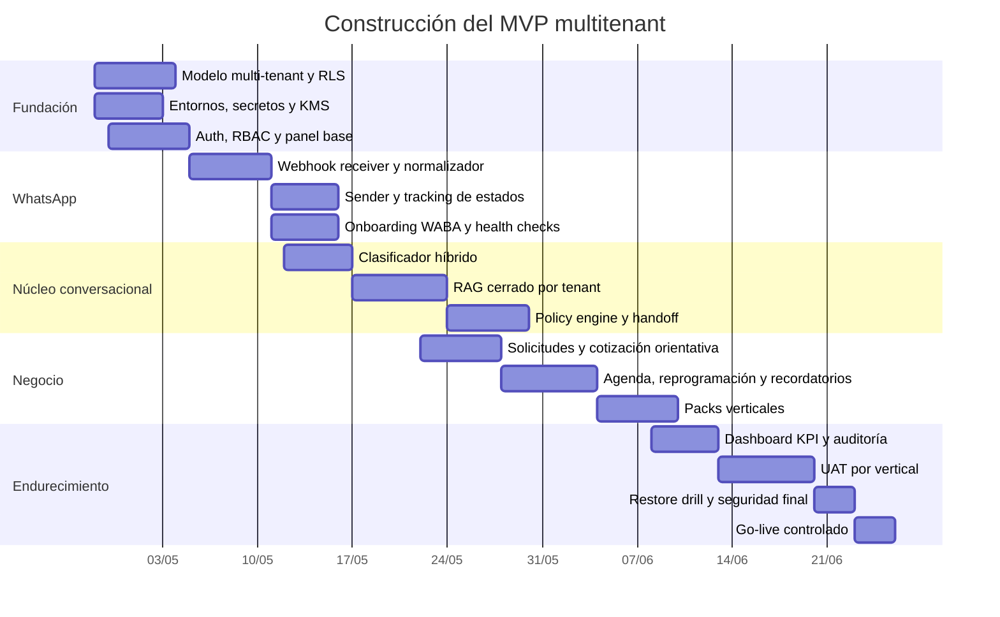

# Especificación técnica del sistema multitenant para el Copiloto IA

## Contexto y supuestos de diseño

Este documento define una arquitectura técnica de referencia para un SaaS multitenant orientado a tres verticales: **talleres y servicios técnicos**, **barberías/peluquerías** y **grooming/daycare de mascotas no clínico**. La plataforma se diseña como una **única base de producto** con un **núcleo común** y **packs de vertical** configurables, porque los tres casos comparten captura de datos, FAQs, agenda, reprogramación, recordatorios, estado y handoff humano. La fecha de referencia funcional y documental es **2026-04-27**. Los elementos no definidos por el usuario se marcan como **no especificado**. La integración principal se plantea sobre **WhatsApp Business Platform / Graph API** con una capa propia de abstracción para desacoplar cambios del proveedor. Meta publica especificaciones OpenAPI de su área de Business Messaging y documenta endpoints y contratos versionados para mensajes, perfiles, números, soluciones y automatización conversacional, por lo que la recomendación técnica es encapsular todo acceso externo detrás de un adaptador interno estable. citeturn4view11turn6view0

Desde el punto de vista normativo, el sistema debe asumir que la **Ley 1581 de 2012** aplica al tratamiento de datos personales en bases de datos públicas y privadas, y que define expresamente autorización previa, roles de **Responsable** y **Encargado** y el concepto de tratamiento como recolección, almacenamiento, uso, circulación o supresión. En este diseño, la asignación recomendada es **cliente = Responsable del Tratamiento** y **plataforma = Encargado del Tratamiento**, salvo respecto de los datos propios de administración comercial del proveedor. Además, el Decreto 1377 de 2013 exige designar una persona o área para la función de protección de datos y regula transferencias y transmisiones internacionales. La SIC, mediante la Circular Externa 002 de 2024, dejó claro que la normativa de protección de datos también aplica cuando los datos se usan para desarrollar, probar, desplegar o monitorear sistemas de IA, exige responsabilidad demostrada, privacidad desde el diseño y, en escenarios de alto riesgo, un estudio de impacto de privacidad documentado. citeturn4view7turn4view9turn8view0

Desde el punto de vista del canal, la arquitectura debe respetar límites reales de WhatsApp Business: la plataforma usa `/{Phone-Number-ID}/messages` para enviar mensajes y marcar leídos; los mensajes se identifican por un ID único y su estado se rastrea por webhooks; la Business Messaging Policy gobierna lo que está permitido y no permitido; y la automatización conversacional oficial se configura sobre welcome messages, prompts e ice breakers y comandos, no como sustitución integral del soporte humano. Además, el contrato de WhatsApp Business Solution exige que un tercero que procese Business Solution Data lo haga **solo en nombre del cliente**, siguiendo sus instrucciones y con salvaguardas técnicas, físicas y administrativas adecuadas. Por ese motivo, este diseño propone un **orquestador con handoff humano obligatorio**, una política estricta de **no entrenamiento con datos del cliente**, y un modelo de **RAG cerrado por tenant**. citeturn6view0turn0search2turn0search5turn7search0

### Restricciones operativas obligatorias

| Tema | Decisión técnica |
|---|---|
| Canal principal | WhatsApp Business Platform |
| Producto | SaaS multitenant, un solo core |
| API pública propia | REST |
| GraphQL | No recomendado para el MVP |
| IAM del panel | JWT/OIDC, proveedor **no especificado** |
| Proveedor LLM | **No especificado** |
| Región cloud | **No especificado** |
| Política de entrenamiento | No entrenamiento con datos del cliente |
| RAG | Cerrado por tenant y por visibilidad |
| Datos clínicos veterinarios | Fuera de alcance |
| Diagnóstico técnico automático | Fuera de alcance |
| Handoff humano | Obligatorio |

### Decisiones de producto fijadas

| Capa | Común a todos los verticales | Variable por vertical |
|---|---|---|
| Inbox conversacional | Sí | No |
| Contactos y consentimiento | Sí | No |
| Intenciones y estados | Sí, taxonomía base común | Sí, subtipos y reglas |
| Agenda, recordatorios y reprogramación | Sí | Sí, recursos y duración |
| Cotización orientativa / intake | Sí | Sí, campos específicos |
| RAG | Sí, arquitectura común | Sí, corpus y prompts |
| Handoff humano | Sí | No |
| Recursos | Sí, modelo común | Sí, tipo de recurso |
| SLA interno | Sí | No |

### Variables no especificadas

| Elemento | Estado |
|---|---|
| IdP exacto | No especificado |
| LLM exacto | No especificado |
| Dimensión final del embedding | No especificado |
| Cloud principal | No especificado |
| Retención exacta por tenant | No especificado |
| Integraciones ERP/POS externas | No especificado |
| Política contractual exacta de exportación | No especificado |

## Arquitectura de referencia

La arquitectura recomendada es **event-driven**, **web-first**, y separa claramente **ingestión**, **orquestación**, **operación humana**, **persistencia** y **observabilidad**. El motivo es doble: primero, los webhooks y estados de WhatsApp operan mejor con procesamiento asíncrono e idempotente; segundo, Meta documenta una superficie de API versionada y en evolución, con mensajes, perfiles, automatización conversacional, soluciones MPS, números y estados de cuenta, por lo que conviene aislar la integración en adaptadores propios. Además, la propia documentación pública de Meta recomienda asumir rate limits estándar de Graph API y usar retry con backoff exponencial en varias APIs de gestión y partner flows. citeturn6view0turn5search0turn7search9turn10search4



### Componentes y responsabilidades

| Componente | Responsabilidad principal | Patrón de escalado |
|---|---|---|
| `api-gateway` | terminación TLS, routing, rate limiting básico | horizontal |
| `webhook-receiver` | recibir webhooks, validarlos, persistir raw y responder rápido | horizontal |
| `event-normalizer` | convertir payloads externos a eventos canónicos | horizontal |
| `conversation-orchestrator` | decidir preguntar, responder, actuar o escalar | horizontal |
| `intent-service` | clasificación híbrida reglas + modelo | horizontal |
| `policy-engine` | límites por vertical, riesgo, privacidad, ventana y plantillas | horizontal |
| `rag-service` | retrieval filtrado por tenant y visibilidad | horizontal |
| `action-engine` | citas, solicitudes, recordatorios, estado, cotización | horizontal |
| `desk-api` | operación del panel humano | horizontal |
| `scheduler` | jobs diferidos, recordatorios y reintentos | horizontal |
| `postgres` | estado transaccional y RLS | vertical + réplica |
| `object-storage` | media, documentos, exports, artefactos | gestionado |
| `redis` | cache, locks, idempotencia, sesiones efímeras | horizontal |
| `otel/monitoring` | métricas, trazas, alertas | horizontal |

### Comunicación entre componentes

| Origen | Destino | Protocolo | Garantía |
|---|---|---|---|
| Meta webhook | `webhook-receiver` | HTTPS | at-least-once |
| Panel web | `desk-api` | HTTPS REST | síncrono |
| `webhook-receiver` | cola | enqueue | durable |
| Worker | Meta Graph API | HTTPS REST | retryable |
| Worker/API | PostgreSQL | SQL | transaccional |
| Worker | Object Storage | S3 API | durable |
| Servicios internos | HTTP o gRPC, **no especificado** | request/response | bounded |

### Estrategia de despliegue recomendada

La opción de referencia para MVP es **cloud gestionada con contenedores sin Kubernetes**: el objetivo es acelerar el lanzamiento y reducir overhead operacional. Como diseño de referencia, se propone **AWS** con ECS/Fargate, RDS PostgreSQL, SQS, ElastiCache/Redis, S3, Secrets Manager y KMS; no porque sea la única opción válida, sino porque sus servicios gestionados soportan bien el patrón requerido y están bien documentados en backup, cifrado y gestión de secretos. Secrets Manager cifra secretos con **envelope encryption** sobre KMS y usa claves de datos AES-256; RDS soporta recuperación a un momento dado y automatización de backups; y S3 soporta SSE-KMS para objetos. Si se elige otra nube, debe reproducir estas propiedades. citeturn4view4turn2search12turn2search13

| Plano | AWS referencia | Equivalente funcional |
|---|---|---|
| Runtime API/worker | ECS Fargate | Cloud Run / App Service / Kubernetes |
| Cola | SQS + DLQ | Pub/Sub / Service Bus |
| Base de datos | RDS PostgreSQL | Cloud SQL / Azure Database for PostgreSQL |
| Cache | ElastiCache Redis | Memorystore / Azure Cache |
| Objetos | S3 | GCS / Blob Storage |
| Secretos | Secrets Manager | Secret Manager / Key Vault |
| Claves | KMS | Cloud KMS / Key Vault |
| Observabilidad | CloudWatch + OpenTelemetry | Equivalente cloud |

### Despliegue, DR y recuperación

PostgreSQL documenta que la recuperación puntual requiere una secuencia continua de **WAL** archivados que cubra al menos desde el inicio del backup base, y recomienda configurar y probar este procedimiento antes de depender de él. Amazon RDS, por su parte, documenta que las copias automatizadas permiten **point-in-time recovery** y que la restauración crea una nueva instancia restaurada, no modifica la original. Por ello, la estrategia recomendada es: **PITR activo**, snapshots diarios, backups lógicos periódicos de metadatos críticos, replicación opcional de objetos y ensayo mensual de restauración. citeturn4view6turn2search12turn4view3



### Objetivos operativos propuestos

| Métrica | Valor propuesto | Tipo |
|---|---:|---|
| RPO | 15 minutos | propuesta |
| RTO | 4 horas | propuesta |
| Respuesta webhook | < 2 s | propuesta |
| Reintento transitorio proveedor | 1m, 5m, 15m, 60m | propuesta |
| Prueba de restore | mensual | propuesta |

## Modelo de dominio y datos

El modelo de datos debe separar claramente: **plataforma**, **tenant/canal**, **contactos y conversaciones**, **objetos de negocio por vertical**, **conocimiento/RAG**, **jobs**, y **auditoría**. La decisión central es un **shared database, shared schema** con `tenant_id` en todas las tablas operativas y **Row-Level Security** activa. PostgreSQL indica que RLS restringe qué filas puede ver o modificar cada sesión, y que si se habilita RLS y no existe política, el comportamiento por defecto es **default deny**. Además, `CREATE POLICY` usa expresiones `USING` y `WITH CHECK` para restringir lectura/modificación y validar la nueva versión de la fila en inserciones y actualizaciones. citeturn4view5turn0search6

### Modelo de clases UML



### Diagrama relacional



### Tablas principales

#### Plataforma, tenant y canal

| Tabla | Campos principales | Índices recomendados | Constraints críticas |
|---|---|---|---|
| `tenants` | `id`, `slug`, `legal_name`, `display_name`, `vertical_code`, `timezone`, `status`, `created_at`, `updated_at`, `deleted_at` | `unique(slug)` | `vertical_code` enum, `status` enum |
| `tenant_settings` | `tenant_id`, `locale`, `business_hours jsonb`, `escalation_policy jsonb`, `pii_policy jsonb`, `no_train`, `max_bot_turns`, timestamps | PK por `tenant_id` | `max_bot_turns > 0` |
| `tenant_channels` | `id`, `tenant_id`, `provider`, `business_id`, `waba_id`, `phone_number_id`, `business_profile_id`, `solution_id`, `token_ref`, `app_secret_ref`, `verify_token_hash`, `quality_rating`, `messaging_limit_tier`, `account_mode`, `status`, timestamps | índice por `phone_number_id`, `waba_id`; `unique(tenant_id, provider)` | `provider` enum, `status` enum |

Meta documenta que la información de número de negocio expone campos como `display_phone_number`, `verified_name`, `status`, `quality_rating`, `account_mode` y `messaging_limit_tier`, y que el perfil de negocio puede leerse y actualizarse por API. Por tanto, `tenant_channels` debe almacenar superficie suficiente para health checks, troubleshooting y reconciliación con el upstream. citeturn5search1turn7search9turn5search9

#### Usuarios y roles

| Tabla | Campos principales | Índices recomendados | Constraints críticas |
|---|---|---|---|
| `users` | `id`, `auth_subject`, `email`, `display_name`, `status`, `mfa_enabled`, `last_login_at`, timestamps | `unique(auth_subject)`, `unique(email)` | `status` enum |
| `user_tenant_roles` | `user_id`, `tenant_id`, `role`, `scopes text[]`, `is_default`, timestamps | índice `tenant_id, role` | PK compuesta `user_id, tenant_id, role` |

#### Contactos y conversaciones

| Tabla | Campos principales | Índices recomendados | Constraints críticas |
|---|---|---|---|
| `contacts` | `id`, `tenant_id`, `wa_id`, `phone_e164`, `phone_hash`, `display_name`, `locale`, `source`, `opt_in_status`, `opt_in_at`, `opt_out_at`, `tags`, `metadata`, timestamps | `unique(tenant_id, wa_id)`, `unique(tenant_id, phone_e164)`, `gin(tags)` | `opt_in_status` enum |
| `conversations` | `id`, `tenant_id`, `contact_id`, `channel_id`, `status`, `opened_by`, `current_owner_user_id`, `current_intent`, `vertical_case_type`, `handoff_required`, `service_window_expires_at`, `summary`, `metadata`, timestamps | índice `tenant_id,status,updated_at desc`, índice por `contact_id,status`, `gin(metadata)` | `status` enum, `opened_by` enum |
| `messages` | `id`, `tenant_id`, `conversation_id`, `external_message_id`, `direction`, `sender_actor_type`, `sender_actor_id`, `message_type`, `body_text`, `media_id`, `mime_type`, `payload`, `status`, `received_at`, `sent_at`, `delivered_at`, `read_at`, `failed_at`, `error_code`, `error_message`, `reply_to_external_message_id`, `created_at` | `unique(tenant_id, external_message_id)`, índice por `conversation_id, created_at`, índice por `tenant_id,status` | `direction`, `sender_actor_type`, `message_type`, `status` enums |
| `message_status_events` | `id`, `tenant_id`, `message_id`, `external_message_id`, `status`, `recipient_id`, `conversation_external_id`, `pricing_category`, `billable`, `errors`, `raw_payload`, `occurred_at` | índice por `external_message_id`, `message_id` | `status` enum |

#### Negocio por vertical

| Tabla | Campos principales | Índices recomendados | Constraints críticas |
|---|---|---|---|
| `resources` | `id`, `tenant_id`, `vertical_code`, `resource_type`, `code`, `name`, `capabilities`, `is_active`, timestamps | `unique(tenant_id, code)`, índice `tenant_id,resource_type` | `resource_type` enum |
| `service_requests` | `id`, `tenant_id`, `contact_id`, `conversation_id`, `vertical_code`, `service_type`, `asset_type`, `asset_brand`, `asset_model`, `problem_summary`, `location_address`, `location_lat`, `location_lng`, `urgency`, `preferred_date`, `preferred_slot`, `status`, `intake`, `assigned_resource_id`, timestamps | índice `tenant_id,status,created_at`, `gin(intake)` | `vertical_code`, `urgency`, `status` enums |
| `quotes` | `id`, `tenant_id`, `service_request_id`, `currency`, `subtotal`, `discount_total`, `tax_total`, `grand_total`, `line_items`, `status`, `valid_until`, timestamps | índice `tenant_id,status` | `currency default 'COP'`, `status` enum |
| `appointments` | `id`, `tenant_id`, `contact_id`, `conversation_id`, `service_request_id`, `resource_id`, `service_code`, `starts_at`, `ends_at`, `timezone`, `status`, `location_type`, `location_data`, `confirmation_status`, `notes`, timestamps | índice `tenant_id,starts_at`, índice `resource_id,starts_at`, índice `contact_id,status` | `starts_at < ends_at`, `status` enum, exclusión de solape por recurso |
| `reminder_jobs` | `id`, `tenant_id`, `target_type`, `target_id`, `channel_id`, `template_name`, `template_locale`, `payload`, `scheduled_for`, `status`, `retry_count`, `last_error`, timestamps | índice `scheduled_for,status`, índice por `target_type,target_id` | `status` enum |

#### Conocimiento, IA y trazabilidad

| Tabla | Campos principales | Índices recomendados | Constraints críticas |
|---|---|---|---|
| `knowledge_documents` | `id`, `tenant_id`, `source_type`, `title`, `source_uri`, `checksum`, `mime_type`, `visibility`, `status`, `uploaded_by_user_id`, timestamps | índice `tenant_id,status`, índice por `checksum` | `source_type`, `visibility`, `status` enums |
| `knowledge_chunks` | `id`, `tenant_id`, `document_id`, `chunk_index`, `section_path`, `chunk_text`, `token_count`, `embedding`, `metadata`, `created_at` | `unique(document_id, chunk_index)`, índice ANN HNSW o IVFFlat | embedding según modelo |
| `prompt_templates` | `id`, `tenant_id nullable`, `vertical_code`, `prompt_type`, `name`, `version`, `content`, `variables`, `is_active`, `checksum`, timestamps | `unique(scope,name,version)` lógico | `version > 0` |
| `webhook_events_raw` | `id`, `tenant_id nullable`, `provider`, `provider_event_id`, `event_type`, `headers`, `payload`, `payload_sha256`, `received_at`, `processing_status`, `processed_at`, `last_error` | `unique(payload_sha256)`, índice `processing_status` | `provider` enum |
| `domain_events` | `id`, `tenant_id`, `aggregate_type`, `aggregate_id`, `event_name`, `event_version`, `idempotency_key`, `payload`, `occurred_at`, `published_at` | `unique(tenant_id,idempotency_key)`, índice `aggregate_type,aggregate_id` | `event_version > 0` |
| `audit_logs` | `id bigserial`, `tenant_id`, `actor_type`, `actor_id`, `action`, `entity_type`, `entity_id`, `ip`, `user_agent`, `metadata`, `created_at` | índice `tenant_id, created_at desc`, índice `entity_type,entity_id` | `actor_type` enum |

### Estrategia de aislamiento por tenant

| Capa | Mecanismo |
|---|---|
| SQL | `tenant_id` + RLS |
| Secretos | referencias por tenant (`token_ref`, `app_secret_ref`) fuera de la BD |
| Objetos | prefijos por tenant en bucket |
| Caché | claves namespaced por tenant |
| Logs | `tenant_id`, `trace_id`, `request_id` |
| RAG | filtro obligatorio por `tenant_id` y `visibility` |
| Jobs | colas lógicas o atributos por tenant |

### Funciones auxiliares y RLS

El ejemplo siguiente fija el patrón recomendado: una variable de sesión `app.tenant_id`, una función auxiliar para leerla y políticas `USING` y `WITH CHECK` sobre tablas operativas. La semántica de `WITH CHECK`, según PostgreSQL, valida la nueva fila en inserciones y actualizaciones cuando RLS está activa. citeturn4view5turn0search6

```sql
create schema if not exists app;

create or replace function app.current_tenant_id()
returns uuid
language sql
stable
as $$
  select nullif(current_setting('app.tenant_id', true), '')::uuid
$$;

create or replace function app.support_mode()
returns boolean
language sql
stable
as $$
  select coalesce(current_setting('app.support_mode', true), 'false') = 'true'
$$;

alter table app.contacts enable row level security;
alter table app.conversations enable row level security;
alter table app.messages enable row level security;
alter table app.service_requests enable row level security;
alter table app.appointments enable row level security;
alter table app.knowledge_documents enable row level security;
alter table app.knowledge_chunks enable row level security;
alter table app.audit_logs enable row level security;

create policy contacts_select_policy
on app.contacts
for select
using (tenant_id = app.current_tenant_id() or app.support_mode());

create policy contacts_insert_policy
on app.contacts
for insert
with check (tenant_id = app.current_tenant_id());

create policy contacts_update_policy
on app.contacts
for update
using (tenant_id = app.current_tenant_id() or app.support_mode())
with check (tenant_id = app.current_tenant_id() or app.support_mode());

create policy contacts_delete_policy
on app.contacts
for delete
using (tenant_id = app.current_tenant_id() or app.support_mode());
```

### SQL DDL de tablas principales

El bloque siguiente contiene el DDL base del núcleo. La dimensión del vector se deja parametrizable; `1536` es un **valor de ejemplo** y debe alinearse con el embedding real del proveedor seleccionado, que sigue **no especificado**.

```sql
create extension if not exists pgcrypto;
create extension if not exists citext;
create extension if not exists vector;
create extension if not exists btree_gist;

create table app.tenants (
  id uuid primary key default gen_random_uuid(),
  slug citext not null unique,
  legal_name text not null,
  display_name text not null,
  vertical_code text not null check (vertical_code in ('field_service','beauty','pet_grooming')),
  country_code char(2) not null default 'CO',
  timezone text not null default 'America/Bogota',
  status text not null check (status in ('trial','active','suspended','churned')),
  created_at timestamptz not null default now(),
  updated_at timestamptz not null default now(),
  deleted_at timestamptz
);

create table app.tenant_settings (
  tenant_id uuid primary key references app.tenants(id) on delete cascade,
  locale text not null default 'es-CO',
  business_hours jsonb not null default '{}'::jsonb,
  escalation_policy jsonb not null default '{}'::jsonb,
  pii_policy jsonb not null default '{}'::jsonb,
  no_train boolean not null default true,
  max_bot_turns integer not null default 8 check (max_bot_turns > 0),
  created_at timestamptz not null default now(),
  updated_at timestamptz not null default now()
);

create table app.tenant_channels (
  id uuid primary key default gen_random_uuid(),
  tenant_id uuid not null references app.tenants(id) on delete cascade,
  provider text not null check (provider in ('whatsapp_cloud_api')),
  business_id text,
  waba_id text,
  phone_number_id text,
  whatsapp_business_profile_id text,
  solution_id text,
  display_phone_number text,
  token_ref text not null,
  app_secret_ref text,
  verify_token_hash bytea,
  quality_rating text,
  messaging_limit_tier text,
  account_mode text,
  status text not null default 'provisioning'
    check (status in ('provisioning','active','degraded','suspended','offboarded')),
  created_at timestamptz not null default now(),
  updated_at timestamptz not null default now(),
  unique (tenant_id, provider)
);

create index ix_tenant_channels_phone on app.tenant_channels(phone_number_id);
create index ix_tenant_channels_waba on app.tenant_channels(waba_id);

create table app.users (
  id uuid primary key default gen_random_uuid(),
  auth_subject text not null unique,
  email citext not null unique,
  display_name text not null,
  status text not null default 'active'
    check (status in ('active','invited','suspended')),
  mfa_enabled boolean not null default false,
  last_login_at timestamptz,
  created_at timestamptz not null default now(),
  updated_at timestamptz not null default now()
);

create table app.user_tenant_roles (
  user_id uuid not null references app.users(id) on delete cascade,
  tenant_id uuid not null references app.tenants(id) on delete cascade,
  role text not null check (role in ('owner','admin','manager','agent','viewer','support')),
  scopes text[] not null default '{}',
  is_default boolean not null default false,
  created_at timestamptz not null default now(),
  primary key (user_id, tenant_id, role)
);

create table app.contacts (
  id uuid primary key default gen_random_uuid(),
  tenant_id uuid not null references app.tenants(id) on delete cascade,
  wa_id text not null,
  phone_e164 text not null,
  phone_hash bytea not null,
  display_name text,
  locale text default 'es-CO',
  source text,
  opt_in_status text not null default 'unknown'
    check (opt_in_status in ('unknown','granted','revoked')),
  opt_in_at timestamptz,
  opt_out_at timestamptz,
  tags text[] not null default '{}',
  metadata jsonb not null default '{}'::jsonb,
  created_at timestamptz not null default now(),
  updated_at timestamptz not null default now(),
  unique (tenant_id, wa_id),
  unique (tenant_id, phone_e164)
);

create index ix_contacts_tenant_phone on app.contacts(tenant_id, phone_e164);
create index gin_contacts_tags on app.contacts using gin(tags);

create table app.conversations (
  id uuid primary key default gen_random_uuid(),
  tenant_id uuid not null references app.tenants(id) on delete cascade,
  contact_id uuid not null references app.contacts(id) on delete cascade,
  channel_id uuid not null references app.tenant_channels(id) on delete restrict,
  status text not null
    check (status in ('open','waiting_user','waiting_agent','human_required','human_active','resolved','closed','archived')),
  opened_by text not null check (opened_by in ('user','agent','system')),
  current_owner_user_id uuid references app.users(id),
  current_intent text,
  vertical_case_type text,
  handoff_required boolean not null default false,
  service_window_expires_at timestamptz,
  summary text,
  metadata jsonb not null default '{}'::jsonb,
  created_at timestamptz not null default now(),
  updated_at timestamptz not null default now()
);

create index ix_conv_tenant_status on app.conversations(tenant_id, status, updated_at desc);
create index ix_conv_contact_open on app.conversations(contact_id, status);
create index gin_conv_metadata on app.conversations using gin(metadata);

create table app.messages (
  id uuid primary key default gen_random_uuid(),
  tenant_id uuid not null references app.tenants(id) on delete cascade,
  conversation_id uuid not null references app.conversations(id) on delete cascade,
  external_message_id text,
  direction text not null check (direction in ('inbound','outbound','system')),
  sender_actor_type text not null check (sender_actor_type in ('contact','bot','agent','system')),
  sender_actor_id uuid,
  message_type text not null
    check (message_type in ('text','template','interactive','image','document','audio','video','reaction','system','unsupported')),
  body_text text,
  media_id text,
  mime_type text,
  payload jsonb not null,
  status text not null
    check (status in ('received','queued','sent','delivered','read','failed')),
  received_at timestamptz,
  sent_at timestamptz,
  delivered_at timestamptz,
  read_at timestamptz,
  failed_at timestamptz,
  error_code text,
  error_message text,
  reply_to_external_message_id text,
  created_at timestamptz not null default now(),
  unique (tenant_id, external_message_id)
);

create index ix_messages_conv_created on app.messages(conversation_id, created_at);
create index ix_messages_tenant_status on app.messages(tenant_id, status, created_at desc);

create table app.message_status_events (
  id uuid primary key default gen_random_uuid(),
  tenant_id uuid not null references app.tenants(id) on delete cascade,
  message_id uuid references app.messages(id) on delete cascade,
  external_message_id text,
  status text not null check (status in ('sent','delivered','read','failed')),
  recipient_id text,
  conversation_external_id text,
  pricing_category text,
  billable boolean,
  errors jsonb,
  raw_payload jsonb not null,
  occurred_at timestamptz not null
);

create index ix_mse_external on app.message_status_events(tenant_id, external_message_id);
create index ix_mse_message on app.message_status_events(message_id);

create table app.resources (
  id uuid primary key default gen_random_uuid(),
  tenant_id uuid not null references app.tenants(id) on delete cascade,
  vertical_code text not null check (vertical_code in ('field_service','beauty','pet_grooming')),
  resource_type text not null check (resource_type in ('staff','bay','vehicle','seat','route')),
  code text not null,
  name text not null,
  capabilities jsonb not null default '{}'::jsonb,
  is_active boolean not null default true,
  created_at timestamptz not null default now(),
  updated_at timestamptz not null default now(),
  unique (tenant_id, code)
);

create table app.service_requests (
  id uuid primary key default gen_random_uuid(),
  tenant_id uuid not null references app.tenants(id) on delete cascade,
  contact_id uuid not null references app.contacts(id) on delete cascade,
  conversation_id uuid references app.conversations(id) on delete set null,
  vertical_code text not null check (vertical_code in ('field_service','beauty','pet_grooming')),
  service_type text not null,
  asset_type text,
  asset_brand text,
  asset_model text,
  problem_summary text,
  location_address text,
  location_lat numeric(9,6),
  location_lng numeric(9,6),
  urgency text check (urgency in ('low','normal','high','critical')),
  preferred_date date,
  preferred_slot text,
  status text not null
    check (status in ('new','qualified','quoted','scheduled','en_route','in_progress','completed','cancelled')),
  intake jsonb not null default '{}'::jsonb,
  assigned_resource_id uuid references app.resources(id),
  created_at timestamptz not null default now(),
  updated_at timestamptz not null default now()
);

create index ix_sr_tenant_status on app.service_requests(tenant_id, status, created_at desc);
create index gin_sr_intake on app.service_requests using gin(intake);

create table app.quotes (
  id uuid primary key default gen_random_uuid(),
  tenant_id uuid not null references app.tenants(id) on delete cascade,
  service_request_id uuid not null references app.service_requests(id) on delete cascade,
  currency char(3) not null default 'COP',
  subtotal numeric(14,2) not null default 0,
  discount_total numeric(14,2) not null default 0,
  tax_total numeric(14,2) not null default 0,
  grand_total numeric(14,2) not null default 0,
  line_items jsonb not null default '[]'::jsonb,
  status text not null check (status in ('draft','sent','accepted','rejected','expired')),
  valid_until timestamptz,
  created_at timestamptz not null default now(),
  updated_at timestamptz not null default now()
);

create index ix_quotes_tenant_status on app.quotes(tenant_id, status, created_at desc);

create table app.appointments (
  id uuid primary key default gen_random_uuid(),
  tenant_id uuid not null references app.tenants(id) on delete cascade,
  contact_id uuid not null references app.contacts(id) on delete cascade,
  conversation_id uuid references app.conversations(id) on delete set null,
  service_request_id uuid references app.service_requests(id) on delete set null,
  resource_id uuid references app.resources(id) on delete set null,
  service_code text not null,
  starts_at timestamptz not null,
  ends_at timestamptz not null,
  timezone text not null default 'America/Bogota',
  status text not null check (status in ('provisional','confirmed','rescheduled','cancelled','completed','no_show')),
  location_type text not null check (location_type in ('in_shop','on_site','pickup_route')),
  location_data jsonb not null default '{}'::jsonb,
  confirmation_status text not null default 'pending'
    check (confirmation_status in ('pending','confirmed','reminded','declined')),
  notes text,
  created_at timestamptz not null default now(),
  updated_at timestamptz not null default now(),
  check (starts_at < ends_at)
);

create index ix_appt_tenant_start on app.appointments(tenant_id, starts_at);
create index ix_appt_resource_time on app.appointments(resource_id, starts_at);

alter table app.appointments
  add constraint ex_appt_resource_no_overlap
  exclude using gist (
    resource_id with =,
    tstzrange(starts_at, ends_at, '[)') with &&
  )
  where (status in ('provisional','confirmed','rescheduled'));

create table app.reminder_jobs (
  id uuid primary key default gen_random_uuid(),
  tenant_id uuid not null references app.tenants(id) on delete cascade,
  target_type text not null check (target_type in ('appointment','quote','service_request','conversation')),
  target_id uuid not null,
  channel_id uuid not null references app.tenant_channels(id) on delete restrict,
  template_name text not null,
  template_locale text not null default 'es_CO',
  payload jsonb not null default '{}'::jsonb,
  scheduled_for timestamptz not null,
  status text not null check (status in ('scheduled','claimed','sent','failed','cancelled')),
  retry_count integer not null default 0,
  last_error text,
  created_at timestamptz not null default now(),
  updated_at timestamptz not null default now()
);

create index ix_reminders_due on app.reminder_jobs(status, scheduled_for);
create index ix_reminders_target on app.reminder_jobs(target_type, target_id);

create table app.knowledge_documents (
  id uuid primary key default gen_random_uuid(),
  tenant_id uuid not null references app.tenants(id) on delete cascade,
  source_type text not null check (source_type in ('upload','url','manual','text')),
  title text not null,
  source_uri text,
  checksum text,
  mime_type text,
  visibility text not null check (visibility in ('faq','internal','agent_only')),
  status text not null check (status in ('draft','indexing','ready','error','archived')),
  uploaded_by_user_id uuid references app.users(id),
  created_at timestamptz not null default now(),
  updated_at timestamptz not null default now()
);

create table app.knowledge_chunks (
  id uuid primary key default gen_random_uuid(),
  tenant_id uuid not null references app.tenants(id) on delete cascade,
  document_id uuid not null references app.knowledge_documents(id) on delete cascade,
  chunk_index integer not null,
  section_path text,
  chunk_text text not null,
  token_count integer not null,
  embedding vector(1536),
  metadata jsonb not null default '{}'::jsonb,
  created_at timestamptz not null default now(),
  unique (document_id, chunk_index)
);

create index ix_chunks_doc_idx on app.knowledge_chunks(document_id, chunk_index);
create index hnsw_chunks_embedding on app.knowledge_chunks
  using hnsw (embedding vector_cosine_ops);

create table app.prompt_templates (
  id uuid primary key default gen_random_uuid(),
  tenant_id uuid references app.tenants(id) on delete cascade,
  vertical_code text not null check (vertical_code in ('field_service','beauty','pet_grooming','global')),
  prompt_type text not null,
  name text not null,
  version integer not null check (version > 0),
  content text not null,
  variables jsonb not null default '{}'::jsonb,
  is_active boolean not null default false,
  checksum text,
  created_at timestamptz not null default now(),
  unique (coalesce(tenant_id, '00000000-0000-0000-0000-000000000000'::uuid), name, version)
);

create table app.webhook_events_raw (
  id uuid primary key default gen_random_uuid(),
  tenant_id uuid references app.tenants(id) on delete set null,
  provider text not null check (provider in ('meta_whatsapp')),
  provider_event_id text,
  event_type text not null,
  headers jsonb not null default '{}'::jsonb,
  payload jsonb not null,
  payload_sha256 text not null unique,
  received_at timestamptz not null default now(),
  processing_status text not null default 'received'
    check (processing_status in ('received','queued','processed','failed')),
  processed_at timestamptz,
  last_error text
);

create table app.domain_events (
  id uuid primary key default gen_random_uuid(),
  tenant_id uuid not null references app.tenants(id) on delete cascade,
  aggregate_type text not null,
  aggregate_id uuid not null,
  event_name text not null,
  event_version integer not null default 1,
  idempotency_key text not null,
  payload jsonb not null,
  occurred_at timestamptz not null default now(),
  published_at timestamptz,
  unique (tenant_id, idempotency_key)
);

create table app.audit_logs (
  id bigserial primary key,
  tenant_id uuid not null references app.tenants(id) on delete cascade,
  actor_type text not null check (actor_type in ('user','system','bot','support')),
  actor_id uuid,
  action text not null,
  entity_type text not null,
  entity_id text not null,
  ip inet,
  user_agent text,
  metadata jsonb not null default '{}'::jsonb,
  created_at timestamptz not null default now()
);

create index ix_audit_tenant_created on app.audit_logs(tenant_id, created_at desc);
create index ix_audit_entity on app.audit_logs(entity_type, entity_id);
```

### Elección de índice vectorial

`pgvector` soporta **HNSW** e **IVFFlat**. La documentación del proyecto indica que HNSW ofrece mejor rendimiento de consulta en la relación velocidad/recall, pero construye más lento y consume más memoria; IVFFlat construye más rápido y usa menos memoria, pero su rendimiento de consulta es peor en esa relación. Para un MVP con corpus por tenant relativamente pequeño o mediano y necesidad de respuestas consistentes, la recomendación es **HNSW por defecto**; cambiar a IVFFlat cuando el tiempo de build o la memoria sean la principal restricción. citeturn9view1turn9view3

## API, eventos y webhooks

La API pública propia será **REST versionada** (`/v1`). La elección no responde a una limitación del dominio, sino a la necesidad de simplificar autorización, soporte, logging, caché y compatibilidad con un panel administrativo y workers. GraphQL puede añadirse en una fase posterior si la experiencia interna de panel lo justifica, pero no aporta ventaja clara en el MVP.

### Convenciones de autenticación y cabeceras

| Header | Uso |
|---|---|
| `Authorization: Bearer <jwt>` | autenticación de usuarios del panel |
| `Authorization: Bearer <service-token>` | autenticación de workloads internos |
| `Content-Type: application/json` | payload JSON |
| `Idempotency-Key: <uuid>` | operaciones POST/PATCH mutantes |
| `X-Request-Id` | correlación end-to-end |
| `If-Match` | control optimista opcional |
| `X-Impersonated-Tenant-Id` | solo soporte interno auditado |

### Integración externa con Meta

La superficie mínima real con Meta incluye: envío y marcado de mensajes mediante `/{Phone-Number-ID}/messages`, automatización conversacional en `/{Phone-Number-ID}/conversational_automation`, lectura de información de números con campos como `quality_rating` y `messaging_limit_tier`, acceso al perfil de negocio, descarga de media, y —si se adopta Multi-Partner Solutions— obtención de tokens granulares mediante `/{Solution-ID}/access_token?business_id=...`. Meta documenta además que los media URLs expiran a los cinco minutos y que varias APIs de gestión aplican rate limits estándar de Graph API con recomendación de retry exponencial. citeturn6view0turn5search0turn5search1turn5search2turn7search0

| Endpoint externo | Método | Uso interno |
|---|---|---|
| `/{Version}/{Phone-Number-ID}/messages` | POST | enviar texto, template, interactive, mark as read |
| `/{Version}/{Phone-Number-ID}/conversational_automation` | POST | welcome message, prompts, bot commands |
| `/{Version}/{Phone-Number-ID}` | GET | health, quality, verification, limits |
| `/{Version}/{Phone-Number-ID}/whatsapp_business_profile` o equivalente de perfil | GET/POST | leer/actualizar perfil |
| `/{Version}/{Solution-ID}/access_token?business_id=...` | GET | token granular por cliente en MPS |
| `/{Version}/{Media-ID}` y media URL | GET | descarga temporal de media |
| `/{Version}/{WABA-ID}/message_templates` | GET/POST | plantillas |
| `/{Version}/{Business-ID}/owned_whatsapp_business_accounts` | GET | discovery de WABAs propias |

### API interna del SaaS

#### Tenants y canales

| Ruta | Método | Auth | Descripción | Estados |
|---|---|---|---|---|
| `/v1/tenants` | POST | `owner` plataforma | crear tenant | `201`, `409`, `422` |
| `/v1/tenants/{tenantId}` | GET | tenant scoped | detalle tenant | `200`, `404` |
| `/v1/tenants/{tenantId}/settings` | PATCH | `admin` tenant | actualizar settings | `200`, `422` |
| `/v1/tenants/{tenantId}/channels/whatsapp` | POST | `admin` tenant | registrar refs WABA y secretos | `201`, `422` |
| `/v1/tenants/{tenantId}/channels/whatsapp/health` | GET | `admin` tenant | estado canal | `200` |

#### Contactos, conversaciones y messages

| Ruta | Método | Auth | Descripción | Estados |
|---|---|---|---|---|
| `/v1/contacts/upsert` | POST | `agent`+ | alta/actualización contacto | `200`, `201`, `422` |
| `/v1/contacts/{contactId}` | GET | `agent`+ | ficha contacto | `200`, `404` |
| `/v1/conversations` | GET | `agent`+ | listar conversaciones | `200` |
| `/v1/conversations/{id}` | GET | `agent`+ | detalle conversación | `200`, `404` |
| `/v1/conversations/{id}/messages` | POST | `agent`+ | enviar mensaje desde desk | `202`, `409`, `422` |
| `/v1/conversations/{id}/handoff` | POST | `agent`+ | crear/aceptar handoff | `202`, `409` |
| `/v1/conversations/{id}/release` | POST | `agent`+ | devolver al bot | `202`, `409` |

#### Negocio

| Ruta | Método | Auth | Descripción | Estados |
|---|---|---|---|---|
| `/v1/service-requests` | POST | `agent`+ o worker | crear solicitud / intake | `201`, `422` |
| `/v1/service-requests/{id}` | PATCH | `agent`+ | actualizar estado/datos | `200`, `409`, `422` |
| `/v1/quotes` | POST | `agent`+ | crear cotización | `201`, `422` |
| `/v1/quotes/{id}/send` | POST | `agent`+ | enviar resumen de cotización | `202`, `409` |
| `/v1/appointments` | POST | `agent`+ o worker | crear cita/reserva | `201`, `409`, `422` |
| `/v1/appointments/{id}/reschedule` | POST | `agent`+ o worker | reprogramar cita | `200`, `409` |
| `/v1/appointments/{id}/cancel` | POST | `agent`+ o worker | cancelar | `200`, `409` |
| `/v1/reminders` | POST | `agent`+ o worker | programar recordatorio | `201`, `422` |

#### Conocimiento y configuración IA

| Ruta | Método | Auth | Descripción | Estados |
|---|---|---|---|---|
| `/v1/knowledge/documents` | POST | `admin` tenant | crear documento | `201`, `422` |
| `/v1/knowledge/documents/{id}/index` | POST | `admin` tenant | reindexar | `202`, `409` |
| `/v1/prompts` | POST | `admin` tenant | crear prompt/version | `201`, `409` |
| `/v1/prompts/{id}/activate` | POST | `admin` tenant | activar prompt | `200`, `409` |
| `/v1/intents/evaluate` | POST | `admin` tenant | test de intención | `200` |

#### Observabilidad y privacidad

| Ruta | Método | Auth | Descripción | Estados |
|---|---|---|---|---|
| `/v1/analytics/overview` | GET | `manager`+ | KPIs generales | `200` |
| `/v1/analytics/conversations` | GET | `manager`+ | funnel conversacional | `200` |
| `/v1/audit-logs` | GET | `admin` tenant | auditoría | `200` |
| `/v1/exports/tenant` | POST | `admin` tenant | exportación controlada | `202` |
| `/v1/privacy/delete-contact/{contactId}` | POST | `admin` tenant | flujo de supresión | `202`, `409` |

### Ejemplos completos de request/response

#### Crear solicitud técnica

```json
POST /v1/service-requests
Authorization: Bearer <jwt>
Content-Type: application/json
Idempotency-Key: 7bdcf7d3-8dcf-4cf1-bd7d-2a8dba2b8a13

{
  "tenant_id": "6c3e0b60-0c11-4e46-8fd7-04f1ad0f1e44",
  "contact_id": "f8f8f6ff-89ec-4b54-a1a2-bd61f7c78ef2",
  "conversation_id": "13ae02b8-6cd8-4adf-9a0b-28d4c337e145",
  "vertical_code": "field_service",
  "service_type": "reparacion_lavadora",
  "asset_type": "lavadora",
  "asset_brand": "Samsung",
  "asset_model": "WA17",
  "problem_summary": "No centrifuga y emite ruido fuerte",
  "location_address": "Cra 15 # 93-21, Bogotá",
  "urgency": "normal",
  "preferred_date": "2026-05-02",
  "preferred_slot": "am",
  "intake": {
    "photo_count": 2,
    "coverage_zone": "norte",
    "customer_notes": "Piso 4 sin ascensor"
  }
}
```

```json
201 Created
{
  "id": "3b3d1a15-8ce9-4c1b-b93e-6f53fdc3f7a7",
  "status": "qualified",
  "quote_status": "pending",
  "next_action": "schedule_visit",
  "created_at": "2026-04-27T15:30:12Z"
}
```

#### Crear cita

```json
POST /v1/appointments
Authorization: Bearer <jwt>
Content-Type: application/json
Idempotency-Key: 6a1177b5-5ccd-4039-a6d9-1dfd3dcaafe2

{
  "tenant_id": "6c3e0b60-0c11-4e46-8fd7-04f1ad0f1e44",
  "contact_id": "f8f8f6ff-89ec-4b54-a1a2-bd61f7c78ef2",
  "conversation_id": "13ae02b8-6cd8-4adf-9a0b-28d4c337e145",
  "service_request_id": "3b3d1a15-8ce9-4c1b-b93e-6f53fdc3f7a7",
  "resource_id": "d6382fa0-9ff0-48f0-94e8-77cb0c58e39d",
  "service_code": "visita_tecnica",
  "starts_at": "2026-05-02T14:00:00-05:00",
  "ends_at": "2026-05-02T15:00:00-05:00",
  "timezone": "America/Bogota",
  "location_type": "on_site",
  "location_data": {
    "address": "Cra 15 # 93-21, Bogotá"
  }
}
```

```json
201 Created
{
  "id": "18eef6df-62cc-4d38-97ff-e4adde9a7b47",
  "status": "confirmed",
  "confirmation_status": "pending",
  "conflicts": [],
  "created_at": "2026-04-27T15:35:04Z"
}
```

#### Enviar mensaje desde desk

```json
POST /v1/conversations/13ae02b8-6cd8-4adf-9a0b-28d4c337e145/messages
Authorization: Bearer <jwt>
Content-Type: application/json
Idempotency-Key: 0c5e5f0f-fd49-40df-9b22-18b54c0f9dfd

{
  "channel": "whatsapp",
  "type": "text",
  "body": {
    "text": "Hola, ya te agendamos visita para mañana entre 2 y 3 p. m."
  },
  "reply_to_external_message_id": "wamid.HBgL...",
  "metadata": {
    "origin": "agent"
  }
}
```

```json
202 Accepted
{
  "request_id": "req_01JT0P3Y4RP7G2KWW",
  "message_job_status": "queued"
}
```

#### Crear documento de conocimiento

```json
POST /v1/knowledge/documents
Authorization: Bearer <jwt>
Content-Type: application/json

{
  "tenant_id": "6c3e0b60-0c11-4e46-8fd7-04f1ad0f1e44",
  "source_type": "upload",
  "title": "FAQ servicios y garantías abril 2026",
  "mime_type": "application/pdf",
  "visibility": "faq",
  "checksum": "sha256:3e5ff1c9f5...",
  "source_uri": "s3://tenant-docs/faq-abril-2026.pdf"
}
```

```json
201 Created
{
  "id": "3ff5ab9d-5f1f-4ec8-98ba-57f772d4f512",
  "status": "draft"
}
```

### Webhooks de Meta y eventos internos

Meta documenta que los mensajes tienen ID único, que su estado puede seguirse por webhooks usando ese ID, y que los estados incluyen semánticas como `sent`, `delivered`, `read` y `failed`. También documenta errores transitorios y de autenticación en varias APIs, lo que obliga a modelar reintentos y diferenciar claramente entre error transitorio, error de validación y error de permiso. citeturn6view0turn10search9

#### Receptor de webhooks

| Ruta | Método | Finalidad |
|---|---|---|
| `/v1/webhooks/meta/whatsapp` | GET | verificación del webhook |
| `/v1/webhooks/meta/whatsapp` | POST | recepción de mensajes y estados |

#### Ejemplo de payload inbound normalizado

```json
{
  "provider": "meta_whatsapp",
  "tenant_id": "6c3e0b60-0c11-4e46-8fd7-04f1ad0f1e44",
  "channel_id": "61aaf3bb-34d8-43d2-8e4b-a7c76bf1f8f5",
  "direction": "inbound",
  "external_message_id": "wamid.HBgLMTY1MDM4Nzk0Mzk...",
  "wa_id": "573001112233",
  "message_type": "text",
  "timestamp": "2026-04-27T15:32:09Z",
  "payload": {
    "text": {
      "body": "Hola, ¿tienen cita mañana por la tarde?"
    }
  }
}
```

#### Ejemplo de payload status normalizado

```json
{
  "provider": "meta_whatsapp",
  "tenant_id": "6c3e0b60-0c11-4e46-8fd7-04f1ad0f1e44",
  "channel_id": "61aaf3bb-34d8-43d2-8e4b-a7c76bf1f8f5",
  "external_message_id": "wamid.HBgLMTY1MDM4Nzk0Mzk...",
  "status": "delivered",
  "recipient_id": "573001112233",
  "pricing_category": "utility",
  "billable": true,
  "timestamp": "2026-04-27T15:32:13Z",
  "errors": []
}
```

#### Catálogo de eventos internos

| Evento | Disparador |
|---|---|
| `wa.inbound.received` | webhook inbound |
| `wa.status.updated` | webhook de estado |
| `contact.upserted` | contacto creado o actualizado |
| `conversation.opened` | creación o reapertura |
| `intent.classified` | salida del clasificador |
| `rag.retrieval.completed` | retrieval exitoso |
| `action.service_request.created` | intake completo |
| `action.appointment.created` | cita creada |
| `action.appointment.rescheduled` | cita movida |
| `action.quote.sent` | cotización comunicada |
| `handoff.requested` | se requiere humano |
| `handoff.accepted` | humano toma control |
| `message.outbound.requested` | se solicita envío |
| `message.outbound.failed` | fallo definitivo |
| `document.indexed` | documento listo |
| `job.retry.scheduled` | retry programado |
| `audit.entry.created` | acción sensible o administrativa |

#### Esquema canónico de evento

```json
{
  "$schema": "https://json-schema.org/draft/2020-12/schema",
  "title": "CanonicalDomainEvent",
  "type": "object",
  "required": ["id", "type", "tenant_id", "source", "occurred_at", "payload", "schema_version"],
  "properties": {
    "id": { "type": "string", "format": "uuid" },
    "type": { "type": "string" },
    "tenant_id": { "type": "string", "format": "uuid" },
    "source": { "type": "string" },
    "subject": { "type": "string" },
    "trace_id": { "type": "string" },
    "occurred_at": { "type": "string", "format": "date-time" },
    "schema_version": { "type": "integer", "minimum": 1 },
    "idempotency_key": { "type": "string" },
    "payload": { "type": "object" }
  }
}
```

## Orquestación conversacional, RAG y diseño multitenant

El servidor debe ejecutar una lógica **guiada por estado**, no una conversación libre sin control. La secuencia recomendada es: normalización del evento, resolución de tenant, clasificación de intención, evaluación de política, recuperación de contexto autorizada, validación de entidades, ejecución de acción idempotente y, si hace falta, handoff humano. Esta estrategia está directamente alineada con dos restricciones externas: la automatización oficial de WhatsApp se concibe como bienvenida, prompts y comandos, no como total autonomía; y el contrato de terceros obliga a procesar Business Solution Data solo en nombre del cliente. Además, la SIC exige en IA identificar, clasificar, medir, controlar y monitorear riesgos, y pide un estudio de impacto de privacidad cuando el riesgo para titulares sea alto. citeturn7search0turn0search2turn8view0



### Taxonomía mínima de intenciones

| Grupo | Intenciones |
|---|---|
| FAQ | horario, ubicación, cobertura, medios_pago, precios_orientativos, políticas |
| Agenda | reservar, confirmar, reprogramar, cancelar, disponibilidad |
| Servicio técnico | crear_solicitud, seguimiento_estado, enviar_fotos, cobertura_zona |
| Belleza | elegir_servicio, elegir_profesional, no_show_recovery |
| Mascotas no clínicas | reservar_grooming, confirmar_ruta, cobertura_ruta |
| Riesgo | queja, garantía_excepción, descuento_excepción, tema_clínico, tema_legal |
| Canal | opt_in, opt_out, fuera_de_alcance, unsupported_message |

### Clasificación híbrida

| Capa | Función |
|---|---|
| `rule-router` | keywords, catálogos, regex, comandos |
| `intent-llm` | clasificación cuando las reglas no bastan |
| `risk-detector` | sensibilidad, datos médicos, conflicto, jurídico |
| `fallback-human` | seguridad ante baja confianza |

| Umbral propuesto | Valor |
|---|---:|
| aceptar intención por LLM | `confidence >= 0.78` |
| ejecutar acción sin humano | `confidence >= 0.85` y entidades completas |
| handoff automático | `confidence < 0.70` o caso sensible |
| responder con RAG | score suficiente y fuente permitida |

### RAG cerrado por tenant

La recomendación es un **RAG cerrado** con reglas duras:

1. nunca mezclar documentos entre tenants;
2. restringir retrieval por `tenant_id` y `visibility`;
3. no responder con material `agent_only` al usuario final;
4. no usar web pública por defecto en producción;
5. almacenar trazabilidad de documentos usados, score y versión del prompt.

La Circular 002 de la SIC exige privacidad desde el diseño, medidas auditables, minimización del riesgo y prohíbe tratar datos parciales o que induzcan a error. También advierte que la información “accesible al público” en Internet no se convierte automáticamente en información de libre apropiación para cualquier finalidad. Por eso, el ingest pipeline debe limitarse a documentos del cliente o a fuentes expresamente autorizadas por él, y debe registrar checksum y procedencia de cada documento. citeturn8view0

#### Pipeline de ingestión

| Paso | Resultado |
|---|---|
| upload | objeto creado y documento registrado |
| extracción | texto plano normalizado |
| sanitización | control de formato, instrucciones hostiles obvias, caracteres de control |
| chunking | segmentos con `chunk_index`, `section_path`, `token_count` |
| embeddings | vector por chunk |
| indexado | inserción en `knowledge_chunks` |
| validación | smoke test de retrieval |
| publicación | `status = ready` |

OWASP identifica la prompt injection —incluida la inyección indirecta vía documentos, RAG o contenido multimodal— como un riesgo clave en aplicaciones LLM. Por tanto, la sanitización de corpus, las listas blancas de herramientas y la separación entre instrucciones del sistema y contenido recuperado son medidas necesarias, no opcionales. citeturn8view0turn6view0

#### Prompt base del sistema

```text
Eres un copiloto operativo para una pyme en Colombia.
Tu objetivo es resolver preguntas repetitivas, recoger datos completos, agendar,
reprogramar, recordar y escalar a humano cuando el caso sea ambiguo, sensible
o esté fuera de política.

Reglas:
- No inventes políticas, precios finales ni disponibilidad.
- Usa solo conocimiento recuperado del tenant actual.
- No accedas ni hagas referencia a datos de otros tenants.
- Si falta información esencial, pide solo el dato mínimo faltante.
- Si el caso es sensible, de salud, jurídico, garantía excepcional o reclamación,
  escala a humano.
```

#### Template RAG

```text
Contexto recuperado:
{{retrieved_chunks}}

Mensaje del usuario:
{{user_message}}

Responde solo con base en el contexto recuperado.
Si el contexto no basta, dilo claramente y ofrece pasar a una persona.
Nunca reveles contenido marcado como interno o agent_only.
```

### Motor de acciones

| Acción | Requisitos | Efecto |
|---|---|---|
| `create_service_request` | contacto + tipo + intake mínimo | crea `service_requests` |
| `create_quote` | solicitud existente + pricing orientativo | crea `quotes` |
| `create_appointment` | slot + recurso + contacto | crea `appointments` |
| `reschedule_appointment` | cita existente + nuevo slot | actualiza cita |
| `cancel_appointment` | cita existente | cancela cita |
| `schedule_reminder` | target + plantilla | crea `reminder_jobs` |
| `handoff_human` | cualquiera | crea `handoffs` |

### Colas, retries e idempotencia

Meta y los sistemas de integración deben tratarse como **at-least-once**, no exactly-once. La clave de mensaje (`external_message_id`) y los jobs mutantes deben convertirse en claves de idempotencia locales. Además, como Meta documenta rate limits estándar y errores con `is_transient` en respuestas Graph API, el sistema debe usar retries con backoff exponencial solo para errores recuperables. citeturn10search9turn10search10

| Operación | Clave de idempotencia |
|---|---|
| webhook inbound | `provider_event_id` o `payload_sha256` |
| mensaje outbound | `Idempotency-Key` + `conversation_id` |
| cita | `contact_id + resource_id + starts_at + service_code` |
| reminder | `target_type + target_id + template_name + scheduled_for` |

| Tipo de fallo | Estrategia |
|---|---|
| `429`, `5xx`, `is_transient=true` | retry 1m, 5m, 15m, 60m, luego DLQ |
| token expirado | refresh + 1 retry |
| URL de media vencida | reobtener URL + 1 retry |
| conflicto de agenda | no retry automático |
| validación de negocio | no retry automático |

### Diseño multitenant y onboarding de WABA

El sistema debe soportar dos modos de operación de canal:

| Modo | Descripción | Recomendación |
|---|---|---|
| `direct_waba` | el cliente conecta su WABA/número propio al tenant | preferido en MVP |
| `mps` | el partner usa Multi-Partner Solutions con token granular por cliente | preparar abstracción, activar después |

La razón para dejar ambos modos desde el inicio es que Meta ya publica las APIs de Multi-Partner Solutions, incluyendo la **Access Token API** para obtener un token granular BISU por negocio y las listas de soluciones por aplicación o WABA. Así, aunque el MVP arranque con `direct_waba`, debe diseñarse un `token_manager` abstracto que más adelante pueda resolver tokens por `solution_id + business_id` sin reescribir el core. citeturn5search0turn7search2turn7search5

#### Checklist de onboarding WABA

| Paso | Validación |
|---|---|
| alta de tenant | `slug`, vertical, timezone |
| alta de canal | `provider=whatsapp_cloud_api` |
| registrar IDs | `business_id`, `waba_id`, `phone_number_id` |
| health inicial | `verified_name`, `quality_rating`, `messaging_limit_tier` |
| configurar webhook | verificación `GET` + recepción `POST` |
| cargar plantillas | confirmación, recordatorio, reactivación |
| configurar perfil | about, email, address, websites, vertical |
| prueba técnica | inbound + outbound + status + media |

## Seguridad, cumplimiento, infraestructura y operación

La guía técnica debe asumir **seguridad por diseño**. Esto implica: secretos fuera de la base, cifrado en tránsito y reposo, MFA para perfiles privilegiados, RBAC por tenant, auditoría exhaustiva, logs con minimización de PII, backups PITR y una política contractual y técnica de no entrenamiento. Además, la SIC exige que las medidas de seguridad sean auditables y que se adopten medidas tecnológicas, humanas, administrativas, físicas y contractuales para evitar acceso indebido, manipulación, destrucción o suministro a no autorizados. citeturn8view0

### Cifrado, claves y secretos

AWS Secrets Manager documenta que cifra secretos mediante **envelope encryption** con AWS KMS y claves de datos AES-256, y que puede usarse para rotar, almacenar y recuperar secretos sin codificarlos en la aplicación. Por ello, en este diseño ningún token Meta, secreto de app, verify token o credencial de BD debe guardarse en claro en PostgreSQL; en la BD solo se almacenan referencias (`token_ref`, `kms_key_ref`, `app_secret_ref`). Para objetos, S3 con SSE-KMS es suficiente en MVP. citeturn4view4turn2search9turn2search13

| Activo | Ubicación recomendada | Protección |
|---|---|---|
| Access tokens Meta | Secret Manager | KMS + rotación/versionado |
| App secrets Meta | Secret Manager | KMS |
| Verify tokens | Secret Manager o hash en DB | nunca texto plano |
| Credenciales de BD | Secret Manager o IAM auth | sin `.env` persistente |
| Media/snapshots/exportes | S3/objetos | SSE-KMS |
| Backups lógicos | bucket dedicado | cifrado + políticas de retención |

### Payload encryption de WhatsApp

El OpenAPI público de Meta describe una capa opcional de **payload encryption** sobre `/messages` y sobre message echoes webhooks usando formato **JWE**, con configuración por número de teléfono y RSA pública de 2048 bits. Esta capacidad debe tratarse como una **fase de endurecimiento** posterior al MVP: no es imprescindible para arrancar, pero sí recomendable cuando el riesgo, el volumen o el valor de la información del tenant lo hagan necesario. citeturn6view0

### RBAC, MFA y soporte

| Rol | Permisos principales |
|---|---|
| `owner` | admin total del tenant, exportes, usuarios, privacidad |
| `admin` | canales, documentos, prompts, settings |
| `manager` | analítica, agenda, visión operacional |
| `agent` | conversations, handoffs, citas, solicitudes |
| `viewer` | lectura |
| `support` | acceso temporal excepcional y auditado |

MFA debe ser obligatoria al menos para `owner`, `admin`, `manager` y `support`. La SIC no impone MFA como control textual en estas fuentes, pero sí exige medidas auditables y eficaces; por tanto, MFA es una **decisión de diseño obligatoria** para este producto.

### PII handling

| Regla | Implementación |
|---|---|
| minimización | pedir solo datos necesarios para cada acción |
| hashing | `phone_hash` para analítica agregada cuando baste |
| logs redactados | no registrar PII completa fuera de tablas controladas |
| visibilidad documental | `faq`, `internal`, `agent_only` |
| exports | firmados, con TTL y autorización explícita |
| supresión | flujo lógico + purga según política del tenant |

### Notas DPA, DPO y gobierno de datos

La Ley 1581 y el Decreto 1377 exigen bases legales claras, autorización previa y distinción entre Responsable y Encargado. El Decreto también exige designar una persona o área para atender la función de protección de datos personales y regula transmisiones/transferencias internacionales. La SIC, además, destaca accountability, privacy by design, gestión de riesgos y PIA para alto riesgo. Por tanto, la implementación mínima debe incluir: **DPA/anexo de tratamiento**, registro de subencargados, política de no entrenamiento, flujo de atención de titulares, evidencia de opt-in/opt-out, y un responsable interno de privacidad aunque el “DPO” formal no esté definido por el usuario. citeturn4view7turn4view9turn8view0turn1search2

### Política de no entrenamiento

La política técnica y contractual del sistema debe ser:

1. los datos del cliente no se usan para entrenar modelos compartidos;
2. no se hace fine-tuning general con Business Solution Data;
3. el retrieval usa exclusivamente documentos del tenant;
4. las evaluaciones internas se anonimizan o sintetizan;
5. cualquier cambio de finalidad requiere nueva base legal/autorización si aplica.

Esta política es coherente con las restricciones contractuales de WhatsApp Business Solution para terceros y con el enfoque de la SIC sobre finalidad, minimización y riesgos de IA. citeturn0search2turn8view0

### Infraestructura recomendada

| Capa | Recomendación |
|---|---|
| Runtime | contenedores gestionados sin Kubernetes en MVP |
| Base de datos | PostgreSQL gestionado con PITR |
| Cola | cola gestionada con DLQ |
| Cache | Redis gestionado |
| Secretos | gestor de secretos con KMS |
| Objetos | almacenamiento con SSE-KMS |
| Observabilidad | OpenTelemetry + métricas + alertas |
| CI/CD | pipeline con migraciones, tests y smoke tests |
| IaC | Terraform o equivalente, **no especificado** |

### Pruebas y UAT

| Tipo de prueba | Casos mínimos |
|---|---|
| Unitarias | validadores, state machine, policies |
| Integración | webhook → cola → worker → DB → sender |
| Contrato | requests/responses REST, errores y headers |
| RAG | groundedness, denials, no cross-tenant leakage |
| Seguridad | RLS, RBAC, MFA, support mode, secretos |
| Resiliencia | token refresh, retry, DLQ, URLs media vencidas |
| DR | restore PITR, restauración de objetos y reindexado |
| UAT talleres | intake + cita + estado |
| UAT belleza | agenda + reprogramación + no-show |
| UAT mascotas | reserva + ruta + recordatorio, sin clínica |

### Checklist de despliegue

| Fase | Control |
|---|---|
| Predeploy | migraciones revisadas, índices listos, secretos creados, plantillas base cargadas |
| Deploy | health checks, workers conectados, cola y DLQ activas |
| Postdeploy | smoke tests inbound/outbound/status/media |
| Seguridad | MFA activa, roles mínimos, support mode desactivado |
| DR | snapshot inicial y prueba de restore planificada |
| Compliance | DPA firmado, política de no entrenamiento, avisos de tratamiento actualizados |

### Gantt técnico



## Anexos

### JSON Schema de `SendMessageRequest`

```json
{
  "$schema": "https://json-schema.org/draft/2020-12/schema",
  "title": "SendMessageRequest",
  "type": "object",
  "required": ["channel", "type"],
  "properties": {
    "channel": {
      "type": "string",
      "enum": ["whatsapp"]
    },
    "type": {
      "type": "string",
      "enum": ["text", "template", "interactive", "read_receipt"]
    },
    "body": {
      "type": "object"
    },
    "reply_to_external_message_id": {
      "type": "string"
    },
    "metadata": {
      "type": "object"
    }
  }
}
```

### JSON Schema de `ServiceRequestCreate`

```json
{
  "$schema": "https://json-schema.org/draft/2020-12/schema",
  "title": "ServiceRequestCreate",
  "type": "object",
  "required": ["tenant_id", "contact_id", "vertical_code", "service_type"],
  "properties": {
    "tenant_id": { "type": "string", "format": "uuid" },
    "contact_id": { "type": "string", "format": "uuid" },
    "conversation_id": { "type": "string", "format": "uuid" },
    "vertical_code": {
      "type": "string",
      "enum": ["field_service", "beauty", "pet_grooming"]
    },
    "service_type": { "type": "string" },
    "asset_type": { "type": "string" },
    "asset_brand": { "type": "string" },
    "asset_model": { "type": "string" },
    "problem_summary": { "type": "string" },
    "location_address": { "type": "string" },
    "urgency": {
      "type": "string",
      "enum": ["low", "normal", "high", "critical"]
    },
    "preferred_date": { "type": "string", "format": "date" },
    "preferred_slot": { "type": "string" },
    "intake": { "type": "object" }
  }
}
```

### JSON Schema de `AppointmentCreate`

```json
{
  "$schema": "https://json-schema.org/draft/2020-12/schema",
  "title": "AppointmentCreate",
  "type": "object",
  "required": ["tenant_id", "contact_id", "service_code", "starts_at", "ends_at", "location_type"],
  "properties": {
    "tenant_id": { "type": "string", "format": "uuid" },
    "contact_id": { "type": "string", "format": "uuid" },
    "conversation_id": { "type": "string", "format": "uuid" },
    "service_request_id": { "type": "string", "format": "uuid" },
    "resource_id": { "type": "string", "format": "uuid" },
    "service_code": { "type": "string" },
    "starts_at": { "type": "string", "format": "date-time" },
    "ends_at": { "type": "string", "format": "date-time" },
    "timezone": { "type": "string" },
    "location_type": {
      "type": "string",
      "enum": ["in_shop", "on_site", "pickup_route"]
    },
    "location_data": { "type": "object" },
    "notes": { "type": "string" }
  }
}
```

### Prompts base por vertical

| Vertical | Prompt de captura |
|---|---|
| Talleres/servicios | “Para ayudarte necesito equipo o marca/modelo, fallo principal y zona o dirección.” |
| Barbería/peluquería | “Dime qué servicio quieres, qué sede prefieres y cuándo te viene bien.” |
| Mascotas no clínico | “Necesito servicio, nombre o tipo de mascota, tamaño aproximado y si necesitas ruta.” |

### Templates de mensajes

| Caso | Template sugerido |
|---|---|
| Confirmación de cita | “Tu cita de {{servicio}} quedó para {{fecha}} a las {{hora}}. Si necesitas moverla, responde CAMBIAR.” |
| Recordatorio visita técnica | “Te recordamos tu visita de {{servicio}} mañana entre {{franja}}.” |
| Reactivación belleza | “¿Quieres que retomemos tu cita de {{servicio}}? Tenemos espacio el {{fecha}}.” |
| Confirmación grooming/ruta | “Tu reserva para {{mascota}} quedó para {{fecha}}. {{texto_ruta}}” |
| Handoff | “Voy a pasar tu caso a una persona del equipo para ayudarte mejor.” |

### Decisiones técnicas finales

| Tema | Decisión |
|---|---|
| Persistencia principal | PostgreSQL gestionado |
| Vector DB | pgvector |
| Índice vectorial inicial | HNSW |
| Aislamiento | shared schema + `tenant_id` + RLS |
| Canal | WhatsApp Business Platform |
| API producto | REST |
| Tokens | secretos fuera de DB |
| Modo WABA inicial | `direct_waba` |
| Modo partner future-ready | `mps` soportado en el diseño |
| RAG | cerrado por tenant |
| Handoff humano | obligatorio |
| Política de entrenamiento | no entrenamiento con datos del cliente |

### Puntos pendientes

| Punto | Estado |
|---|---|
| proveedor LLM | no especificado |
| dimensión final del embedding | no especificado |
| IdP exacto | no especificado |
| región primaria/secundaria | no especificado |
| política exacta de retención y supresión por tenant | no especificado |
| integraciones profundas externas | no especificado |

La arquitectura y el modelo aquí propuestos priorizan **rapidez de lanzamiento**, **seguridad**, **replicabilidad por vertical** y **cumplimiento** con el marco actual de WhatsApp Business y de protección de datos en Colombia. Las decisiones más rígidas —núcleo común, RLS, RAG cerrado, no entrenamiento, handoff humano, PITR y secretos fuera de la BD— no son adorno arquitectónico, sino medidas directamente justificadas por la documentación oficial de Meta, PostgreSQL, AWS y la regulación colombiana vigente consultada para esta fecha. citeturn6view0turn4view5turn4view6turn4view4turn4view7turn8view0

## Implementación Docker del core de referencia

Este repositorio ahora incluye un core ejecutable en Docker que materializa la arquitectura descrita en esta especificación. La guía operativa está en [`ARCHITECTURE.md`](ARCHITECTURE.md) e incluye los servicios, responsabilidades, conexión a base de datos, política de secretos y endpoints principales.

### Arranque local seguro

```bash
./scripts/bootstrap.sh
```

El script genera `.env` y `.secrets/*` con permisos locales seguros si no existen, levanta PostgreSQL con `pgvector`, Redis, MinIO, OpenTelemetry Collector, API, worker de eventos y scheduler. Los archivos con secretos reales están ignorados por git; usa `.env.example` como plantilla y cambia los valores antes de producción.

### Validación rápida

```bash
curl -fsS http://localhost:8000/v1/health
```

La API queda disponible en `http://localhost:8000/docs` y usa `X-Tenant-Id` para activar Row-Level Security en PostgreSQL durante cada transacción.
