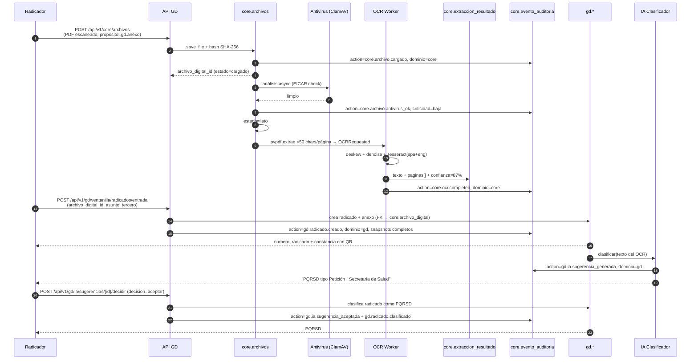
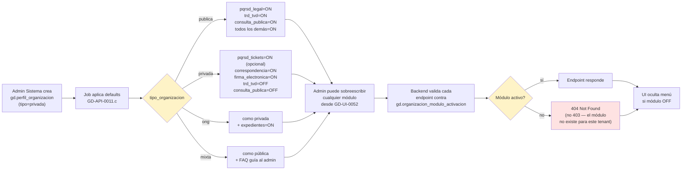
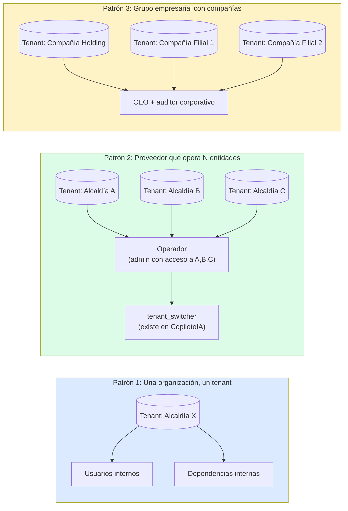

# Arquitectura del módulo Gestión Documental con IA

> Vista visual + textual de cómo encaja Gestión Documental con CopilotoIA, Knowledge y los dos servicios transversales (`core.*` para archivos+extracción y auditoría). Acompaña a `BACKLOG.md`, `UI_BACKLOG.md` y `README.md` de esta carpeta.

## 1. Modelo de tenant y perfil organizacional (neutro de sector)

```mermaid
erDiagram
    TENANTS ||--o| GD_PERFIL_ORGANIZACION : "1:1 opcional"
    TENANTS ||--o{ USER_TENANT_ROLES : "tiene"
    USERS ||--o{ USER_TENANT_ROLES : "pertenece"
    USERS ||--o{ GD_PERFIL_USUARIO : "extensión institucional"
    TENANTS ||--o{ GD_PERFIL_USUARIO : "por tenant"
    USERS ||--o{ GD_ASIGNACION_ALCANCE : "alcance de roles GD"
    GD_DEPENDENCIA ||--o{ GD_ASIGNACION_ALCANCE : "limita alcance"
    TENANTS ||--o{ GD_ORG_MODULO_ACTIVACION : "activa"
    TENANTS ||--o{ GD_DEPENDENCIA : "contiene"
    GD_DEPENDENCIA ||--o{ GD_DEPENDENCIA : "padre/hijo"
    GD_PERFIL_ORGANIZACION ||--o| CORE_ARCHIVO_DIGITAL : "logo"

    TENANTS {
        uuid id PK
        text slug UK
        text legal_name
        text display_name
        text vertical_code "libre tras TASK-0033"
        text country_code
        text timezone
        text status "trial|active|suspended|churned"
    }

    USERS {
        uuid id PK
        text email
        text status "del producto principal"
    }

    USER_TENANT_ROLES {
        uuid user_id FK
        uuid tenant_id FK
        text role "gd.radicador | gd.profesional | owner | manager | ..."
    }

    GD_PERFIL_USUARIO {
        uuid user_id FK
        uuid tenant_id FK
        text tipo_vinculacion "planta|provisional|ops|practicante|..."
        date fecha_inicio_vinculacion
        date fecha_fin_vinculacion
        text estado_gd "activo|suspendido|inactivo|bloqueado|retirado"
        uuid dependencia_actual_id FK
        uuid cargo_actual_id FK
    }

    GD_ASIGNACION_ALCANCE {
        uuid id PK
        uuid user_id FK
        uuid tenant_id FK
        text rol_codigo "FK a gd.rol — ej. gd.profesional"
        uuid dependencia_id FK
        text alcance "propio|dependencia|institucional|global"
        date fecha_inicio
        date fecha_fin "null = vigente"
        text motivo
    }

    GD_PERFIL_ORGANIZACION {
        uuid tenant_id PK_FK
        text tipo_organizacion "publica|privada|mixta|ong|gremial|cooperativa"
        text identificacion_fiscal "NIT/RFC/EIN/CUIT"
        text razon_social_legal
        text formato_radicado "{prefijo}-{vigencia}-{consec:06d}"
        text politica_firma_default
    }

    GD_ORG_MODULO_ACTIVACION {
        uuid tenant_id FK
        text modulo_codigo "pqrsd_legal|pqrsd_tickets|firma_*|trd_tvd|..."
        bool activado
        jsonb configuracion
    }
```

**Lectura clave del ER:**

- `app.users` queda intacta. **No existe `gd.usuario`.**
- `app.user_tenant_roles` es la única tabla de membresía usuario↔organización↔rol. Los roles del módulo se diferencian por **prefijo de texto** en `role`: `gd.radicador`, `gd.profesional`, etc. Convive con `owner`, `manager`, `agent` del producto principal sin conflicto.
- `gd.perfil_usuario` (1 fila por user+tenant) agrega los atributos institucionales que no caben en `app.users` ni en `user_tenant_roles`: tipo de vinculación, fechas, estado GD, dependencia y cargo vigentes.
- `gd.asignacion_alcance` resuelve lo que `user_tenant_roles` no expresa: **a qué dependencia aplica un rol**. Un usuario que es `gd.profesional` en dos dependencias = dos filas en `gd.asignacion_alcance` con la misma fila en `user_tenant_roles`.
- Cerrar una asignación de alcance (`fecha_fin`) **no borra la fila** — queda para reconstruir snapshots históricos. Cuando un radicado de 2024 muestra "actuó Juan, dependencia Oficina Jurídica", esa información se reconstruye consultando `gd.asignacion_alcance` con `fecha_inicio ≤ fecha_actuación < COALESCE(fecha_fin, ∞)`.

**Conclusión del modelo:**

- **Tenant = la organización pagadora.** Una alcaldía, una clínica privada, un holding industrial — cada uno es un tenant. Aislamiento por RLS ya está en 44 tablas con `app.tenant_id` seteado vía `set_config('app.tenant_id', ...)` por sesión.
- **`gd.perfil_organizacion`** es **opcional, 1:1 con tenant**. Solo los tenants que activan el módulo Gestión Documental tienen perfil. El resto (clientes solo de CopilotoIA conversacional) no lo crea.
- **Tipo de organización** controla defaults, no comportamiento. Cualquier organización puede activar PQRSD si quiere, incluso una empresa privada. La diferencia entre `pqrsd_legal` (con términos hábiles colombianos + consulta pública con QR) y `pqrsd_tickets` (versión interna sin obligación legal) es un módulo, no un fork del código.
- **Usuarios** viven en `app.users` ya existente. La pertenencia a una organización es `app.user_tenant_roles`, con `role` prefijado por módulo (`gd.radicador`, `gd.profesional`, etc. — viven al lado de `owner`, `manager`, `agent` del producto principal).

## 2. Arquitectura completa: capas, dominios y zonas transversales

```mermaid
graph TB
    subgraph TENANT["🏢 Tenant (app.tenants) — aislamiento RLS por app.tenant_id"]
        direction TB

        subgraph CORE_LAYER["🔧 core.* — Servicios transversales"]
            subgraph CORE_FILES_BLOCK["EP-018 · Archivos, extracción, OCR"]
                CORE_FILES[("core.archivo_digital<br/>hash, MIME, antivirus")]
                CORE_EXTR[("core.extraccion_resultado<br/>texto, páginas, confianza")]
                STORAGE[("Filesystem / S3<br/>tenants/{tid}/...")]
                ANTIVIRUS["ClamAV (async)"]
                OCR["Tesseract / Textract / Vision"]
                XLSX["openpyxl"]
                PDF_EXT["pypdf / python-docx"]
                CORE_FILES --> STORAGE
                CORE_FILES -.-> ANTIVIRUS
                CORE_FILES -.-> OCR
                CORE_FILES -.-> XLSX
                CORE_FILES -.-> PDF_EXT
                OCR --> CORE_EXTR
                XLSX --> CORE_EXTR
                PDF_EXT --> CORE_EXTR
            end

            subgraph CORE_AUDIT_BLOCK["EP-019 · Auditoría transversal"]
                CORE_AUD[("core.evento_auditoria<br/>particionada · append-only<br/>dominio: app | gd | knowledge | core")]
                AUDIT_HELPER["audit() / audit_async() / audit_durably()<br/>request_id + snapshots"]
                AUDIT_HELPER --> CORE_AUD
            end
        end

        subgraph APP_DOMAIN["💬 app.* — CopilotoIA (existente)"]
            APP_CONTACT[("app.contacts")]
            APP_APPT[("app.appointments")]
            APP_CAMP[("app.campaigns")]
            APP_CONV[("app.conversations")]
        end

        subgraph KNOWLEDGE["📚 Knowledge / RAG (existente)"]
            KDOC[("app.knowledge_documents<br/>archivo_digital_id FK")]
            KCHUNK[("app.knowledge_chunks<br/>embeddings + texto")]
            CHUNKER["chunker 500tok"]
            EMBED["embeddings provider"]
            RAG_RET["retrieval léxico + pgvector"]
            KDOC --> CHUNKER --> KCHUNK --> EMBED --> RAG_RET
        end

        subgraph GD_DOMAIN["📂 gd.* — Gestión Documental"]
            GD_PERFIL[("gd.perfil_organizacion<br/>1:1 con tenant<br/>tipo_organizacion")]
            GD_MOD[("gd.organizacion_modulo_activacion<br/>feature flags")]
            GD_DEPS[("gd.dependencia · cargo · canal<br/>estructura versionada")]

            GD_RAD[("gd.radicado<br/>número único")]
            GD_PQRSD[("gd.pqrsd<br/>opt-in por módulo")]
            GD_CORR[("gd.correspondencia")]
            GD_EXP[("gd.expediente")]

            GD_DOC[("gd.documento + version<br/>archivo_digital_id FK")]
            GD_ANE[("gd.anexo<br/>polimórfico")]
            GD_FIRM[("gd.firma_documento")]

            GD_TRD[("gd.trd · tvd · serie · subserie<br/>opt-in por módulo")]
            GD_IA[("gd.solicitud_ia · resultado_ia")]

            GD_RAD --> GD_PQRSD
            GD_RAD --> GD_CORR
            GD_RAD --> GD_EXP
            GD_PQRSD --> GD_DOC
            GD_CORR --> GD_DOC
            GD_DOC --> GD_FIRM
            GD_ANE -.-> GD_RAD
            GD_ANE -.-> GD_PQRSD
            GD_TRD -.->|clasifica| GD_DOC
            GD_PERFIL --> GD_MOD
        end

        KDOC -->|archivo_digital_id| CORE_FILES
        GD_DOC -->|archivo_digital_id| CORE_FILES
        GD_ANE -->|archivo_digital_id| CORE_FILES
        GD_PERFIL -->|logo_archivo_digital_id| CORE_FILES
        APP_CONV -.->|adjuntos futuros| CORE_FILES

        KDOC -.->|consume texto| CORE_EXTR
        GD_DOC -.->|consume texto| CORE_EXTR

        APP_DOMAIN -.->|audit"action=appointment.cancelled"| AUDIT_HELPER
        KNOWLEDGE -.->|audit"action=knowledge.indexed"| AUDIT_HELPER
        GD_DOMAIN -.->|audit"action=gd.radicado.anulado"| AUDIT_HELPER
    end

    AUTH["Auth0 / JWT<br/>SET app.tenant_id"] -->|RLS por tenant_id| TENANT

    style CORE_LAYER fill:#fef3c7,stroke:#d97706,stroke-width:3px
    style APP_DOMAIN fill:#dbeafe,stroke:#2563eb
    style KNOWLEDGE fill:#bfdbfe,stroke:#1d4ed8
    style GD_DOMAIN fill:#dcfce7,stroke:#16a34a
    style TENANT fill:#f5f5f4,stroke:#57534e
```

**Lo que muestra este diagrama:**

- **`core.*`** (amarillo) es la **única zona transversal nueva**. Tiene dos servicios: archivos+extracción (EP-018) y auditoría (EP-019). Ambos sirven a los tres dominios de negocio.
- **`app.*`** (azul oscuro) es el producto principal CopilotoIA — citas, contactos, conversaciones, campañas. Hoy escribe a `app.audit_logs`; mañana escribe a `core.evento_auditoria` con `dominio='app'` vía un helper rebrandeado.
- **Knowledge** (azul claro) sigue siendo el RAG conversacional. Sus archivos hoy viven en `app/services/knowledge_storage.py`; mañana viven en `core.archivo_digital`. Sus tablas no cambian, solo agregan FK al nuevo archivo.
- **`gd.*`** (verde) es Gestión Documental. Es el dominio nuevo grande. Su modelo institucional (radicado, PQRSD, expediente, TRD, firma) es propio y no se mezcla con Knowledge.

## 3. Flujo end-to-end: PDF escaneado entra como anexo de PQRSD



**Lo que muestra:**

- Cada paso crítico escribe a `core.evento_auditoria` con su `dominio` (core / gd) y campos snapshot.
- El archivo binario solo se almacena una vez en `core.archivo_digital`. Tanto el `gd.anexo` como un eventual `app.knowledge_documents` lo referencian por FK.
- OCR es transparente: si el PDF tiene texto embebido, se salta; si está escaneado, se ejecuta. La IA de clasificación recibe texto extraído sin saber si vino de pypdf o de Tesseract.

## 4. Cómo se decide qué módulos están activos para esta organización



**Lo que muestra:** la diferencia entre "este usuario no tiene permiso" (403) y "este módulo no aplica para esta organización" (404). No es lo mismo legalmente y la UI lo refleja distinto.

## 5. Decisión de tenant: tres patrones que el cliente puede operar



**Los tres patrones funcionan con la misma infraestructura.** Lo único que cambia es **cuántos tenants se aprovisionan** y **a qué tenants se da acceso un usuario** vía `user_tenant_roles`. La separación de datos sigue siendo por RLS sobre `tenant_id`. No hay sub-tenants ni multi-org dentro de un tenant — el patrón 3 (holding) se hace con tenants independientes + un usuario corporativo con acceso a varios, no con un super-tenant.

## 6. Relación con Knowledge — qué se comparte y qué no

| Cosa | Knowledge | Gestión Documental | Mecanismo |
|---|---|---|---|
| Storage de bytes | ✓ | ✓ | `core.archivo_digital` (compartido) |
| Antivirus | ✓ | ✓ | `IAntivirusScanner` (compartido) |
| Extracción PDF/DOCX | ✓ | ✓ | `pypdf` / `python-docx` (compartido) |
| Extracción XLSX | nuevo | ✓ | `openpyxl` (nuevo en EP-018) |
| OCR imágenes / PDF escaneado | nuevo | ✓ | Tesseract (nuevo en EP-018) |
| Chunking (500 tok / overlap 80) | ✓ | ✗ | Solo Knowledge — RAG necesita chunks |
| Embeddings | ✓ | ✗ | Solo Knowledge — gd.* no hace búsqueda semántica |
| Modelo `knowledge_document` | ✓ | ✗ | Knowledge sigue siendo Knowledge |
| Modelo `gd.documento` con versión, estado, firma | ✗ | ✓ | Gestión Documental — chunks no aplican aquí |
| TRD/TVD, expedientes, retención | ✗ | ✓ | Solo `gd.*` |
| Auditoría | ✓ | ✓ | `core.evento_auditoria` con `dominio` distinto |

**Regla:** lo que se comparte es la **capa baja** (bytes, texto, eventos). Lo que se diferencia es la **lógica de negocio** (RAG conversacional vs. SGDEA institucional).

## 7. Implicaciones para el orden de ejecución

Ya que `core.*` es prerrequisito para ambos dominios institucionales, el orden de entregas se ajusta así:

```
Entrega 0 (nueva, transversal) — Servicios core
    ├─ EP-019 Auditoría transversal (precede EP-001)
    └─ EP-018 Archivos + extracción + OCR (precede EP-009)

Entrega 1 — Base institucional
    ├─ EP-001 Identidad + roles
    └─ EP-002 Perfil de organización + estructura

Entrega 2..8 — sin cambios respecto al README sección 5
```

Si el cliente prefiere no tocar `app.audit_logs` ahora, EP-019 puede ejecutarse parcialmente: solo crea `core.evento_auditoria` para `dominio in (gd, core)`, deja `app.audit_logs` intacto y posterga la migración (GD-API-0117) a un trimestre posterior. El refactor del helper (GD-API-0116) puede hacerse sin migrar datos — solo cambia dónde escriben las nuevas filas.

---

**Última actualización:** 2026-05-20
**Versión:** 0.1 (borrador — alineado con BACKLOG.md y UI_BACKLOG.md de la misma carpeta)
